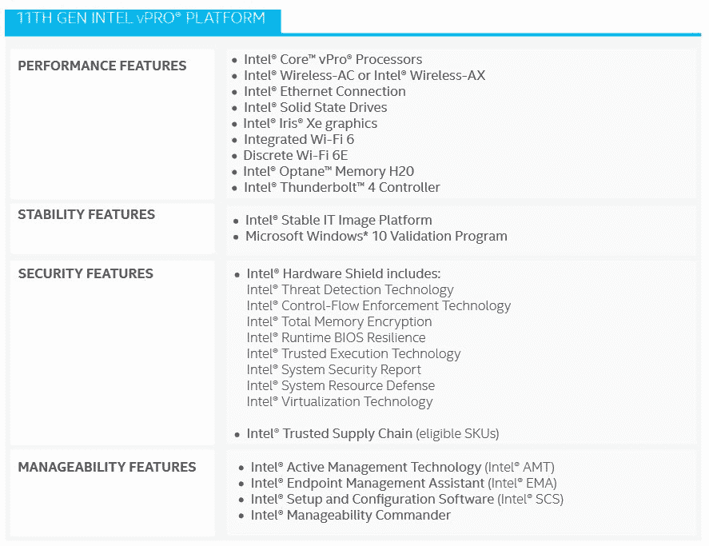
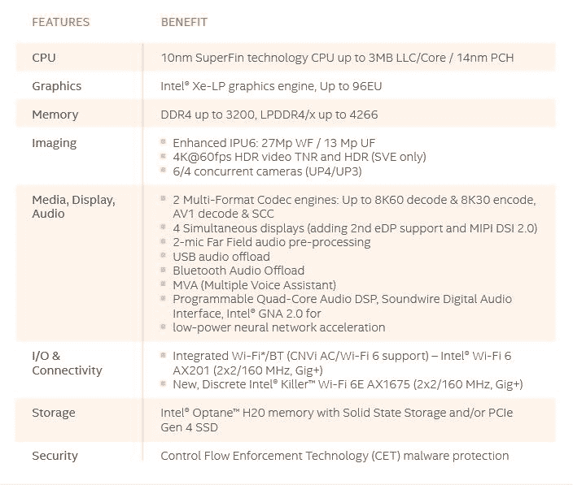

# 英特尔推出全新第 11 代博锐、H 系列和 N 系列移动处理器

> 原文：<https://www.xda-developers.com/intel-11th-gen-vpro-h-series-mobile-processors-launched/>

去年年底，英特尔宣布了面向主流笔记本电脑的第 11 代 Tiger Lake U 系列处理器。在今年的 CES 2021 上，该公司正在将范围扩大到采用新的第 11 代博锐和 H 系列处理器的商务和游戏笔记本电脑。我们已经看到原始设备制造商如[戴尔](https://www.xda-developers.com/dell-launches-new-latitude-precision-laptops-optiplex-desktops/)、联想和[惠普](https://www.xda-developers.com/hp-unveils-new-envy-elite-dragonfly-elitebook-laptops-2-in-1-elite-folio-more-ces-2021/)宣布了基于最新博锐和 EVO 博锐平台的新企业笔记本电脑，而专注于游戏的品牌如华硕、雷蛇和宏碁预计将在本周晚些时候宣布采用更高内核 H 系列处理器的新游戏笔记本电脑。

英特尔还宣布了面向低功耗入门级和教育系统的全新 N 系列英特尔奔腾银和英特尔赛扬处理器。此外，我们还预览了即将推出的第 11 代英特尔酷睿 S 系列台式机处理器(Rocket Lake-S)及其下一代处理器(Alder Lake)。

## 第 11 代英特尔博锐移动处理器

据称，面向商用笔记本电脑的全新第 11 代英特尔博锐平台可提供业界最高的性能，并改进了基于硬件的安全性。它采用了 10 纳米 SuperFin 技术，据说与上一代产品相比，AI 性能提高了 8 倍，创作和视频编辑速度提高了 2.3 倍。据说，这些芯片在使用微软 Office 365 等应用程序时，速度比竞争对手快 23%，在视频电话会议中，办公效率比竞争对手快 50%。借助 Hardware Shield，英特尔正在提供基于硬件的安全性以及针对勒索软件和加密挖掘攻击的人工智能(AI)威胁检测。这些芯片还采用了英特尔控制流执行技术，以帮助关闭长期以来躲避纯软件解决方案的一整类攻击。此外，与标准 Wi-Fi 5 相比，Wi-Fi 6/6E (Gig+)支持在办公环境中提供 6 倍的上传和下载速度，在家中提供 3 倍的速度。

 <picture></picture> 

Intel 11th-Gen vPro Features

基于新的商用芯片组，英特尔还推出了 Evo 博锐平台，该平台遵循了去年 Evo 品牌的相同路线。因此，凭借轻薄时尚的设计、增强的性能、真实的电池续航时间和身临其境的视觉体验，企业用户可以期待最佳和最优质的体验。该公司预计，今年晚些时候将有超过 60 款来自不同 OEM 厂商的新笔记本电脑采用英特尔博锐和 Evo 平台。此外，该公司还发布了英特尔 Evo Chromebooks，推出了一种新的高端 chrome book。

## 第 11 代英特尔酷睿 H 系列移动式处理器

英特尔通常为游戏笔记本电脑推出具有高 TDP(散热设计功率)的强大 H 系列移动 CPU。然而，这一次他们专注于超薄游戏笔记本电脑，并推出了新的第 11 代英特尔酷睿 H 系列或 H35 移动处理器，用于厚度仅为 16 毫米的笔记本电脑中的发烧级游戏。该系列共有三种型号，包括 i7-11375H、i7-11370 H 和 i7-11300H。这三款产品的基本 TDP 均为 28W，但最高可达 35W。新系列由最高 5GHz 的 Core i7 特别版 4 核处理器领导。也支持 PCIe 第四代，当然，新的处理器是基于 10 纳米超精细技术。该公司还宣布了一款 8 核处理器，将于本季度晚些时候开始发货。

新 H 系列的其他显著特性包括支持高达 3200 的 DDR4、高达 4266 的 LPDDR4/x、Xe-LP 显卡和 KillerTM WiFi 6E (Gig+)。宏碁、华硕、微星和 Vaio 将推出基于第 11 代英特尔酷睿 H35 系列处理器的新系统，用于超便携游戏，而顶级制造合作伙伴将在 2021 年上半年推出 40 多种设计。

 <picture></picture> 

Intel 11th-Gen H-Series Features

## 第 11 代英特尔 N 系列移动式处理器

对于教育笔记本电脑，英特尔在新的 N 系列下宣布了一系列新的移动处理器。英特尔奔腾银处理器和赛扬处理器基于英特尔 10 纳米架构设计，据说整体应用性能比同类产品提高了 35%，图形性能提高了 78%。这使得多任务处理时应用性能和浏览更加流畅，加上先进的摄像头和连接功能，带来丰富的视频会议和观看体验。

## 火箭湖和阿尔德湖

我们已经知道，英特尔的下一代台式机 CPU 将于 3 月份推出 [Rocket Lake](https://www.xda-developers.com/intel-11th-gen-rocket-lake-desktop-processors-arrive-q1-2021/) ，而 Alder Lake 将于 2021 年下半年推出。英特尔已经确认，第 11 代英特尔酷睿 S 系列台式机处理器将由英特尔酷睿 i9-11900K 引领，客户预计每周期指令数(IPC)将提高 19%。根据[最近的泄露](https://wccftech.com/intel-core-i9-11900k-flagship-rocket-lake-desktop-cpu-benchmarks-leak-5-3-ghz-clocks/)，某些基准测试已经在互联网上发布，这表明它将是一个耗电的 8 核 CPU，第一阶段功率限制为 125W，第二阶段功率限制为 250W。

至于 Alder Lake，英特尔认为它将是 x86 架构的一个突破，因为它是最具功率可扩展性的片上系统。Alder Lake 将高性能内核和高效内核结合到一个产品中，并将基于一个新的增强版 10 纳米 SuperFin 构建。这也将成为未来领先台式机和移动处理器的基础。