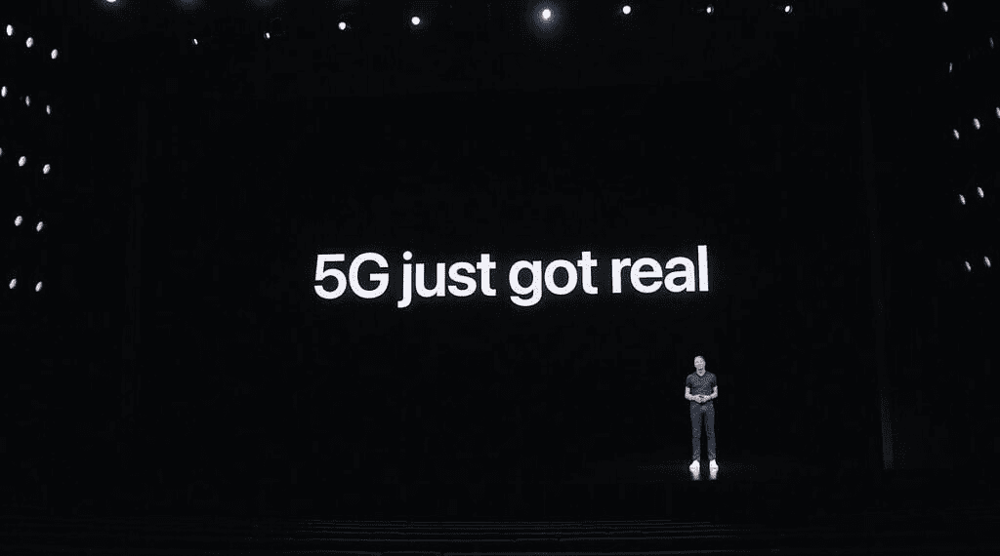
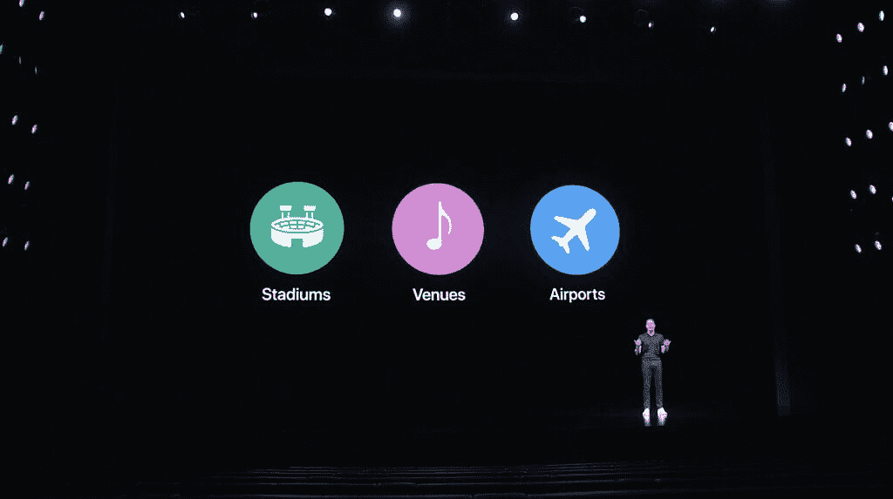
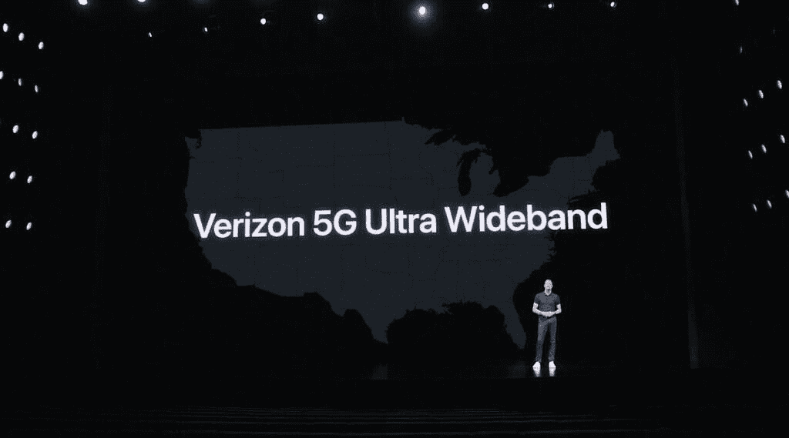

# iPhone 12 5G 是 5G 迫切需要的火箭助推器

> 原文：<https://www.xda-developers.com/iphone-12-5g/>

iPhones 一直给我留下深刻印象的一点是，它们是主流文化话语的一部分。当苹果推出新 iPhone 时，新闻不仅被科技媒体报道，甚至被生活方式或一般新闻媒体报道。这是大多数其他手机品牌经常无法获得的相关性水平——尽管三星经常被大量报道，但当苹果发布公告时，似乎每个人都有话要说。

因此，当你读到这里的时候，你会听说苹果已经宣布了新的 [iPhone 12 系列](https://www.xda-developers.com/apple-iphone-12-series/)中的四款机型，它们的一个主要新功能是它们都支持 [5G](https://www.xda-developers.com/5g/) 。

 <picture></picture> 

Apple's big claim was that 5G just got real with the launch of the iPhone 12\. This alone shows how important 5G is to the iPhone story this year, so much so that they reportedly forewent the option of a 120Hz display in favor of 5G.

这对移动行业的每个人来说都是一个好消息，从运营商到高通，甚至是三星这样的竞争对手，因为他们都在推动 5G 宣传列车——即使 5G 还没有完全准备好进入黄金时段。但现在苹果正在这么做，5G 将得到急需的推动。

## 5G 来了！嗯，算是吧...

从技术上来说，5G 在美国已经存在一年多了，但从实际和现实的角度来说，它只是在这里的一部分。sub-6 5G(由 T-Mobile 和美国电话电报公司使用)的速度在很大程度上比 4G 快一点，在某些情况下，[慢](https://www.washingtonpost.com/technology/2020/09/08/5g-speed/)。然后是威瑞森部署的毫米波 5G，虽然它实际上很快——我们已经收到了超过 2Gbps 的威瑞森最快网络连接——但接收区域极其有限。

事实上，威瑞森利用 iPhone 12 发布会作为平台宣布，它也正在推出 sub-6 网络，虽然速度较慢，但至少将覆盖“全国”威瑞森不太可能奇迹般地解决了 T2 T 和 T-Mobile 的 sub-6 5G 速度变慢的问题，所以在不久的将来，5G 的状态可能基本保持不变。

通常情况下，如果某样东西被如此大肆宣传，却连最基本的东西都没有兑现，消费者就会反抗。想象一下，如果你买了一辆仍然需要汽油的特斯拉或者一个不能折叠的 Galaxy Fold，你会有多生气。你会发疯的。

事实上，在美国，5G 的可悲状态并没有受到太多的抵制，这表明，在很大程度上，普通人*不知道太多，他们也不关心* *关于* 5G。三星、LG 和摩托罗拉可能已经在美国发布 [5G 手机](https://www.xda-developers.com/best-5g-phones/)一年多了，美国的每个运营商和手机商店都贴满了宣传 5G 的横幅。尽管如此，在大多数情况下，人们还不在乎——直到 iPhone 12。

 <picture></picture> 

Verizon highlighted the benefits of 5G UWB in Stadiums, Venues, and Airports.

## 当苹果做一些事情的时候，移动行业也会跟着做

几年前，我采访了 Anker 的首席执行官阳萌，他告诉我，他希望苹果公司能够转向 USB-C，因为用他的话说，“一旦苹果公司这样做了，整个行业都会效仿，USB-C 立即成为规范。”

在苹果做到这一点之前，它并不是主流，当他们做到这一点时，整个行业通常都会加入进来

Android 粉丝读到这里可能会翻白眼，但这是真的。想想 FaceTime。早在苹果推出视频通话之前，视频通话就已经存在于各种应用中，但直到苹果推出视频通话，视频通话才开始流行，至少在北美是这样。真正的无线耳塞也是如此。在 AirPods 首次亮相的近一年前，德国品牌博拉琪和中国初创企业已经发布了无线耳塞。但是这个市场直到 AirPods 之后才开始起步。

今天，AirPods 是无线耳塞的代名词，在世界各地无处不在。既然我们谈到了 AirPods 的话题，还记得耳机插孔是所有电子设备都必须包含的端口吗？苹果杀了它；人们，包括媒体和粉丝，大声抱怨；但最终，苹果还是赢了——耳机插孔在智能手机中已经死了。

现在最新的 iPhones 不仅支持 5G，苹果还在积极炒作？这将会改变整个行业的游戏规则。普通人会想知道 5G 现在是什么，也许会在他们的 iPhone 12s 连接到 5G 网络时开始提问，5G 网络没有带来数据速度的明显改善，而每个运营商都试图称赞 5G 的好处。

 <picture></picture> 

Apple and Verizon are going to heavily promote 5G UWB, which isn't available in many places.

## iPhone 12 5G 将如何刺激运营商采取行动？

考虑其他功能，如可视语音邮件、iMessage 和 eSIMs。这些都是苹果开发的功能，并且几乎立即得到了运营商的广泛支持。考虑到每年售出的 iPhone 数量，iPhone 是能够刺激运营商采取行动的头号智能手机。

人们不知道他们想要什么，直到你给他们看，苹果会让人们想要 5G

eSIMs 是一个很好的例子——它们已经以某种形式在某些 Android 手机上存在了一段时间，但运营商支持非常粗略。eSIM 在 iPhone 和 iPad 上的引入使得更多的运营商支持 eSIM。尽管如此，仍然存在一些问题，只有随着技术的成熟才能解决。

这最终也将适用于 5G 和 iPhone 12。这项技术还没有得到充实，但直到现在，大多数人都不关心 5G。众所周知的行业秘密是，iPhone 用户提供的每用户平均收入要高得多——这是合作伙伴和运营商关注的关键指标之一——这意味着苹果用户比安卓用户花费更多。这也意味着苹果可以对运营商施加一定的影响——从第一代 iPhone 开始，我们就看到了苹果对定价的严格控制。现在，他们需要找出如何在短时间内对 5G 进行有意义的改进。

他们怎么做到的？美国电话电报公司发言人[告诉*华盛顿邮报*](https://www.washingtonpost.com/technology/2020/09/08/5g-speed/) 它可以为 5G 聚合更多的 4G 频谱以提高速度(目前低于 6 5G 基本上与 4G LTE 共享相同的频谱)。5G 信号的[致密化](https://www.rcrwireless.com/20161109/fundamentals/network-densification-5g-tag31-tag99)——增加给定空间内的信号容量——是另一种提议的方法，也是威瑞森实现其网络超宽带部分的方式。

无论他们最终做什么，运营商现在面临的压力是提供实际上是第五代的数据速度。由于 iPhone 现在支持它，苹果的营销部门将使主流公众想要它。正如史蒂夫·乔布斯曾经说过的，人们不知道他们想要什么，直到你给他们看，我们可以相信苹果会让人们想要 5G。