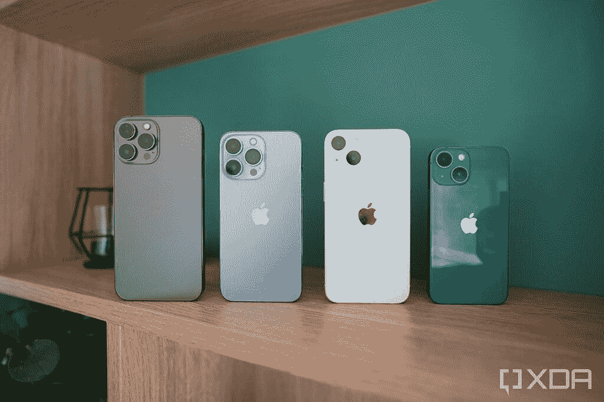

# iPhone 13 Mini 可能是最后一款“迷你”iPhone

> 原文：<https://www.xda-developers.com/iphone-13-mini-last-small-iphone/>

苹果公司最近推出了 iPhone 13 系列，包括像去年一样的四款新机型——标准的 [iPhone 13](https://www.xda-developers.com/iphone-13/) 、 [iPhone 13 Mini](https://www.xda-developers.com/iphone-13-mini/) 、 [iPhone 13 Pro](https://www.xda-developers.com/iphone-13-pro/) 和 [iPhone 13 Pro Max](https://www.xda-developers.com/iphone-13-pro-max/) 。但该公司明年可能不会继续这一趋势。有传言称，由于销量不佳，苹果可能会将迷你机型从明年的 iPhone 阵容中剔除。

 <picture></picture> 

iPhone 13 Pro Max, iPhone 13 Pro, iPhone 13, and iPhone Mini.

苹果推出 iPhone 12 Mini 是为了迎合那些喜欢可以单手轻松使用的小巧手机的人群。然而残酷的现实是，这是一个非常小众的受众群体。智能手机已经成为大多数人的娱乐中心，消费媒体和输入电子邮件和信息等任务在更大的显示屏上更好。更小的外形也带来了电池寿命方面的重大妥协。

因此，iPhone 12 Mini 的[销售数字远低于预期](https://www.xda-developers.com/iphone-12-mini-sales-reportedly-well-below-expectations/)。虽然 iPhone 13 Mini 在电池寿命方面确实有所改善，但仍然可以肯定地说，更大的 iPhone 将更受大众欢迎。苹果继续销售一款不盈利的产品是没有意义的，这也是为什么我们明年可能看不到 iPhone 14 Mini 的原因。

 <picture></picture> 

iPhone 13 Mini

乔恩·普罗瑟证实了这一理论，并表示如果你喜欢小手机，iPhone 13 Mini 将是最后一部“迷你”手机。不过，这些仍然是推测，所以不要全信。尽管普罗瑟有着良好的记录，但最近发布的 Apple Watch 7 提醒我们，泄露最终仍然只是泄露，我们无法总是确定苹果是否会公布泄露的确切信息。

如果你像我一样喜欢小手机，这肯定是一个悲伤的消息，但如果销量不佳，苹果继续发布迷你机型在财务上没有意义。谢天谢地，苹果今年没有将其从阵容中删除。因此，如果你想买一部紧凑型旗舰手机，我们建议你看看我们的 [iPhone 13 Mini impressions](https://www.xda-developers.com/apple-iphone-13-mini-first-impressions/) ，并继续关注我们的全面评论，以决定你是否应该购买它。