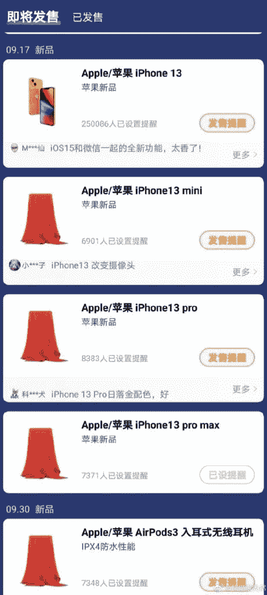

# iPhone 13 系列可能从 9 月 17 日开始接受预购

> 原文：<https://www.xda-developers.com/iphone-13-series-pre-order-17-september/>

# iPhone 13 系列可能从 9 月 17 日开始接受预购

根据一项新的传言，iPhone 13 的预购据说将从 9 月 17 日开始，这款手机将从 9 月 24 日开始销售。

苹果一年一度的 iPhone 发布会传统上在每年九月举行。然而，去年，由于新冠肺炎病毒爆发，导致生产延迟，该产品的上市被推迟。iPhone 12 系列于 10 月份发布，其中两款机型 iPhone 12 mini 和 iPhone 12 Pro Max 仅在一个月后的 11 月份开始销售。这一次，看起来苹果已经恢复了其最初的 iPhone 13 发布时间表，或者至少是谣言所表明的。

据中国电子商务网站[IT Home](https://www.ithome.com/0/571/411.htm)(*via[front page tech](https://www.frontpagetech.com/2021/08/25/yep-iphone-13-pre-orders-starting-september-17th-launch-on-september-24th/)*)报道，新款 iPhone 13 系列将于 9 月 14 日**发布，9 月 17 日**开始预售。FrontPageTech 的乔恩·普罗瑟也证实这些日期与他从消息来源处获得的信息一致。随着 9 月 17 日开始预售，iPhone 13 系列预计将于 9 月 24 日开始销售。****

 ****iPhone 13 系列今年也将包括 4 款手机——iPhone 13、iPhone 13 mini、iPhone 13 Pro 和 iPhone 13 Pro Max。与去年不同的是，iPhone 12 和 iPhone 12 Pro 在宣布后不久就可以上市，但 iPhone 12 mini 和 12 Pro Max 推迟了一个月，预计这四款手机都将在今年 9 月 17 日接受预购。

 <picture></picture> 

Screenshot from @PandalsBald on Weibo

*微博*账号 *@PandalsBald* 贴出了 9 月 17 日开始预售的所有四款 iPhone 型号零售清单的截图。目前，我们无法确认这张截图的合法性，所以你应该半信半疑地看待这些信息。

你对 iPhone 13 系列感到兴奋吗？如果你正等着挑选一个模特，请在下面的评论区告诉我们。****