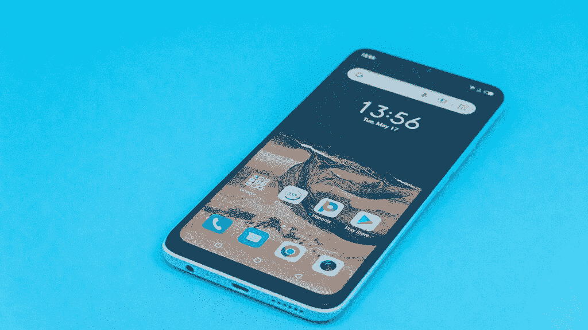
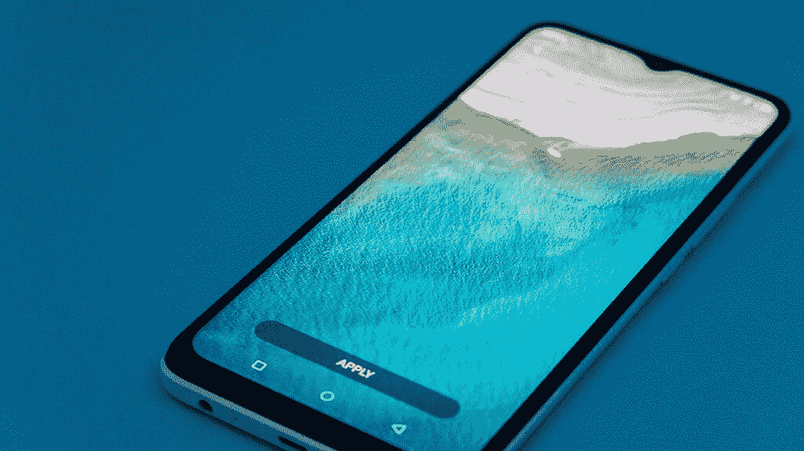
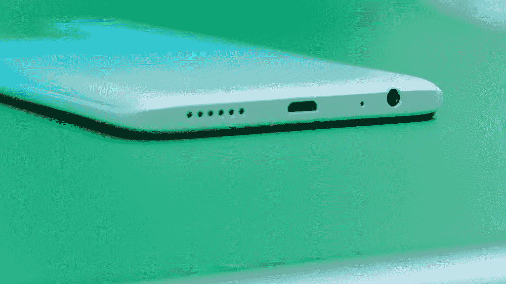

# itel P38 以低于 100 美元的价格为非洲市场带来了快速充电

> 原文：<https://www.xda-developers.com/itel-p38-fast-charging/>

你可能不知道，根据 IDC 2022 年全球手机跟踪报告，itel 是全球领先的 100 美元以下智能手机品牌。他们负责将一些最好的智能手机技术带到非洲市场，并且价格低廉。凭借丰富的设备选择，itel 能够提供将强大功能融入其预算解决方案的智能手机。新的 itel P38 由 Android 11 Go 版驱动，并非常注重快速充电功能。对于一部 100 美元以下的手机来说，15W 的快速充电与 5,000mAh 的电池容量搭配起来，令人印象深刻。让我们仔细看看 itel P38。

[**itel P38 网站**](https://www.itel-life.com/global/phone/smart-phone/p-power/p38/)

 <picture></picture> 

itel P38

## 价格低廉，功能强大

itel P 系列的目标是随时提供强大的规格。首先是 6.6 英寸高清显示屏。大屏幕显示清晰的图像、令人印象深刻的色彩，为任何类型的媒体消费提供身临其境的体验。一个小水滴凹槽包含自拍相机，屏幕被一个令人印象深刻的小边框包围。实现了 90%的屏幕与机身比例，给你一个更大的全视图显示器，看起来很适合像抖音这样的应用程序。

 <picture></picture> 

itel P38 HD+ Display

翻转手机，看看超级时尚的设计，有三种亮丽的颜色可供选择。在银河蓝、云杉绿或星云黑之间选择。手机背面有一个独特的配置，其中容纳双摄像头设置的玻璃延伸到包含指纹传感器。使用不同的纹理图案，产生视觉上令人愉悦的美感。

这款手机配备了 1.3GHz 四核芯片组和 2GB 内存，可用于游戏。使用随附的 i-boost 1.0 软件进一步增强手机性能，获得更流畅的体验。32GB 的存储空间为您提供了充足的空间来存储您最喜爱的所有应用程序和大约 16，000 张照片。

对于摄像头，你会发现一个 800 万像素的人工智能传感器在后面，还有一个用于自拍的前置摄像头。使用人工智能功能，通过针对每个场景优化的设置来拍摄精彩的照片。

为了进一步保护用户隐私，P38 系列进行了升级，将自带人脸解锁和八大功能指纹解锁。面部和指纹双重解锁模式使 P38 得心应手，同时保持用户数据的安全和完好。

 <picture></picture> 

itel P38 Back

## 非洲市场价格低于 100 美元的最佳快速充电手机

这款手机最令人印象深刻的功能可能是快速充电的 5000 毫安时电池。只需十分钟的充电时间，就可以获得三小时的通话时间。得益于 15W 的充电能力，这款手机的充电速度是上一版本的两倍。

 <picture></picture> 

itel P38 Charge Port and Headphone Jack

预嵌入的 AI Power Master 系统允许您最大限度地利用电池，从而延长使用寿命:

*   sim 卡待机 12 天
*   26 小时的通话时间
*   10 小时的视频播放
*   51 小时的音乐播放
*   6.5 小时的游戏时间

使用 itel P38，享受由 Android 11 GO 驱动的快速充电手机的强大功能。在下面的官方网站了解更多信息。

[**itel P38 网站**](https://www.itel-life.com/global/phone/smart-phone/p-power/p38/)

我们感谢 itel 赞助这篇文章。我们的赞助商帮助我们支付与运行 XDA 相关的许多费用，包括服务器成本、全职开发人员、新闻撰稿人等等。虽然您可能会在门户内容旁边看到赞助内容(这些内容将始终被标记为赞助内容),但门户团队对这些帖子不承担任何责任。赞助内容、广告和 XDA 仓库完全由一个独立的团队管理。XDA 绝不会通过接受金钱来赞扬一家公司，或以任何方式改变我们的观点或看法，从而损害其新闻诚信。我们的意见不能被收买。