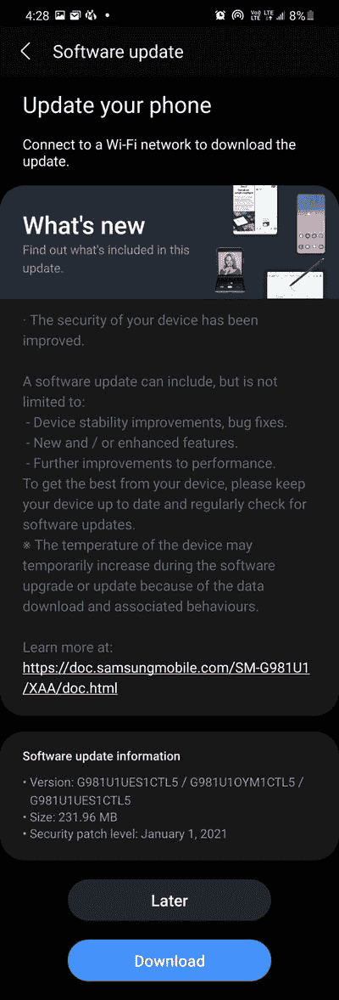

# 2021 年 1 月 Pixel 和部分 Galaxy 手机安全更新发布

> 原文：<https://www.xda-developers.com/january-2021-android-security-patches-update-google-pixel-samsung-galaxy/>

谷歌将在 2021 年的第一周发布一系列新的月度安卓安全补丁。这个月值得注意，因为它标志着没有谷歌 Pixel 2 和 Pixel 2 XL (RIP！).不过，我们仍然有像素 5、像素 4a、像素 5G、像素 4a、像素 4、像素 4 XL、像素 3a、像素 3a XL、像素 3 和像素 3 XL 的补丁。此外，三星正在特定地区推出 Galaxy S20 和 Galaxy S9 系列的新更新，带来相同的安全补丁级别(SPL)。

与上个月的 Android 安全更新不同，这次更新没有伴随着 Pixel 功能的下降。此外，谷歌没有概述 Pixel 系列的任何“显著修复”，尽管 Android 平台、Linux 内核和供应商组件有各种安全改进。您可以在下面的图表中看到所有的修复和附带的设备。

**[像素 3 论坛](https://forum.xda-developers.com/pixel-3)| |[像素 3 XL 论坛](https://forum.xda-developers.com/c/google-pixel-3-xl.8243/)**

**[像素 3a 论坛](https://forum.xda-developers.com/c/google-pixel-3a.8868/)| |[像素 3a XL 论坛](https://forum.xda-developers.com/c/google-pixel-3a-xl.8875/)**

**[像素 4 论坛](https://forum.xda-developers.com/c/google-pixel-4.9014/)| |[像素 4 XL 论坛](https://forum.xda-developers.com/c/google-pixel-4-xl.9021/)**

**[Pixel 4a 论坛](https://forum.xda-developers.com/c/google-pixel-4a.10249/)| |[Pixel 4a 5G 论坛](https://forum.xda-developers.com/c/google-pixel-4a-5g.11321/)| |[Pixel 5 论坛](https://forum.xda-developers.com/c/google-pixel-5.11335/)**

**构建编号:**

*   全球:

    *   像素 3 (XL): RQ1A.210105.003

    *   像素 3a (XL): RQ1A.210105.002

    *   像素 4 (XL): RQ1A.210105.003

    *   像素 4a: RQ1A.210105.002

    *   像素 4a (5G): RQ1A.210105.003

    *   像素 5: RQ1A.210105.003

*   威瑞森:

虽然 OTA 将在几天内到达你的谷歌 Pixel 设备，但你也可以手动安装更新，要么通过刷新最新的工厂映像，从恢复中下载 OTA 文件，要么使用[谷歌的在线刷新工具](https://pixelrepair.withgoogle.com/)为你完成这项工作。

**[下载工厂图片](https://developers.google.com/android/images)| |[下载 OTA 图片](https://developers.google.com/android/ota)**

除了上面提到的 Pixel 设备，三星还将在 2021 年 1 月为几款 Galaxy 系列设备推出 Android 安全更新。对于 Galaxy S20，高通骁龙动力的美国航母解锁版本正在接收新的更新，版本号为 **G98xU1UES1CTL5** 。

 <picture></picture> 

Thanks to XDA Senior Member [farookh](https://forum.xda-developers.com/m/farookh.986256/) for the screenshot!

**[银河 S20/S20+/S20 超论坛](https://forum.xda-developers.com/c/samsung-galaxy-s20-s20-s20-ultra.9711/)**

除了 Galaxy S20，更新还将推出 Galaxy S9 和 Galaxy S9+的全球 Exynos 版本。这一新版本的标签为 **G96xFXXSDFTL1** ，目前在 DBT 地区上市，这是三星在德国的代码。

**[三星 Galaxy S9 XDA 论坛](https://forum.xda-developers.com/c/samsung-galaxy-s9.7408/)| |[三星 Galaxy S9+ XDA 论坛](https://forum.xda-developers.com/c/samsung-galaxy-s9.7530/)**