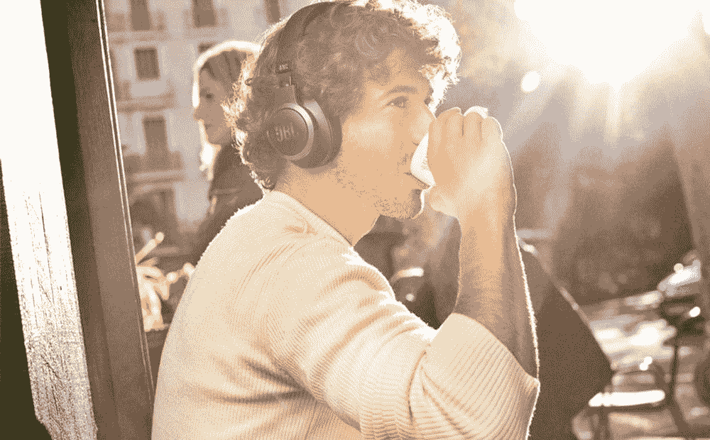
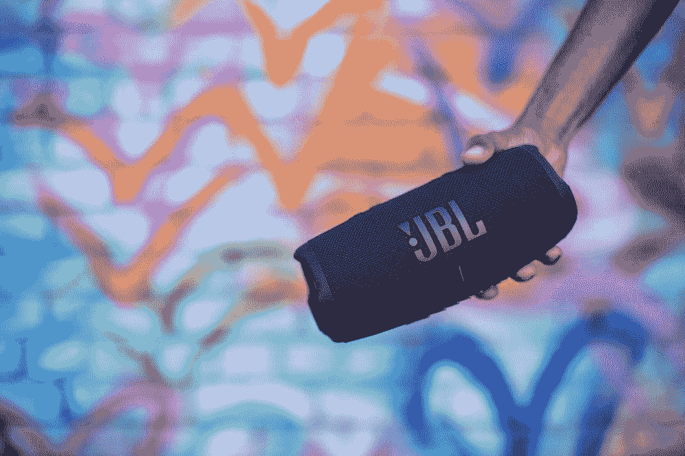
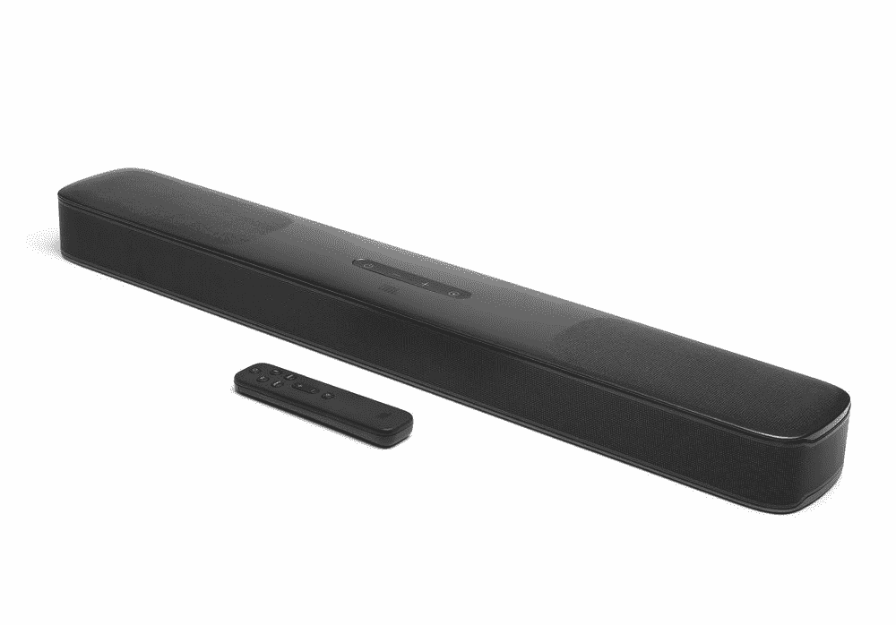

# JBL 2021 年的产品系列包括新的耳机、耳塞等

> 原文：<https://www.xda-developers.com/jbls-2021-new-headphones-earphones-bluetooth-speakers-soundbars/>

在疯狂的 CES 2021 开幕之前，JBL 宣布了一系列新的音频产品，包括耳机，耳机，蓝牙扬声器和条形音箱。基本上，如果你需要为你的家或你自己配备音频设备，JBL 可以满足你。

## JBL 巡回赛 ONE 和 JBL 巡回赛 Pro Plus

JBL [宣布](https://news.jbl.com/en-CEU/195459-jbl-launches-tour-headphone-series-designed-for-business-professionals)其巡演系列的两个新成员:耳挂式降噪耳机和真正的无线耳塞。它们的设计、功能和价格迎合了两种不同的人群，所以这是一个找到你个人偏好的问题。

JBL Tour One 是一款耳挂式降噪耳机，JBL 称其“可以即时监控环境声音，并根据用户环境的完美降噪水平进行调整。”还有一个“SilentNow”功能，允许用户在不激活蓝牙的情况下启用噪音消除模式。有时你需要屏蔽噪音，而不去听任何特别的东西。

以下是 JBL 之旅的规格:

*   真正的自适应噪声消除
*   JBL 专业音响由 40 毫米动态驱动器驱动
*   高分辨率音频经过认证，支持高达 40kHz 的频率
*   50 小时的总音乐播放时间
*   25 小时，带噪音消除和蓝牙功能
*   仅使用蓝牙 50 小时
*   快速充电(充电 10 分钟=播放 2 小时)
*   自适应环境感知和对讲
*   4 麦克风技术带来卓越的通话质量
*   谷歌和亚马逊的免提语音控制
*   USB-C 充电
*   自动播放/暂停
*   适用于旅行的 SilentNow 和“我的闹钟”功能
*   智能开关，针对听音乐和看电影进行了优化
*   兼容 JBL 耳机应用程序，定制聆听和使用行为
*   快速配对

接下来是 JBL 巡回赛 Pro Plus，真正的无线耳塞，具有自适应噪音消除功能。它们支持快速配对、双连接+同步，并承诺总音乐播放时间超过 30 小时。

以下是 JBL 职业巡回赛的规格:

*   自适应噪声抵消
*   JBL 专业音响由 6.8 毫米动态驱动器驱动
*   总音乐播放时间超过 30 小时
*   主动降噪 6 小时
*   仅蓝牙 8 小时
*   快速充电(充电 10 分钟=播放 1 小时)
*   自适应环境感知和对讲
*   3 麦克风波束形成阵列技术带来的声音清晰度
*   双连接+同步和快速对
*   谷歌和亚马逊的免提语音控制
*   IPX4 防汗
*   寂静和我的闹钟
*   智能音频和视频，针对听音乐和看电影进行了优化
*   定制的 tap 面板控制
*   “检查我的最佳匹配”，允许用户通过应用程序检查耳朵的匹配情况
*   兼容 JBL 耳机应用程序，定制聆听和行为

## JBL Live Pro Plus, JBL Live 660NC, JBL Live 460NC

JBL 还在其 Live 系列中发布了三款新耳塞。新系列中有适合每个人的东西，包括真正的无线、耳挂和入耳式耳塞，因此您可以选择最适合自己的型号。

JBL Live Pro Plus 是入耳式耳塞，其设计类似于苹果最初的 AirPods。有一个耳塞，它的耳塞杆伸出来，为锻炼或在镇上散步提供了一个安全的配合。JBL Live Pro Plus 具有自适应噪音消除和智能环境功能，因此您可以阻止噪音或让噪音进入。

以下是 JBL Live Pro Plus 的规格:

*   JBL 标志性声音
*   智能环境下的自适应噪声消除
*   无线充电；Qi 兼容
*   回声消除麦克风技术
*   双重连接+同步
*   自动播放/暂停
*   耳机播放时间长达 7 小时(如果使用降噪功能，则可播放 6 小时)
*   紧凑型充电盒，电池续航时间长达 21 小时
*   全访问触摸控制
*   可通过我的 JBL 耳机应用程序定制
*   IPX4 防水
*   快速配对
*   通过 USB Type-C 快速充电
*   多语音助手(谷歌助手和亚马逊 Alexa)的免提语音控制
*   热门词汇和设备动作支持

€179 将于 4 月在 black 发售 JBL Live Pro Plus，颜色有黑色、白色、粉色和米色。

JBL Live 660NC 是一款耳挂式耳机，具有自适应噪声消除、多点连接支持和长达 50 小时的播放时间。这款耳机还支持快速充电功能，因此只需充电 10 分钟，您就可以获得长达 4 小时的播放时间。

以下是 JBL Live 660NC 的规格:

*   JBL 标志性声音
*   自动播放/暂停
*   智能环境下的自适应噪声消除
*   谷歌和亚马逊的免提语音控制
*   立体声通话
*   多点连接
*   长达 50 小时的播放时间(如果使用自适应噪声消除功能，则为 40 小时)
*   快速充电(10 分钟充电= 4 小时游戏时间)
*   热门词汇和设备动作支持
*   可通过我的 JBL 耳机应用程序定制

JBL Live 660NC 将于 3 月份在 black 发售，€179 有黑色、白色和蓝色三种颜色。

还有 JBL Live 460NC，该公司称这是其 update Live 系列中最经济的选择。这款入耳式耳机具有自适应噪声消除、智能环境技术和长达 50 小时的总电池寿命。

以下是 JBL Live 460NC 的规格:

*   JBL 标志性声音
*   自动播放/暂停
*   智能环境下的自适应噪声消除
*   谷歌和亚马逊的免提语音控制
*   立体声通话
*   多点连接
*   长达 50 小时的播放时间
*   快速充电(10 分钟充电= 4 小时游戏时间)
*   热门词汇和设备动作支持
*   可通过我的 JBL 耳机应用程序定制

€129 将于 3 月份在 black 发售 JBL Live 460NC，颜色有黑色、蓝色、白色和玫瑰色。

## JBL 充电 5 便携式蓝牙音箱

根据 JBL 的说法，Charge 5 具有赛道形状的驱动器，独立的高音扬声器和双无源辐射器，以获得最佳的声音。这款扬声器提供 20 小时的播放时间和内置电源，因此用户可以在听音乐的同时为手机充电。Charge 5 可以连接到其他 JBL 便携式扬声器，以获得更宽广的声音。

以下是 JBL 充电 5 的规格:

*   内置 IP67 级防水防尘设计
*   启用 JBL PartyBoost
*   无线蓝牙 v5.1 流媒体
*   内置 7500mAh 电源组:可充电锂离子电池支持 20 小时的游戏时间，并提供通过 USB 充电的能力
*   跑道形驱动器、独立高音扬声器和双无源 JBL 低音辐射器
*   包装在纸质的环保包装中

€179 将于 3 月在 JBL.com 和部分零售商处发售 JBL 充电 5。

## JBL Bar 5.0 MultiBeam soundbar

JBL 新产品系列中的最后一款产品是 JBL 酒吧 5.0 MultiBeam，这是一款具有虚拟杜比全景声和该公司专有波束形成技术的条形音箱。紧凑的设计意味着它将适合任何生活空间，同时仍然提供广阔的声音。

JBL 酒吧 5.0 多波束配备了四个无源辐射器，低音强劲，不需要低音炮就能获得电影院般的体验。JBL 表示，条形音箱可以很容易地集成到多房间生态系统中，并与 Alexa 多房间音乐、苹果 AirPlay 2 和 Chromecast 兼容。

JBL 酒吧 5.0 多波束将在 JBL.com 和€399 年春季选择零售商。