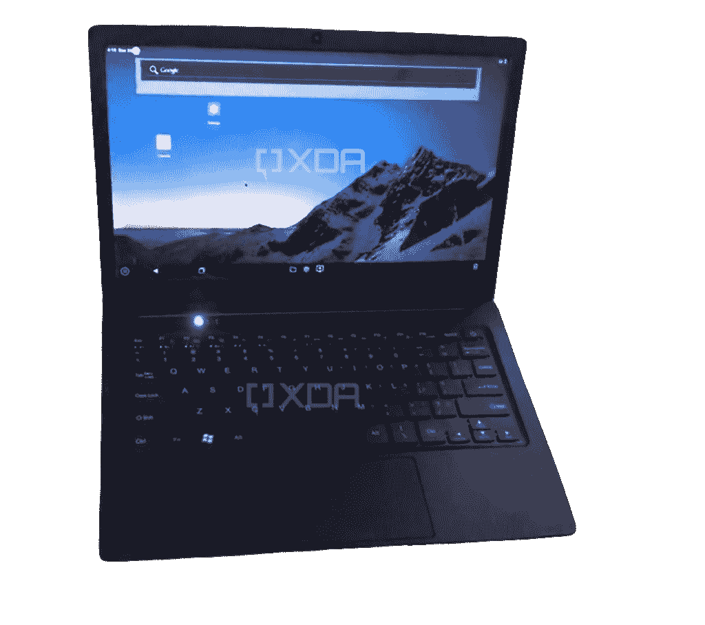

# 独家报道:Reliance 的 JioBook 正在印度测试低价笔记本电脑

> 原文：<https://www.xda-developers.com/jiobook-by-reliance-jio-jioos-rumor/>

我们在 *XDA* 了解到，印度移动网络运营商 Reliance Jio 自 2016 年末公开推出以来经历了[惊人的增长](https://www.xda-developers.com/reliance-jio-crosses-100-million-subscribers-in-india-in-5-months-launches-jio-prime-subscription-plan/)，目前正在开发一款暂定名为 JioBook 的新产品。在销售了数千万台低成本的 JioPhone 设备，为数百万以前使用基本功能手机的印度人带来了 4G LTE 之后，Jio 可能正在寻求通过提供一种屏幕更大的设备来支持其不断增长的数字服务，这种设备可以通过蜂窝连接访问这些服务。

2018 年初，高通科技公司产品管理高级总监米盖尔·努内斯(Miguel Nunes)告诉 [*《经济时报》*](https://telecom.economictimes.indiatimes.com/news/reliance-jio-in-talks-with-qualcomm-to-launch-laptops-with-cellular-connectivity/63713226) ，这家美国芯片制造商已经与 Reliance Jio 举行了会谈，以推出具有蜂窝连接功能的笔记本电脑。近三年后，Jio 似乎终于开发出了基于高通硬件的产品，但使用的组件和软件与最初讨论的有所不同。

JioBook 似乎运行的是谷歌的 Android 操作系统，而不是运行 Windows 10 的笔记本电脑。根据 XDA 审核的固件，Jio 可能将其 Android 分支命名为“JioOS”。为了降低成本，Jio 的原型笔记本电脑目前使用高通的骁龙 665 (sm6125)，这是一种 11 纳米芯片组，[在 2019 年初](https://www.xda-developers.com/qualcomm-snapdragon-665-snapdragon-730g/)宣布。该芯片组采用内置的 4G LTE 调制解调器——骁龙 X12——JioBook 可能会利用它为 Reliance Jio 庞大的 4G 网络提供蜂窝连接。

根据 XDA*审阅的文件，Jio 正在与总部位于中国的[blue bank Communication Technology](http://www.bluebank.com.cn/)合作开发该产品，blue bank Communication Technology 是一家为第三方开发移动设备和软件的工程公司。在其网站上，Bluebank [自豪地提到了](http://www.bluebank.com.cn/osproduct)其开发运行 KaiOS 的产品，KaiOS 是一种功能手机的移动操作系统，并包括 Reliance 两代 JioPhone 的图片。*

根据我们审查的文件，JioBook 的开发始于 2020 年 9 月初，预计将持续到 2021 年上半年。在产品开发周期的 EVT(即工程验证测试)阶段，JioBook 有未完成的硬件，包括一个含有 Windows 键的回收键盘，正如下面由 *XDA* 获得的现场图像所示。到 4 月中旬，该产品预计将进入产品开发周期的 PVT 或产品验证测试阶段，因此其当前的设计可能比下图更接近最终的硬件。特别是，Windows 密钥很可能会被替换为更适合该产品和软件的密钥，尽管我们不知道它会被替换为什么。

 <picture></picture> 

A photograph of the Reliance JioBook prototype in the EVT stage of the product development cycle

在深入研究笔记本电脑的固件时，我们发现了 PC 将拥有 1366x768 分辨率显示屏的证据，尽管我们不知道实际显示屏的大小。

Bluebank 在开发过程中测试了 JioBook 的几个迭代，包括一个配有 2GB lpddr 4x 内存和 32GB eMMC 存储的模型，以及后来一个配有 4GB lpddr 4x 内存和 64GB eMMC 5.1 存储的模型。Bluebank 和 Reliance Jio 似乎正在从各种供应商那里采购低成本组件，最著名的是三星的移动 DRAM 和 NAND 芯片，以及高通的骁龙 665。根据用于 PCB 的组件列表，笔记本电脑可能有一个用于视频输出的迷你 HDMI 连接器，支持超过 2.4 和 5GHz 频率的 WiFi，蓝牙，三轴加速度计和高通音频芯片。

PC 目前运行的是干净的 Android 10 版本，在发布之前不太可能会切换到 ARM 上的 Windows 10。高通和微软只在少数骁龙芯片组上支持 ARM 上的 Windows 10，但骁龙 665 不在其中。JioBook 可能会采用骁龙 665 和 Android 来降低成本，这可能解释了为什么目前没有安装谷歌应用程序。预装谷歌的应用程序套件需要一个许可证来分发谷歌移动服务，这是许多供应商愿意支付的成本，但确实略微增加了产品的价格。正如你所料，笔记本电脑的固件预装了大量 Jio 应用程序，包括 JioStore、JioMeet、JioPages 和 Jio 的广告服务。有趣的是，还预装了几款来自微软的应用，包括微软团队、Edge 和 Office。不过，我们不知道这些应用是否会在生产硬件上发布。

虽然我们通过对电脑固件的分析发现了“JioBook”品牌，但我们并不确定该产品是否会以这个名字发布。不过，JioBook 品牌将与 Reliance 的其他 Jio 品牌产品相匹配，包括最畅销的 JioPhone。我们不知道该产品将于何时发布，但 XDA 查看的时间表显示，组装可能在五月中旬左右进行。

当它上市时，我们预计它的零售价格会非常低，尽管我们不知道会有多低。鉴于 Jio 作为移动网络运营商在印度的主导地位及其销售入门级硬件的记录，JioBook 很有可能在寻求购买第一台个人电脑的价格敏感型消费者中获得关注。让数百万印度新消费者手中拥有更大屏幕的设备，有可能将 Jio 的数字服务在采用方面提升到一个新的水平，这可能是他们推出这款产品的目标。