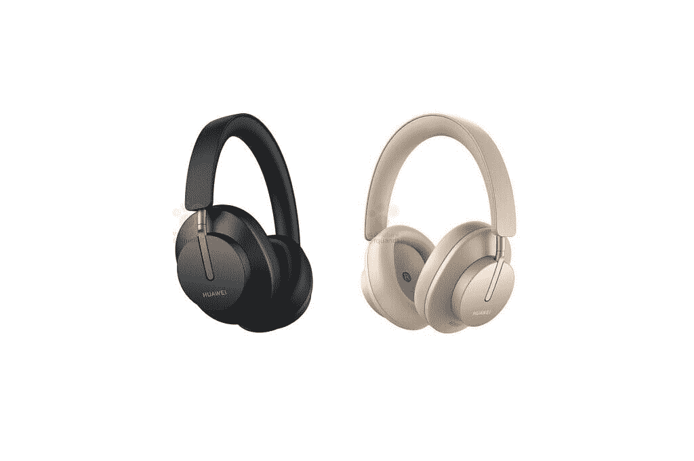

# 加入华为社区如何赢取免费华为赠品

> 原文：<https://www.xda-developers.com/join-huaweis-community/>

华为有一个强大而活跃的用户社区，他们喜欢在线分享和讨论不同的话题。这是一个开发者、用户、艺术家、创作者和摄影师的地方。凡是使用华为产品的人，都会在[华为官方论坛](https://consumer.huawei.com/en/community/?utm_source=xda&utm_medium=content&utm_campaign=captain_league)里找事情聊。现在，用户有机会通过加入这个伟大的社区赢得一些免费的华为赠品。

除了作为社区一员的所有好处之外，你还可以通过成为队长联盟的一员赢得一些免费的东西。这个项目是为了让最热心的成员在社区中扮演更重要的角色。在队长联盟中，有以下职位的角色:

*   调解人
*   内容团队
*   社会管理

在改善华为社区的过程中，每个角色都扮演着特殊的角色。你可以在这里了解更多关于这些角色，以及如何加入队长联盟[。](https://consumer.huawei.com/en/community/details/Join-the-Huawei-Community-Captain-League-/topicId_149997/?utm_source=xda&utm_medium=content&utm_campaign=captain_league)

参加这个项目有很多好处。成为团队成员之一，意味着你将与全球最有才华的华为粉丝密切合作；并将与官方社区团队进行日常沟通。此外，它还意味着独家访问新产品、线下活动和官方推广您的内容！

 <picture></picture> 

Huawei FreeBuds Studio

想要赢得华为免费工作室的机会吗？你所要做的就是 [**从脸书上的** **华为社区**](https://www.facebook.com/HUAWEICommunityGlobal/?utm_source=xda&utm_medium=content&utm_campaign=captain_league) 转贴这个帖子。你将参加抽奖，有机会赢得一副免费的精美耳机。

###### 我们感谢华为赞助这篇文章。我们的赞助商帮助我们支付与运行 XDA 相关的许多费用，包括服务器成本、全职开发人员、新闻撰稿人等等。虽然您可能会在门户内容旁边看到赞助内容(这些内容将始终被标记为赞助内容),但门户团队对这些帖子不承担任何责任。赞助内容、广告和 XDA 仓库完全由一个独立的团队管理。XDA 绝不会通过接受金钱来赞扬一家公司，或以任何方式改变我们的观点或看法，从而损害其新闻诚信。我们的意见不能被收买。