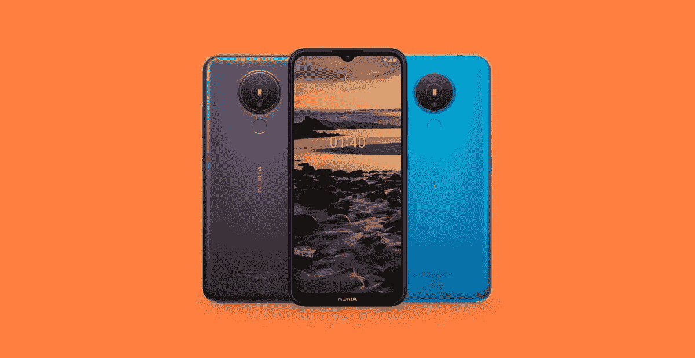
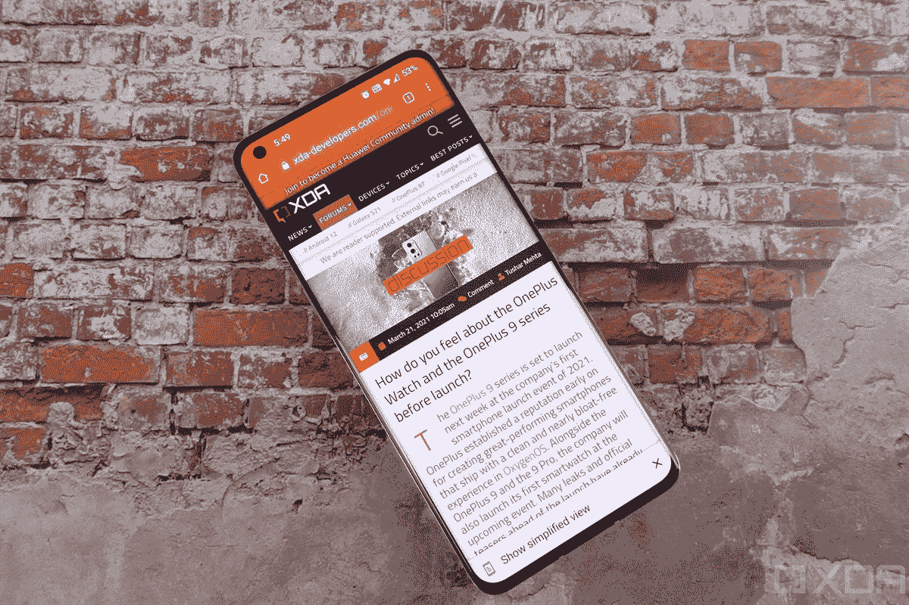

# 两起高调离职事件动摇了一加和 HMD Global

> 原文：<https://www.xda-developers.com/juho-sarvikas-leaves-hmd-global-kyle-kiang-leaves-oneplus/>

HMD Global 和一加是目前智能手机行业最重要的两家公司。两家公司都没有超过十年的历史，但 HMD Global 已经成功开拓了一个利基市场，销售搭载类似安卓系统的廉价手机，而一加则把目光投向了高端手机。然而，两家公司现在都在失去关键高管，这可能表明战略转变可能正在进行中。

HMD Global 的首席产品官 Juho Sarvikas 周五宣布，他已经做出了艰难的决定，是时候继续前进了。自诺基亚品牌安卓手机制造商 HMD Global 成立以来，萨尔维卡斯(上图)一直是该公司最杰出的人物之一。

Sarvikas 于 2016 年作为创始成员加入 HMD Global，担任首席产品官，领导 HMD 的工程、设计和营销团队。他后来成为 HMD Global 北美业务的副总裁，同时继续担任首席财务官。在加入 HMD Global 之前，他在微软工作，担任诺基亚功能手机业务的负责人，此前他在诺基亚最初的手机部门工作了八年，担任过各种管理职务。他还没有表明他下一步将在哪里工作。

 <picture></picture> 

The Nokia 1.4, launched in February.

与此同时，一加公司的另一位高管即将离开公司:首席营销官 Kyle Kiang(通过 [*输入*](https://www.inputmag.com/tech/oneplus-cmo-kyle-kiang-is-leaving-company-in-a-few-weeks) )。这则新闻是在[一加 9 系列](https://www.xda-developers.com/oneplus-9/)和[一加手表](https://www.xda-developers.com/oneplus-watch-launch/)曝光后不久爆出的。Kiang 自 2015 年起在一加工作，先是担任全球营销主管，然后自 2019 年起担任首席营销官。2017 年至 2019 年，他还担任该公司北美地区的总经理。在加入一加之前，他曾在 LG 和百事可乐从事营销工作。

在过去的几个月里，一加已经出现了其他一些引人注目的离职事件，这表明该公司可能正在向一个新的方向转变。联合创始人之一 Carl Pei 于去年离开了一加。他现在在总部位于伦敦的初创公司[工作，名为 Nothing](https://www.xda-developers.com/nothing-to-launch-wireless-headphones-this-summer/) ，旨在推出无线耳机和其他科技产品。几位高层沟通成员也在 2020 年离开了一加。

 <picture></picture> 

The OnePlus 9 Pro

目前还不清楚萨尔维卡斯离开 HMD Global 会对该公司的产品计划产生什么影响，不过重组可能正是 HMD 所需要的。HMD Global 效仿了摩托罗拉的策略，以相似的价格不断发布智能手机，其中许多手机在竞争中并不突出。该公司最近的高端手机是[诺基亚 8 V 5G UW](https://www.xda-developers.com/nokia-8-v-5g-uw-verizon-launch/) ，这是威瑞森在美国的独家手机，原价为 700 美元(尽管有一个中档骁龙 765G 芯片组)[只有一个承诺的操作系统更新](https://www.androidpolice.com/2020/11/12/nokia-8-v-5g-uw-review/#:~:text=HMD%20Global%20confirmed)。Android 11 直到 2 月才开始在 HMD Global 的诺基亚阵容[推出。](https://www.xda-developers.com/nokia-8-3-5g-stable-android-11-update/)

一加最近也有一些失误，尽管该公司在旗舰智能手机产品线中仍保持强劲势头。一加 9 和 9 Pro 是其迄今为止最好的手机之一，一加正在扩展新产品类别，如可穿戴设备和电视。然而，很容易提出这样的论点，即一加正在远离其根源——其手机的价格几乎每一代都在上涨，OxygenOS 已经远远偏离了传统的 Android。

我们希望 HMD Global 和一加继续发布高质量和有竞争力的智能手机，因为我们最不需要的就是三星和苹果之间的双头垄断。