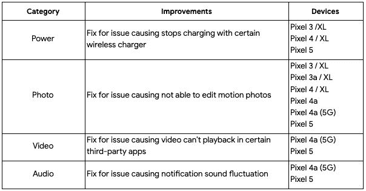

# 2021 年 6 月谷歌 Pixel 手机安全更新上线

> 原文：<https://www.xda-developers.com/june-2021-android-security-update/>

今天是 2021 年 6 月的第一个星期一，这意味着是时候发布新的 Android 安全公告了。按照计划，谷歌已经发布了 2021 年 6 月的 Android 安全公告。他们还开始推出当前支持的 Pixel 手机的新更新，尽管作为一个奖励，Pixel 手机的最新更新也带来了最新的 Pixel 功能下降。

## 2021 年 6 月安全更新公告

2021 年 6 月的 Android 安全公告(可在此处查看)详细列出了严重程度从高到严重的多个安全漏洞。正如我们在过去所看到的，许多被披露的漏洞并没有提供额外的文档来解释受影响的内容以及补丁如何解决问题。你可以在这里阅读每月的 Android 安全更新如何工作[。](https://www.xda-developers.com/how-android-security-patch-updates-work/)

## 像素更新公告/功能更新

除了在一般的 Android 安全更新公告中提供有关漏洞的信息，谷歌还在为 Pixel 设备推出的更新中添加了新功能。像素功能每 3 个月推出一次，所以最新的每月更新比平时更令人兴奋。

只要你拥有当前支持的型号之一，你就应该从今天开始在你的 Pixel 设备上获得 2021 年 6 月的安全更新[。这包括像素 3、像素 3×1、像素 3a、像素 3a×1、像素 4、像素 4×1、像素 4a、像素 4a×5 和像素 5。以下是每个像素设备的内部版本号:](https://support.google.com/pixelphone/thread/112711167/google-android-pixel-security-update-june-2021?hl=en)

*   像素 3 (XL): RQ3A.210605.005
*   像素 3a (XL): RQ3A.210605.005
*   像素 4 (XL): RQ3A.210605.005
*   像素 4a: RQ3A.210605.005
*   像素 4a (5G): RQ3A.210605.005
*   像素 5: RQ3A.210605.005

 ** [像素工厂图像](https://developers.google.com/android/images)**| |**|[像素 OTA 图像](https://developers.google.com/android/ota)**

三星已经开始向几款 Galaxy 设备推出 2021 年 6 月的安全补丁[，其他智能手机原始设备制造商可能会很快跟进。](https://www.xda-developers.com/samsung-june-2021-galaxy-s21-galaxy-20-galaxy-z-flip-5g/)