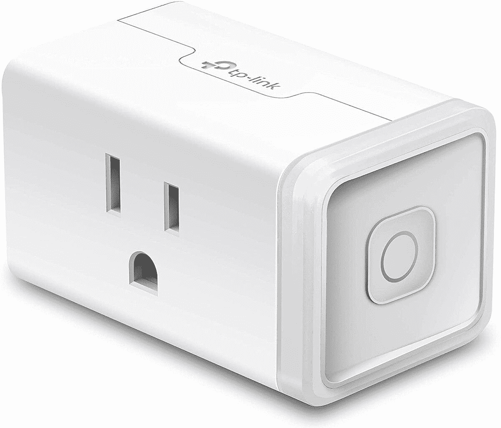

# 只需 12 美元，就能为您的智能家居购买一台 Kasa 智能插头迷你电脑

> 原文：<https://www.xda-developers.com/kasa-smart-plug-mini-deal/>

智能家居可以很棒。你可以看到门外的东西，轻松地开关灯，还有更多取决于你愿意投资的东西。智能家居产品有很多[，但智能家居中必不可少的是智能插头！除非你想花太多的钱用智能灯替换你完美的普通灯。但这并不十分划算，而 Kasa Smart Plug Mini 仅售 12 美元。](https://www.xda-developers.com/best-smart-home-gifts-under-100/)

没有什么特别要说的 Kasa 智能插头迷你-这是一个智能插头！你把它插到电源插座上，然后插入你选择的不太智能的东西，这样你就可以控制它了。你最常使用的物品是你的灯，所以你可以使用智能插头随意开关，但也有其他物品可以使用它！由于 Kasa Smart Plug Mini 与 Alexa、Google Assistant 和 Cortana 兼容，因此使用大多数标准智能集线器设置它不会有任何问题。

即使你还没有设法拥有一个智能家居中枢，你也可以通过 Kasa 应用程序控制 Kasa 智能插头迷你。因此，如果你想要的只是远程关闭客厅灯的能力，而不需要其他智能家居的花里胡哨，你只需拿起这个智能插头就可以了！

Woot 提供 12 美元的低价！亚马逊旗下的。所以，如果你有亚马逊 Prime，就可以免运费。这项交易的唯一问题是每位顾客只能购买一台！但是，好吧，如果你有其他人不介意为你抢一个，你将能够很快进货。

 <picture></picture> 

Kasa Smart Plug HS103

##### Kasa 智能插头迷你

需要智能插头吗？今天就去 Woot 买一个吧！仅售 12 美元！那是便宜货，但对顾客来说只是一件。

你最喜欢的智能家居物品是什么？请在评论中告诉我们！