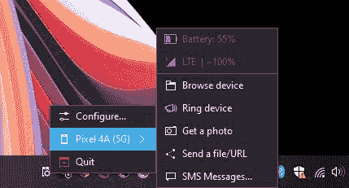

# KDE 连接现在可以将安卓手机连接到 Windows 电脑

> 原文：<https://www.xda-developers.com/kde-connect-windows-and-mac-release/>

# KDE 连接现在可以将您的 Android 手机链接到您的 Windows PC

KDE 连接，一个让你把你的 Linux 电脑和安卓手机连接起来的工具，现在已经可以在 Windows 和 macOS 上使用了。

KDE 连接，一个让你把你的 Linux 电脑和安卓手机连接起来的免费工具，现在已经可以在 Windows 和 macOS 上使用了。在概念上，KDE 连接非常类似于微软的[你的手机](https://www.xda-developers.com/microsoft-your-phone-app-device-indicators/)应用和推推。您可以在手机和 PC 之间共享文件、接收通知、检查手机电池电量、共享剪贴板内容等等。然而，真正让它从微软你的手机和其他[类似服务](https://www.xda-developers.com/join-3-0-new-website-desktop-app-local-network/)中脱颖而出的是它的高级功能。例如，你可以将手机屏幕用作电脑的触摸板。它甚至可以让你从手机上执行自定义命令来控制各种计算机状态(重启、休眠、关机等)。).

 <picture></picture> 

Photo courtesy: *Liliputing*

如此多的 Linux 用户已经在使用 KDE 连接，如果你想在你的 Windows 或 macOS PC 上使用它，你终于可以(通过[*Liliputing*](https://liliputing.com/2021/07/kde-connect-now-supports-windows-as-well-as-linux-and-macos-link-your-phone-to-your-pc.html)*)*。KDE 连接的初始版本现在可以和二进制包一起用于 Windows。macOS 用户的道路有点艰难，因为还没有 macOS 的 KDE 连接的官方版本。用户将不得不自己从源代码中构建应用程序。如果这不是问题，您可以在这里找到构建说明。与此同时，Windows 用户可以通过[这个链接](https://www.microsoft.com/en-us/p/kde-connect/9n93mrmsxbf0?&activetab=pivot:overviewtab)从微软商店下载 KDE 连接的测试版，并在这里找到最新的二进制文件[。](https://binary-factory.kde.org/job/kdeconnect-kde_Release_win64/lastSuccessfulBuild/artifact/)

由于 KDE 连接在 iOS 上不可用，Mac 用户将需要一个 Android 或运行 SailfishOS 或 Plasma Mobile 的手机。

以下是当您连接手机和 PC 时，使用 KDE 连接可以执行的操作

*   共享剪贴板:在设备之间复制和粘贴
*   浏览远程文件系统
*   远程输入:将手机屏幕用作电脑的触摸板
*   通知同步:从桌面管理您的 Android 通知
*   暂停音乐:当您接到电话时，自动暂停或静音所有媒体
*   URL/文件共享:传输和共享任何 URL
*   多媒体遥控器:将您的手机用作媒体播放器的遥控器
*   演示遥控器:控制演示(连同一个指针)，只需使用您的手机
*   端到端 TLS 加密:您的信息是安全的
*   WiFi 连接:无需 USB 线或蓝牙
*   在桌面上远程运行自定义命令
*   拨打您的电话以快速找到它
*   在桌面上读取手机的电池和信号强度