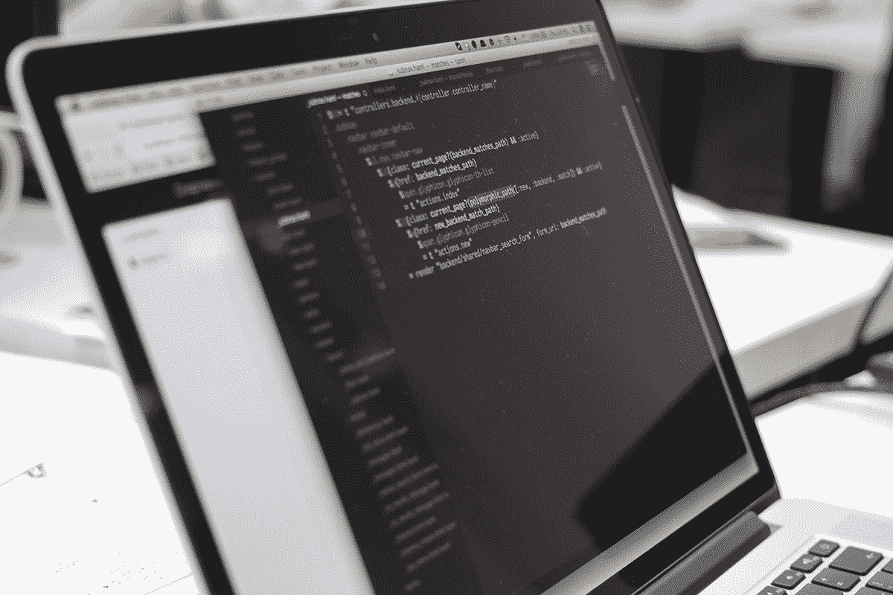
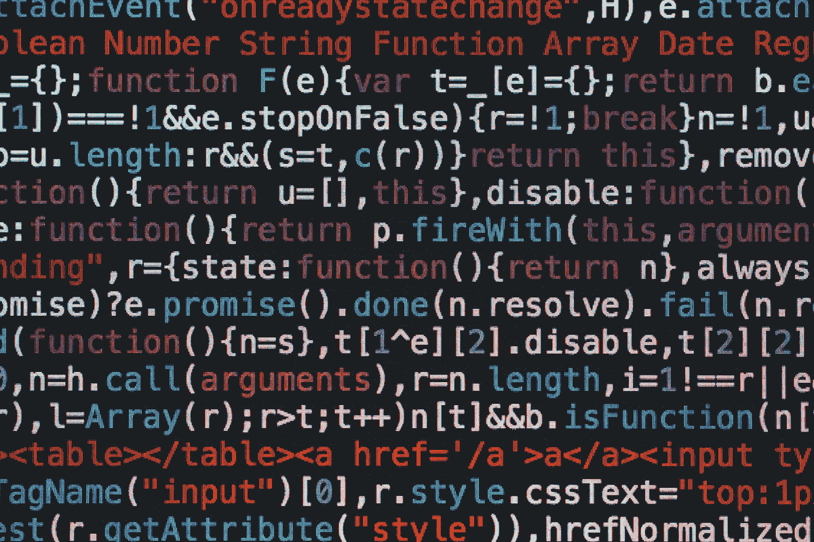

# 学习 Android 开发及更多内容，这些培训套餐最高可享受 98%的优惠

> 原文：<https://www.xda-developers.com/learn-android-development-and-more-with-up-to-98-off-these-training-bundles/>

无论你是在考虑开始新的职业生涯，还是只想尝试一些周末项目，学习新技能都是明智之举。你可以在 XDA Developers Depot 找到关于 Android 开发、数据等的顶级培训——现在比原价低 98%。

## **1)完整的安卓棉花糖开发教程**

****

这个 15 小时的课程将向您展示如何构建适用于任何现代设备的 Android 应用程序。在这个过程中，你会发现如何使用关键工具并坚持材料设计原则。你还可以为手机和可穿戴设备开发五个项目应用。

花费 15 美元获得 [完整的安卓棉花糖开发课程](https://depot.xda-developers.com/sales/the-complete-android-marshmallow-development-course?utm_source=xda-developers.com&utm_medium=referral&utm_campaign=the-complete-android-marshmallow-development-course&utm_term=scsf-485966&utm_content=a0x1P000004exQHQAY&scsonar=1) (注册 147 美元)，节省了 89%。

## **2) Kotlin for Android:从初级到高级**

虽然 Java 仍在使用，但 Kotlin 是用于 Android 开发的令人兴奋的新语言。这门课程通过 22.5 小时的视频教程帮助你掌握这门语言。从编写第一个代码到向 Play Store 提交应用程序，您可以获得完整的演练。

花费 19 美元获得 [Kotlin for Android:初级到高级](https://depot.xda-developers.com/sales/kotlin-for-android-beginner-to-advanced-2?utm_source=xda-developers.com&utm_medium=referral&utm_campaign=kotlin-for-android-beginner-to-advanced-2&utm_term=scsf-485965&utm_content=a0x1P000004exQHQAY&scsonar=1)(reg。199 美元)，节省了 90%。

## **3)完整的 2021 年微软 Azure 认证准备包**

****

Azure 是发展最快的云计算平台之一，这个捆绑包可以帮助你成为认证专家。你总共可以获得 10 门全长课程，涵盖云应用、机器学习、大数据等。一半的课程都是为了获得微软的官方认证。

花费 39 美元获得 [完整的 2021 年微软 Azure 认证预备包](https://depot.xda-developers.com/sales/the-complete-2020-microsoft-azure-certification-prep-bundle-2?utm_source=xda-developers.com&utm_medium=referral&utm_campaign=the-complete-2020-microsoft-azure-certification-prep-bundle-2&utm_term=scsf-485948&utm_content=a0x1P000004exQHQAY&scsonar=1) (注册 1839 美元)，节省了 97%。

## **4)2021 年安卓开发电子书&视频课程超级捆绑**

****

结合 46 个小时的视频教程和 6 本电子书，这个 2021 捆绑包将带你进入 Android 开发的前沿。培训涵盖 Java、Firebase、Spring 和其他关键工具，帮助您构建应用程序和游戏。你可以向像布兰登·琼斯这样的老师学习，他是辛辛那提大学的兼职助理教授。

获得[2021 Android 开发电子书&视频课程超级捆绑](https://depot.xda-developers.com/sales/the-2021-android-development-ebook-video-course-bundle?utm_source=xda-developers.com&utm_medium=referral&utm_campaign=the-2021-android-development-ebook-video-course-bundle&utm_term=scsf-485967&utm_content=a0x1P000004exQHQAY&scsonar=1) 售价 29.99 美元(reg。880 美元)，节省了 96%。

## **5)完整的 Android 11 开发者捆绑包**

****

如果你想专注于视频培训，这个 Android 11 捆绑包提供了 38 小时的 Kotlin、Java、Firebase、网络、设计等内容。每门课程都从基础开始，即使你没有开发经验，也能帮助你提高。

花费 39.99 美元获得 [完整的 Android 11 开发者捆绑包](https://depot.xda-developers.com/sales/the-complete-android-11-developer-bundle?utm_source=xda-developers.com&utm_medium=referral&utm_campaign=the-complete-android-11-developer-bundle&utm_term=scsf-485968&utm_content=a0x1P000004exQHQAY&scsonar=1)(reg。2200 美元)，节省了 98%。

## **6)2021 年高级 Python 认证训练营捆绑包**

****

从机器学习到道德黑客，这个包帮助你掌握 Python 编程和这种语言能做的所有事情。通过 13 门课程和 41 个小时的内容，你从编写第一行代码到制作人工智能软件和网络自动化。

花费 34.99 美元获得[2021 年高级 Python 认证训练营捆绑包](https://depot.xda-developers.com/sales/the-2021-premium-python-certification-bootcamp-bundle?utm_source=xda-developers.com&utm_medium=referral&utm_campaign=the-2021-premium-python-certification-bootcamp-bundle&utm_term=scsf-485972&utm_content=a0x1P000004exQHQAY&scsonar=1)(reg。2585 美元)，节省了 98%。

## **7)一体化 Microsoft Excel 认证培训包**

****

现在对数据技能的需求非常大，这 10 门课程可以帮助你成为 Excel 专家。您将获得 50 小时的视频教程，向您展示如何使用函数、公式、宏、数据透视表等等。该捆绑包还涵盖了数据科学、分析等内容。

花费 33.99 美元获得 [微软 Excel 认证培训套装](https://depot.xda-developers.com/sales/the-all-in-one-microsoft-excel-certification-training-bundle?utm_source=xda-developers.com&utm_medium=referral&utm_campaign=the-all-in-one-microsoft-excel-certification-training-bundle&utm_term=scsf-485969&utm_content=a0x1P000004exQHQAY&scsonar=1) (注册号 2000 美元)，节省了 98%。

****

说到数据——这个包向你展示了如何通过创建数字运算算法来盈利。通过 10.5 小时的培训，学习如何通过 Python 利用机器学习，并通过统计套利在加密货币上获利。这些课程的平均评分为 4.1 星。

以 144.99 美元的价格获得 [加密交易捆绑包](https://depot.xda-developers.com/sales/quantitative-crypto-trading-strategies-for-intermediate-to-advanced-learners-course-bundle?utm_source=xda-developers.com&utm_medium=referral&utm_campaign=quantitative-crypto-trading-strategies-for-intermediate-to-advanced-learners-course-bundle&utm_term=scsf-485970&utm_content=a0x1P000004exQHQAY&scsonar=1) 的量化方法(reg。577 美元)，节省了 74%。

## **9)完整的 2021 超级明星自由职业者套装**

****

想摆脱你的工作吗？这 13 门课程帮助你建立一个自由职业生涯，从簿记到数字营销。除了寻找客户、管理资金和在家保持高效工作的建议之外，这本书里还有几个商业点子。

获得[2021 年超级巨星自由职业者套装](https://depot.xda-developers.com/sales/the-complete-2021-superstar-freelancer-bundle?utm_source=xda-developers.com&utm_medium=referral&utm_campaign=the-complete-2021-superstar-freelancer-bundle&utm_term=scsf-485971&utm_content=a0x1P000004exQHQAY&scsonar=1) 只需 39.99 美元(reg。2587 美元)，节省了 98%。

*价格随时变化*