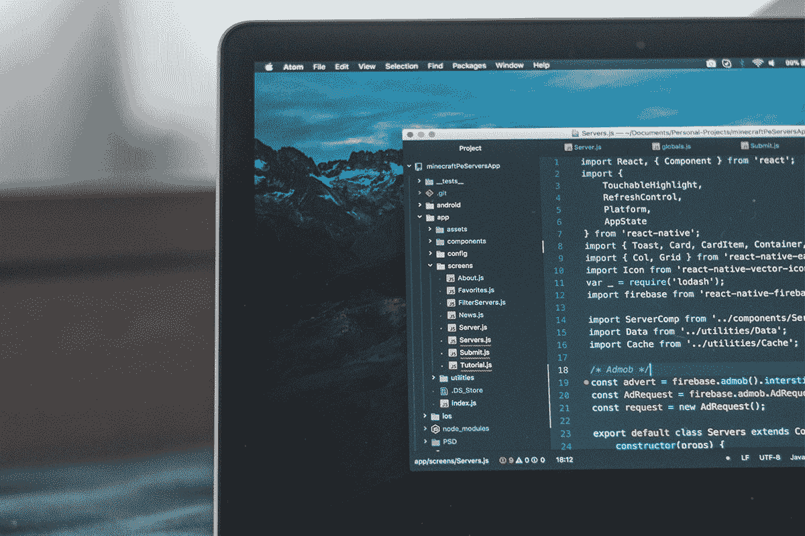
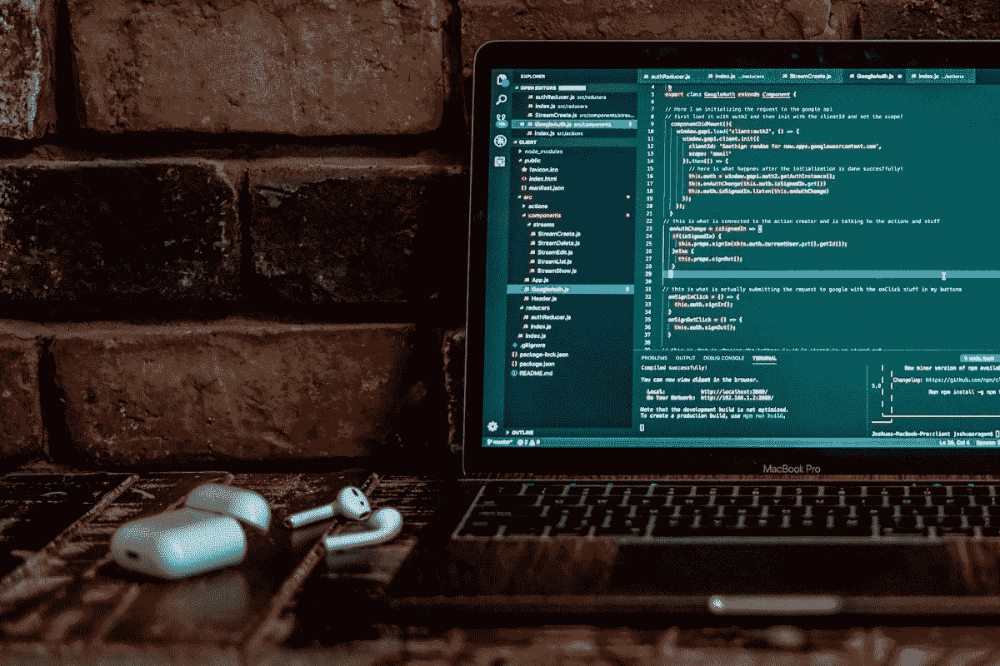
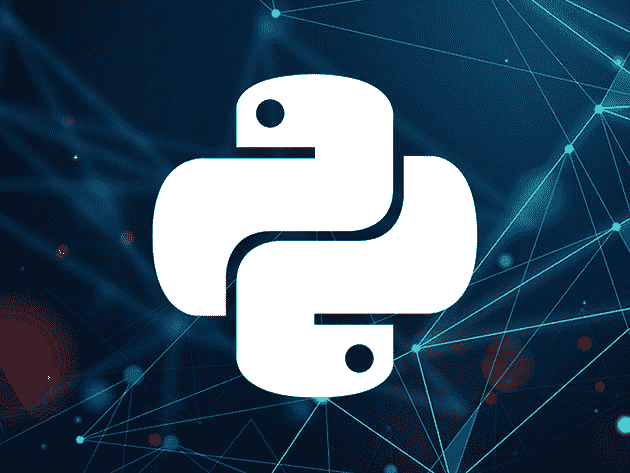
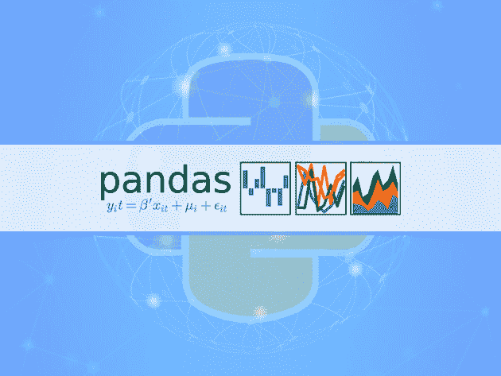

# 从零开始学习 Python:本周出售的顶级课程

> 原文：<https://www.xda-developers.com/learn-python-from-scratch-top-courses-on-sale-this-week/>

大多数计算机科学专业的学生在大一的时候都会学习 Python。为什么？因为这种语言简单易学，用途非常广泛。如果你想探索人工智能或钻研数据，这些 Python 课程可以帮助你开始——现在在 XDA 开发者仓库有超过 90%的折扣。

## **Python 初学者:Python 开发的基础知识**

****

对 Python 完全陌生？ [本课程](https://depot.xda-developers.com/sales/python-for-beginners-the-basics-for-python-development?utm_source=xda-developers.com&utm_medium=referral&utm_campaign=python-for-beginners-the-basics-for-python-development&utm_term=scsf-440913&utm_content=a0x1P000004YZ08QAG&scsonar=1) 是一个很好的起点。通过 13 个视频教程，您将学习该语言如何工作以及如何使用基本功能。该课程评级为 4.2 星，通常为 199 美元——但你今天可以花 14.99 美元买到。

## **用 Python 编码:对有抱负的开发人员的终极培训包**

****

如果你想让你的技能更上一层楼， [这个捆绑包](https://depot.xda-developers.com/sales/the-2020-ultimate-learn-to-code-python-bundle?utm_source=xda-developers.com&utm_medium=referral&utm_campaign=the-2020-ultimate-learn-to-code-python-bundle&utm_term=scsf-440914&utm_content=a0x1P000004YZ08QAG&scsonar=1) 提供了顶级导师(包括罗布·帕西瓦尔)91 小时的基础培训。通过六门对初学者友好的课程，您将学习如何构建 web 应用程序、使用 API、自动化软件测试等等。该培训价值 691 美元，但您只需花费 49.99 美元 即可获得 [。](https://depot.xda-developers.com/sales/the-2020-ultimate-learn-to-code-python-bundle?utm_source=xda-developers.com&utm_medium=referral&utm_campaign=the-2020-ultimate-learn-to-code-python-bundle&utm_term=scsf-440914&utm_content=a0x1P000004YZ08QAG&scsonar=1)

## **完整的 Python 电子书&视频课程捆绑**

****

从 AI 到数据分析，你可以用 Python 做很多事情。 [这个捆绑包](https://depot.xda-developers.com/sales/the-complete-python-ebook-video-course-bundle?utm_source=xda-developers.com&utm_medium=referral&utm_campaign=the-complete-python-ebook-video-course-bundle&utm_term=scsf-440915&utm_content=a0x1P000004YZ08QAG&scsonar=1) 帮助你探索各种可能性，包含五门课程和五本电子书，分别关于机器学习、数据科学、算法等。 [总价值 776 美元，内容现在只需 29.99 美元](https://depot.xda-developers.com/sales/the-complete-python-ebook-video-course-bundle?utm_source=xda-developers.com&utm_medium=referral&utm_campaign=the-complete-python-ebook-video-course-bundle&utm_term=scsf-440915&utm_content=a0x1P000004YZ08QAG&scsonar=1) 与此成交。

## **Epic Python 开发者认证包**

****

[这个捆绑包](https://depot.xda-developers.com/sales/the-epic-python-developer-certification-bundle?utm_source=xda-developers.com&utm_medium=referral&utm_campaign=the-epic-python-developer-certification-bundle&utm_term=scsf-440916&utm_content=a0x1P000004YZ08QAG&scsonar=1) 是任何想要掌握 Python 的人的终极资源。通过 12 门课程和 91 个小时的视频教学，您可以深入了解 Python 编程、机器学习、网络、数据科学、攻击性测试等等。 [今天下单 39.99 美元](https://depot.xda-developers.com/sales/the-epic-python-developer-certification-bundle?utm_source=xda-developers.com&utm_medium=referral&utm_campaign=the-epic-python-developer-certification-bundle&utm_term=scsf-440916&utm_content=a0x1P000004YZ08QAG&scsonar=1) 即可获得全部 1081 个教程，价值 1794 美元。

## **完整的 2020 Python 编程认证包**

****

现在很多 Python 编程工作都专注于数据科学和机器学习。 [这个捆绑包](https://depot.xda-developers.com/sales/the-complete-2020-python-programming-certification-bundle?utm_source=xda-developers.com&utm_medium=referral&utm_campaign=the-complete-2020-python-programming-certification-bundle&utm_term=scsf-440917&utm_content=a0x1P000004YZ08QAG&scsonar=1) 专注于这些主题，有 12 个关于当今使用的最流行的工具和框架的课程——包括 Keras、Pandas、PyTorch 等等。价值 2358 美元的 [培训现在只需 49.99 美元](https://depot.xda-developers.com/sales/the-complete-2020-python-programming-certification-bundle?utm_source=xda-developers.com&utm_medium=referral&utm_campaign=the-complete-2020-python-programming-certification-bundle&utm_term=scsf-440917&utm_content=a0x1P000004YZ08QAG&scsonar=1) 就有了这笔交易。

## **完整的 Python 数据科学包**

****

通过 12 门实践课程， [这一捆绑](https://depot.xda-developers.com/sales/the-complete-python-data-science-bundle?utm_source=xda-developers.com&utm_medium=referral&utm_campaign=the-complete-python-data-science-bundle&utm_term=scsf-440918&utm_content=a0x1P000004YZ08QAG&scsonar=1) 为有志成为数据科学家的人提供了完美的教育。它包括 35 个小时的内容，教程基于熊猫，火花，Plotly，NumPy 和更多的实际例子。通常售价 1189 美元， [这些课程现在只要 37 美元](https://depot.xda-developers.com/sales/the-complete-python-data-science-bundle?utm_source=xda-developers.com&utm_medium=referral&utm_campaign=the-complete-python-data-science-bundle&utm_term=scsf-440918&utm_content=a0x1P000004YZ08QAG&scsonar=1) 。

*价格随时变化*