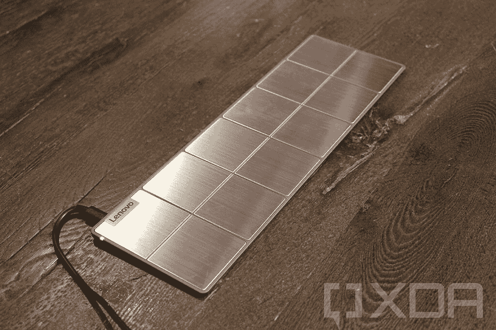
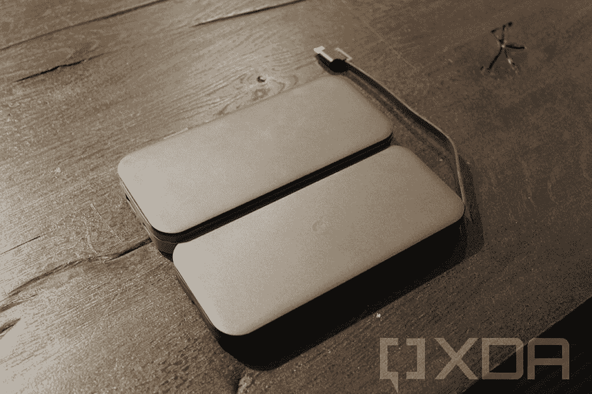
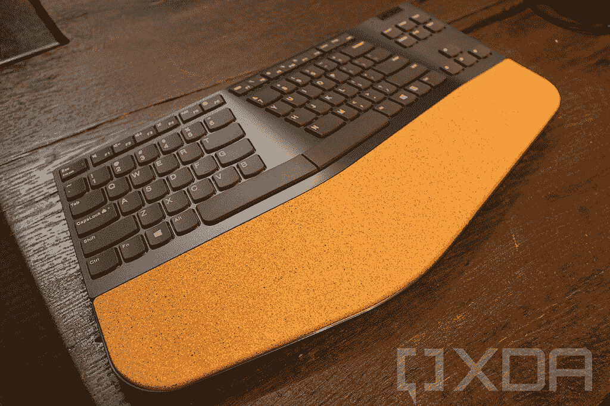

# 联想的新配件包括一个笔记本电脑无线充电器

> 原文：<https://www.xda-developers.com/lenovo-accessories-includes-wireless-charger-laptops/>

上个月，联想[宣布了其新的联想 Go 品牌配件](https://www.xda-developers.com/lenovo-portable-usb-c-charger-charge-your-laptop/)。当时只有两款设备，但今天，该公司准备推出一系列产品。不幸的是，直到今年晚些时候他们都不会来了。

 <picture></picture> 

USB-C Wireless Charging Kit pad

名单上最酷的可能是联想 Go USB-C 无线充电套件，它实际上是一个笔记本电脑的无线充电器。之所以称之为套件，是因为它实际上由多个部分组成。有一个插条可以插入笔记本电脑的 USB Type-C 端口，并连接到笔记本电脑的底部。该条与衬垫接触，提供 65W 的功率。

它将于 10 月上市，售价 139.99 美元。

 <picture></picture> 

USB-C Wireless Mobile Power Bank and USB-C Laptop Power Bank

不过，这并不是给你的东西充电的唯一方式。如果你在路上，有 10，000mAh 容量的无线移动电源银行和 20，000mAh 容量的 USB-C 笔记本电脑电源银行。无线手机实际上有无线充电功能，也可以同时给 30W 的设备充电。笔记本电脑的输出功率为 65W。

联想 Go 无线移动电源银行和联想 Go USB-C 笔记本电脑电源银行将分别于 1 月和 7 月上市，售价分别为 69.99 美元和 89.99 美元。

 <picture></picture> 

Wireless Vertical Mouse

接下来是老鼠。联想 Go 配件全阵容有三款。无线多设备鼠标是上个月发布的，它可以让你在多个设备上使用。USB-C 无线鼠标是相当标准的，然后你有无线垂直鼠标，这是为了符合人体工程学。它采用了“握手”设计，正如你从上面的图片中看到的，它的一部分是由软木制成的。

无线多设备鼠标、USB-C 无线鼠标和无线垂直鼠标将分别于 7 月、7 月和 8 月上市，售价分别为 59.99 美元、39.99 美元和 49.99 美元。

 <picture></picture> 

Wireless Split Keyboard

如果你是软木塞的粉丝，这是个大日子。无线分离键盘也利用了这种材料，因为它应该更舒适。旁边是无线数字键盘。

无线分离键盘和无线数字小键盘将于 10 月上市，售价分别为 89.99 美元和 49.99 美元。

只是多了几个联想的配件。该公司正在推出一些具有主动噪声消除功能的耳机，包括有线 ANC 耳机、无线 ANC 耳机和 ANC 入耳式耳机。它们都是为与微软团队合作而设计的。这三款产品都将于 11 月上市，售价分别为 99.99 美元、179.99 美元和 79.99 美元。

最后，我们有联想 Go 技术配件组织者。正如你所看到的，它可以容纳所有需要随身携带的东西，比如钢笔、便携式充电器、鼠标、手机等等。它将于 9 月上市，售价 44.99 美元。