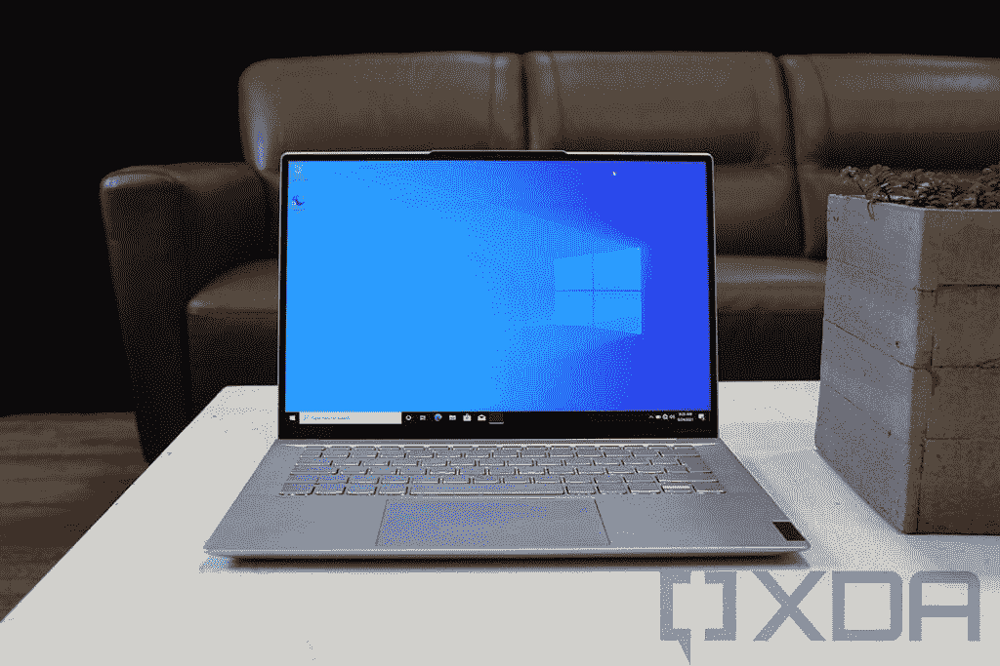
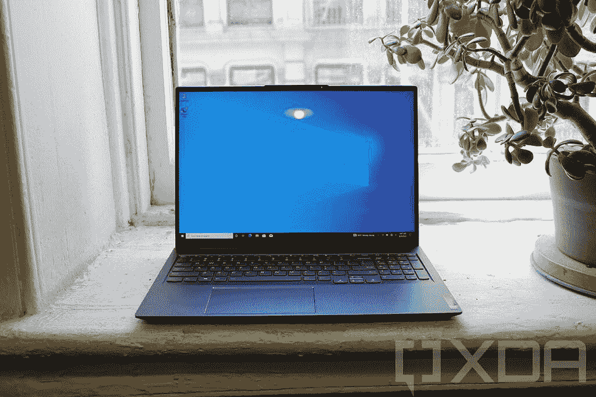

# 联想有一款新的笔记本电脑，配有 14 英寸 90Hz 有机发光二极管显示屏

> 原文：<https://www.xda-developers.com/lenovo-has-a-new-laptop-with-a-14-inch-90hz-oled-display/>

联想今天宣布了两款新的 Windows 11 笔记本电脑。其中包括世界上最轻的 14 英寸有机发光二极管笔记本电脑 IdeaPad Slim 7 Carbon 和 IdeaPad Slim 7 Pro。

但没错，它们是 Windows 11 笔记本电脑。今年 10 月，它们将成为首批搭载微软新操作系统的新电脑。

首先是联想 IdeaPad Slim 7 Carbon，它与 ThinkPad X1 Carbon 一样，由碳纤维和镁制成。毕竟，你可能还记得联想曾经为 X1 Carbon 配备了 14 英寸的有机发光二极管显示屏，是的，IdeaPad Slim 7 Carbon 甚至更轻*2.37 磅*。

 <picture></picture> 

Lenovo IdeaPad Slim 7 Carbon

它也不仅仅是一台有机发光二极管笔记本电脑，因为它的屏幕也是 90Hz。当谈到 Windows 笔记本电脑时，高刷新率往往与游戏有关，这是有充分理由的。他们在比赛时给你优势。然而，它往往被忽视，这为每个人提供了更好的用户体验，正如我们在科技市场的移动端看到的那样。

14 英寸 90Hz 有机发光二极管显示器具有 Delta E < 2 的色彩准确度和 100% DCI-P3 色域。它的亮度为 400 尼特。除此之外，联想 IdeaPad Slim 7 Carbon 还配备了 AMD 锐龙 5000 U 系列处理器，可选 NVIDIA MX450 显卡，最高 16GB LPDDR4x RAM，以及最高 1TB PCIe M.2 SSD。

它将于 10 月上市，起价 1289.99 美元。

 <picture></picture> 

Lenovo IdeaPad Slim 7 Pro

接下来是 IdeaPad Slim 7 Pro，它的尺寸更大，配有 16 英寸 16:10 QHD 显示屏，亮度为 500 尼特，刷新率为 120 赫兹。联想承诺认证的 DisplayHDR 400 和 100% sRGB 色域。此外，触摸板也大了 11%。

这款电脑还配备了 AMD 锐龙 5000 处理器，但芯片是 H 系列，所以功能更强大，它配备了 NVIDIA GeForce RTX 3050 显卡。你可以通过高达 16GB 的双通道 DDR4 RAM 和 1TB 的 PCIe M.2 固态硬盘来获得它。

它有云灰色和风暴灰色两种，起价 1449 美元。

该公司还推出了智能无线耳塞，与充电盒中的电池结合使用可持续 28 小时。由于联想智能配对，它们是第一个支持 Android 和 Windows 快速配对的产品，并且有白色和黑色两种颜色。

联想智能无线耳塞将于第三季度上市，售价为 99.99 美元。