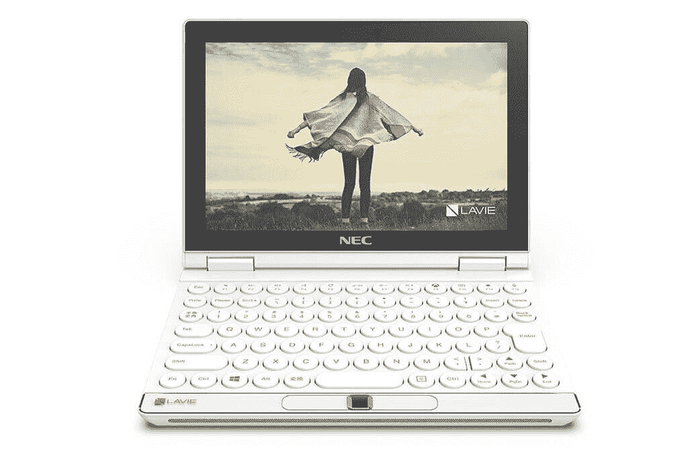
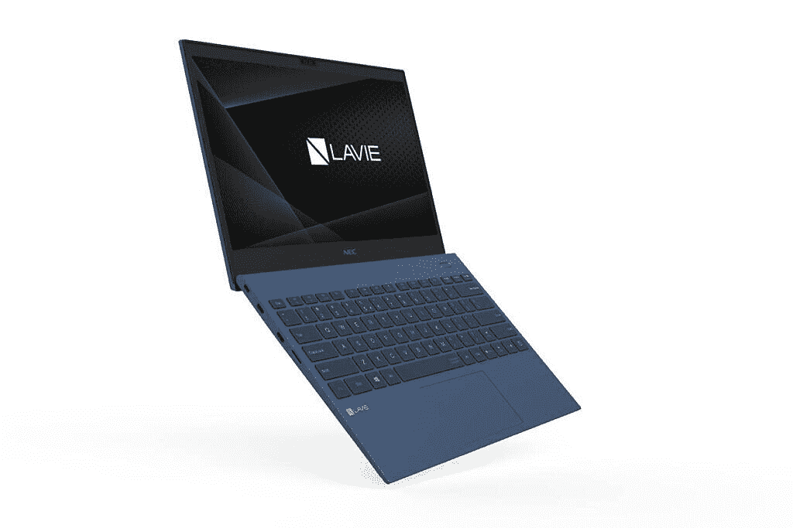

# 联想 LAVIE MINI，LAVIE Pro 移动笔记本电脑在 CES 2021 上发布

> 原文：<https://www.xda-developers.com/lenovo-lavie-mini-pc-lavie-pro-mobile-laptop-launch-ces-2021/>

联想在 2016 年接管了 NEC Corporation 的计算业务，从那以后，它一直在以 LAVIE 品牌销售一些产品。在今年的 CES 2021 上，联想推出了两款 Lavie 品牌的设备 Lavie Mini 和 Lavie Pro Mobile。前者是一款 8 英寸的超移动 PC，而 Lavie Pro Mobile 是一款更传统尺寸的笔记本电脑。这些发布伴随着新的[联想 IdeaPad 5 系列](https://www.xda-developers.com/lenovo-ideapad-5g-ideapad-5-pro-ideapad-5i-pro-launch-ces-2021/)、新的 [Yoga 7 AIO 个人电脑、新的显示器](https://www.xda-developers.com/lenovo-yoga-aio-7-pc-l27e30-l24i30-launch-ces-2021/)和新的[联想 Tab P11](https://www.xda-developers.com/lenovo-tab-p11-snadragon-662-launch-ces-2021/) 发布，作为该公司 CES 公告的一部分。

## 洗迷你电脑

Lavie Mini 从技术上来说是一台袖珍电脑，但更像是一台 2 合 1 敞篷概念电脑。该设备采用 8 英寸 WUXGA (1920 x 1200)触摸屏显示器，可配置英特尔第 11 代酷睿 i7 移动处理器和英特尔 Iris Xe 显卡。内部有一个 256GB 的固态硬盘，16GB 的 LPDDR4 内存。LAVIE MINI 的总重量为 579 克，非常容易携带，并配有背光键盘。这款小巧的设备还配有一个红外摄像头，可通过 Windows Hello 无缝登录，最高可配 26 瓦时电池，并带有 Wi-Fi 6。

 <picture></picture> 

NEC LAVIE MINI

该设备配有一个特殊的可选游戏控制器，可以将迷你笔记本电脑转变为任天堂 Switch 风格的便携式游戏控制台。据联想称，这款设备可以处理“高质量的个人电脑游戏，如皇家战役和赛车游戏”。该控制器配备了游戏所需的所有必要按钮和按键，以及振动、左/右触发按钮和模拟拇指操纵杆。而且，就像任天堂 Switch 一样，您可以使用可选的 HDMI 连接坞站在大屏幕上玩游戏。

NEC LAVIE MINI 带游戏控制器

### 定价和可用性

Lavie Mini 目前是一个原型，联想尚未透露任何关于发布或价格的计划。然而，它确实让我们想起了 GDP Win 3 手持游戏电脑，它提供了相同的功能，但具有独特的滑动外形。

* * *

## Lavie Pro 移动版

NEC 产品组合中的第二款产品是 Lavie Pro Mobile。它是去年型号的升级版，配备了第八代英特尔酷睿处理器选项，封装简洁轻巧。今年，该公司推出了一些受欢迎的升级，包括持久的电池寿命和改进的 1.5 毫米按键行程，以获得更好的打字体验。这款笔记本还配备了提升铰链功能，可以根据个人喜好倾斜键盘。重量约 889 克，厚度 16.7 毫米，绝对是市场上最轻的笔记本电脑之一。

 <picture></picture> 

NEC LAVIE Pro Mobile

至于其他规格，Lavie Pro Mobile 可以配置最高 11 代英特尔酷睿 i7 处理器，配有英特尔 Iris Xe 显卡，13.3 英寸全高清(1920 x 1080 像素)显示屏，据称电池续航时间可达 10 小时。

### 定价和可用性

这款笔记本电脑在美国的起价为 1699.99 美元，具体上市时间将由联想在晚些时候公布。