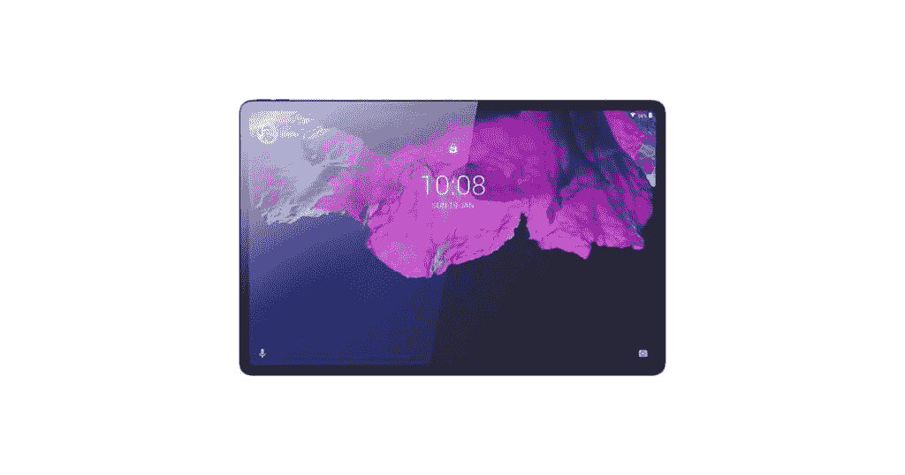
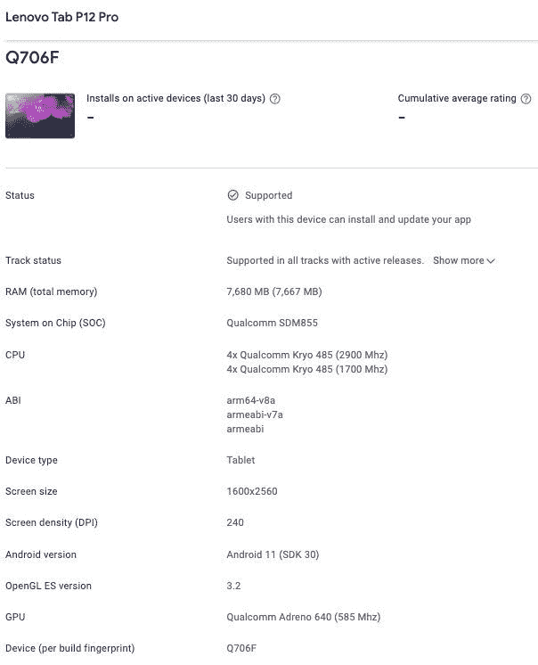

# 联想 Tab P12 Pro 出现在搭载 SD 888 芯片的 Google Play 主机上

> 原文：<https://www.xda-developers.com/lenovo-preparing-tablet-tab-p12-pro/>

# 联想正在准备一款新的平板电脑，以跟进其中端平板电脑 P11 Pro

联想 Tab P12 Pro 在 Google Play 控制台上被发现，预计将是一款采用骁龙 888 芯片组的高端平板电脑。

联想是为数不多的仍在生产优秀安卓平板电脑的安卓 OEM 厂商之一。去年的 Tab P11 Pro T1 是一款不错的中档平板电脑，今年早些时候[在印度](https://www.xda-developers.com/lenovo-tab-p11-pro-india-launch/)推出。现在，该公司正在准备中端平板电脑的继任者，但它将采用旗舰规格。即将推出的平板电脑已经出现在 Google Play 控制台上，它被称为联想 Tab P12 Pro。

 <picture></picture> 

Image credits: Mysmartprice

Google Play 主机上的列表(*via[mysmartprise](https://www.mysmartprice.com/gear/lenovo-tab-p12-pro-google-play-console-listing-specifications-revealed/)*)透露了联想 Tab P12 Pro 的一些规格。 *Pro* 这个名字表示一款针对专业用户的产品，虽然 Tab P11 Pro 并没有真正实现它，但似乎 Tab P12 Pro 可能会证明这个标签是正确的。该标签已经出现在 Google Play 控制台上，这意味着联想计划很快推出它。

## 联想 Tab P12 Pro 泄露规格

Google Play 控制台上列出了联想 Tab P12 Pro，型号为 TB-Q706F。该列表包括一张看起来像平板电脑本身的渲染图的图像。该列表还揭示了该设备的一些规格，包括有关其 SoC、RAM 和显示器的信息。

 <picture></picture> 

Image Credits: Mysmartprice

根据上市情况，联想 Tab P12 Pro 将配备骁龙 855 SoC 和 8GB 内存。这将使它成为性能冠军，并在原始性能方面成为最好的安卓平板电脑之一。显示器的分辨率将为 1600x2560 像素，平板电脑将运行 Android 11。这差不多是我们目前所知的关于平板电脑的所有信息。

从这些规格来看，联想 Tab P12 Pro 看起来是对其前代产品的重大改进。对于不知道，标签 P11 专业功能适中的骁龙 730G 芯片组。如果你想购买一款新的安卓平板电脑，联想平板电脑 P12 Pro 可能值得等待。