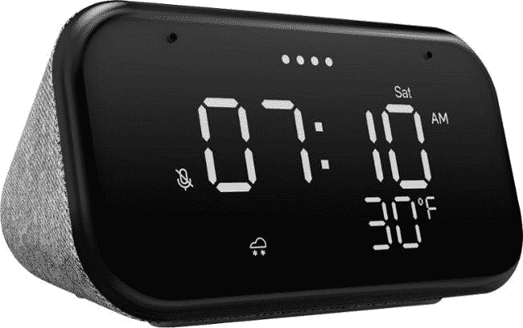

# 只需 30 美元，使用联想智能时钟套装扩展您的智能家居！

> 原文：<https://www.xda-developers.com/lenovo-smart-clock-bundle-best-buy/>

装饰你的房子会花很多钱...当然，除非你在关注交易(或者在看我们的[100](https://www.xda-developers.com/best-smart-home-gifts-under-100/)美元以下的智能家居礼物)!如果你知道去哪里找，智能商品的销售是很常见的。一些零售商，如亚马逊和百思买，倾向于对你可能最需要的智能家居产品定期打折。今天，百思买为那些希望扩大智能家居的人提供了一个令人难以置信的交易——联想智能时钟套装，仅售 30 美元！

通常情况下，只要 95 美元，你就可以得到联想智能时钟 Essential 和 4 个装的通用电气白色智能灯泡。任何过去看过智能灯泡价格的人都知道它们很贵，通用电气的灯泡通常只卖 45 美元。你也可以[现在以 20 美元](https://shop-links.co/1730062074980492946?u1=887dac01-1fb4-43b4-b487-a5c5b26fa858)的价格单独购买它们，但只需多花 10 美元，你就可以得到联想智能时钟精华版！

可以说是联想智能时钟捆绑包中的明星，联想智能时钟 Essential 可能是我最喜欢的智能时钟。这很简单，因为它大多只是...一个时钟，带有漂亮的大显示屏，让您在房间的任何地方都能轻松看到时间。但是，您也可以使用 Lenovo Smart Clock Essential 来控制家中的其他智能设备。就像，你知道的，你得到的智能灯泡！

联想智能时钟 Essential 没有像其他智能时钟一样的屏幕，但如果你已经有了类似标准[联想智能时钟](https://shop-links.co/1730062075788870557?u1=60f303d4-bca5-4c7a-8b17-9d7c13d88b19)的东西，你可能就不需要它了！Essential 非常适合只需要一个时钟和一个扬声器的房间，而不是一个带屏幕的智能时钟的所有功能。老实说，我认为它是简单性和功能性的完美结合。

这款出色的联想智能时钟套装的唯一亮点是什么？你将不得不从你当地的百思买买它！不过，只要 30 美元，我觉得路边捡东西还是值得的。

 <picture></picture> 

Lenovo Smart Clock Bundle

##### 联想智能时钟

只需 430 英镑，就能获得联想智能时钟 Essential 和 4 个装的 GE 软白色智能灯泡！这是两个非常有用的智能家居产品的一个令人难以置信的交易。

如果你所在的地区没有联想智能时钟套装，不要担心，因为你仍然可以在网上单独购买[联想智能时钟必备](https://shop-links.co/1730062077112955368?u1=c6138633-bcf8-4a97-b0d4-5cfc34abb4cc)和 [GE 智能灯泡](https://shop-links.co/1730062074980492946?u1=887dac01-1fb4-43b4-b487-a5c5b26fa858)进行送货。价格不会一样低，但是有点折扣总比没有折扣好！