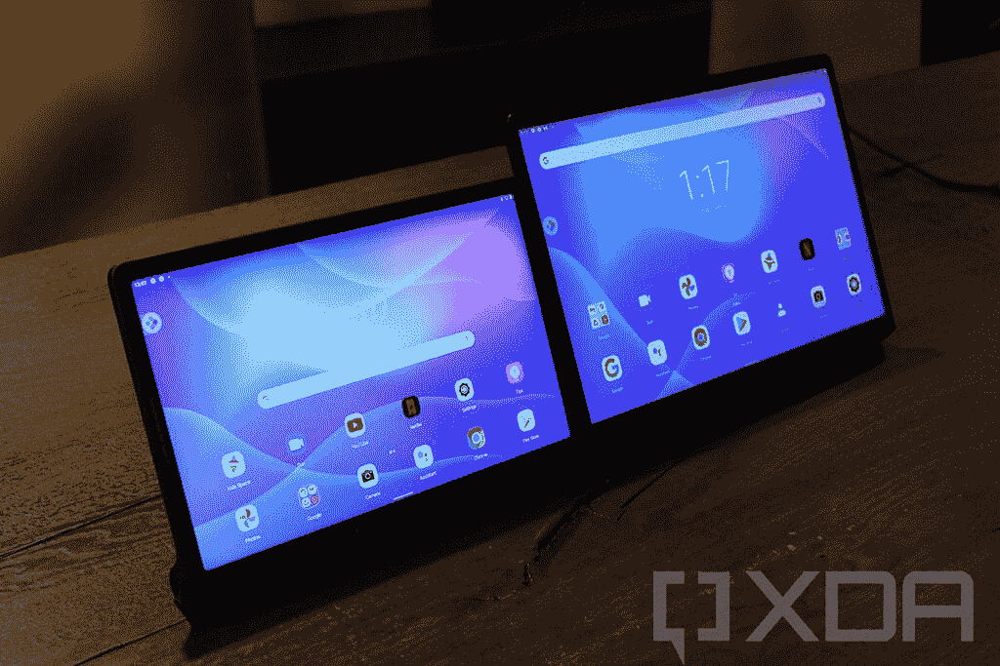
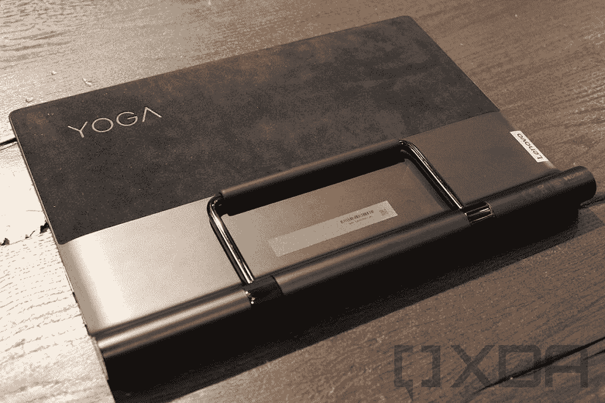
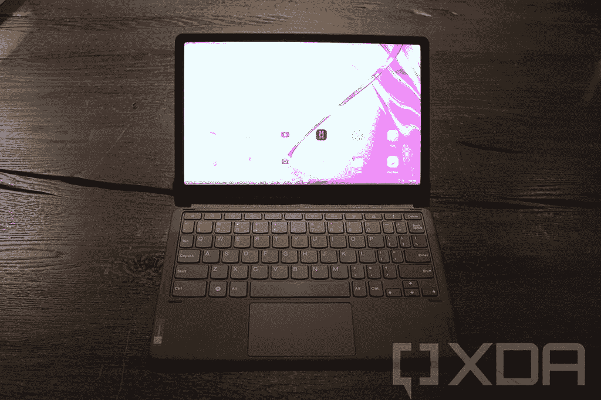

# 联想推出 Yoga Tab 13，一款带有 HDMI 输入的平板电脑

> 原文：<https://www.xda-developers.com/lenovo-smart-clock-wireless-charging-yoga-tab-13-tablet-hdmi/>

今天，联想推出了智能时钟 2，以及一系列新的 Android 平板电脑。其中包括带有 HDMI 接口的新 Yoga Tab 13，带有可连接键盘的 Tab P11 Plus 等等。

可能最令人兴奋的是 Yoga Tab 13，这是我们在 5 月份发现的东西。通过 HDMI in 端口，您可以将其用作第二台显示器。联想用它作为你电脑的第二台显示器，但它也可以是一种在旅途中用任天堂 Switch 玩游戏的方式。

 <picture></picture> 

Yoga Tab 11 and Yoga Tab 13

联想 Yoga Tab 13 配备了一系列高级功能，例如 13 英寸屏幕上的 2，160x1，350 分辨率和骁龙 870 芯片组。除此之外，你还将获得 8GB LPDDR5 内存，以及 128GB 或 256GB 的存储空间。

音频质量是联想用这款大平板电脑吹捧的另一件事。它有四个 JBL 扬声器，其中两个内置在设备的条形音箱中。所有这些都由一个 10，000 毫安的电池供电。

 <picture></picture> 

Yoga Tab 13

该设备的背面覆盖有 Alcantara 面料。微软 Surface 粉丝一定会喜欢的东西。联想 Yoga Tab 13 将于 7 月上市，起价 679.99 美元。

联想 Yoga Tab 11 更休闲一点。自带一个联发科 G90T，11 寸屏幕进来 2,000x1,200。

你还会注意到有一个重新设计的支架，联想 Yoga Tab 13 上也有这种东西。这些平板电脑适用于各种使用场合。你可以用它来支撑它，把它竖起来，甚至把它挂在墙上。

Yoga Tab 11 还配有四个 JBL 扬声器，有两种配置:4GB 内存和 128GB 存储，以及 8GB 内存和 256GB 存储。它将于 8 月上市，起价 319.99 美元。

 <picture></picture> 

Tab P11 Plus

你可能还记得一款叫做 Chromebook Duet 的产品。这是一款超级便宜的联想平板电脑，运行 Chrome 操作系统，有一个可连接的支架和键盘。Tab P11 产品是一个几乎相同的产品，但它运行的是 Android。

它由联发科 Helio G90T 处理器驱动，但与 Yoga Tab 11 不同，它没有蜂窝变体。除此之外，规格与 Yoga Tab 11 有些类似，包括 11 英寸的 2000 x 1，200 显示屏，内存配置也类似。它甚至有同样的 7500 毫安时电池。

联想 P11 Plus 将于 8 月上市，起价 259.99 美元。

实际上，联想还将发布两款 Android 平板电脑，分别是 Tab M7 和 Tab M8。这些非常简单。Tab M7 是入门级的，包括一个联发科 MT8166，或者 LTE 型号的 MT8766。它有 2GB 内存和 32GB 存储空间，以及 1，024x600 的显示屏。Tab M8 配有联发科 Helio P22T、2GB 或 3GB 内存、32GB 存储空间和 1，280x800 显示屏。

Tab M7 将于 7 月上市，起价 109.99 美元，Tab M8 将于今年晚些时候上市，但不会在美国上市。

联想也在推出智能时钟 2。你可能还记得最初的那款，那是一款超级便宜的 4 英寸谷歌助手智能显示屏。不知何故，这对联想来说不够便宜，联想推出的智能时钟价格更低。

智能时钟 2 配有可选的无线充电板，因此您可以在睡觉时为手机充电。它也有一个新的设计，它有三种颜色:阴影黑，希瑟灰和深渊蓝。

带有无线充电底座的智能时钟 2 的起价为 89.99 美元，将于 9 月份上市。