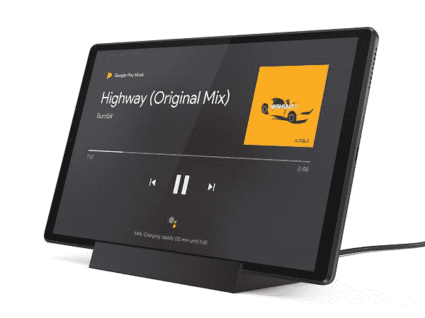

# 联想智能标签系列的环境显示被谷歌应用削弱

> 原文：<https://www.xda-developers.com/lenovo-smart-tab-range-ambient-display-crippled-by-google-app/>

联想智能标签用户正在等待谷歌应用程序更新后该系列独特功能之一的修复。Smart Tab 系列是一系列平板电脑，当它们停靠在充电座上时，使用 Android 的环境显示器作为类似于 Google Nest Hub 的 Google Assistant 客户端，并带有远场麦克风，允许停靠时发出语音命令。

今年夏天早些时候，联想论坛上开始出现报告，因为用户抱怨说，尽管设置正确，但他们的屏幕在对接时只是变成空白。我们已经在我们的联想 M8 智能标签上进行了测试，果然，没有发现环境模式。

产品论坛上有无数的帖子都在抱怨这个问题。有一次，有人暗示已经找到了解决办法，但事实证明也没有用。已经确认对 8 寸和 10 寸版本都有影响。

 <picture></picture> 

Lenovo Tab M10 HD 2nd Gen with Google Assistant

来自论坛管理员的最新回应表明，问题出在谷歌应用上，特别是环境模式，而不是平板电脑硬件，谷歌和联想都有一份错误报告。没有确切原因的迹象，也没有解决的时间表。

我们已经检查了这些设备的升级路径，似乎这些设备的 Android 10 升级将在圣诞节前登陆，这可能也包含一个修复，因为 [Android 9 设备兼容性越来越成为一个遗留问题](https://www.xda-developers.com/all-apps-google-play-required-target-android-10-api-level-29/)。用户感到沮丧是因为这一系列产品是围绕其双重功能进行宣传的。如果没有这一点，它本质上是一款运行 Android 9 的称职的中端平板电脑——而不是广告中所说的产品。就像任何新功能一样，总有出现问题的风险，但当你为一系列产品戴上这个功能的帽子时，它看起来并不怎么好。

我们已向联想询问任何进一步的更新，但截至发稿时尚未得到回应。