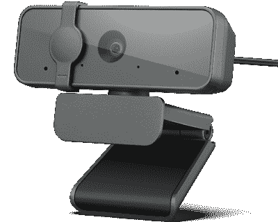

# 联想的高清网络摄像头现在仅售 28 美元

> 原文：<https://www.xda-developers.com/lenovos-hd-webcam-now-on-sale-for-just-28/>

# 联想的高清网络摄像头现在仅售 28 美元

这款来自联想的基本 30FPS 1080p 网络摄像头现在在该公司自己的易贝商店仅售 27.99 美元。

在去年的大部分时间里，购买网络摄像头几乎是不可能的，一些受欢迎的网络摄像头的价格仍然高于疫情之前的水平。令人欣慰的是，价格在过去几个月里一直在缓慢下降，现在甚至有可能以不到 30 美元的价格买到一款基本款。联想精选 FHD 网络摄像头现在在该公司自己的易贝商店以 27.99 美元出售，比原价低 22 美元。

这个网络摄像头有一个 95 FoV 的 1080p 镜头，两个麦克风，360°旋转，和一个物理隐私快门。底部还有一个标准的 1/4 英寸螺纹支架，所以如果你愿意，你可以在三脚架上使用它，而不是在你的显示器/笔记本电脑上使用。它只能以 30 帧/秒的速度录制，没有 60 帧/秒的模式。

 <picture></picture> 

Lenovo Select FHD Webcam

##### 联想精选 FHD 网络摄像头

这种基本的网络摄像头比没有摄像头要好，但可能不会比大多数笔记本电脑的内置摄像头好。

YouTube 上有几个[视频样本](https://youtu.be/nvbkxAmp2Rw?t=39)，结果肯定是*不惊人*。联想精选 FHD 相机肯定比完全没有网络摄像头要好，但在大多数照明情况下都有不错的纹理水平。然而，你真的不能指望 30 美元有多高，至少在网络摄像头的需求仍高于 2019 年水平的时候。