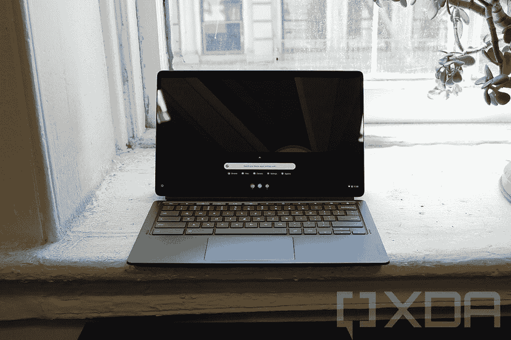
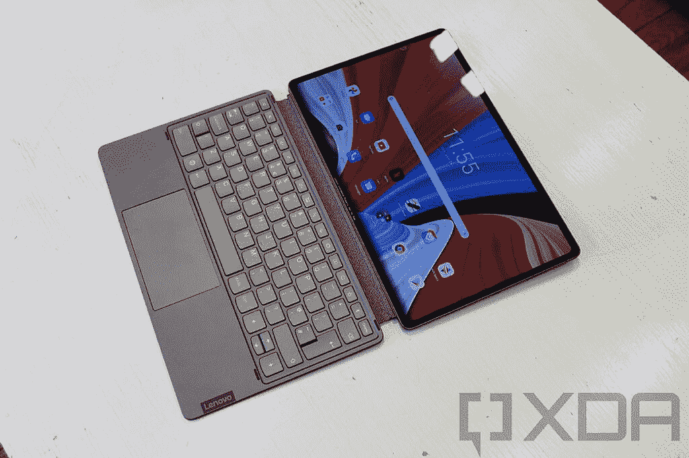

# 联想新推出的 Chromebook Duet 5 拥有有机发光二极管屏幕等等

> 原文：<https://www.xda-developers.com/lenovos-new-chromebook-duet-5-has-an-oled-screen-snapdragon-processor-and-more/>

联想今天宣布了一些新的平板电脑，包括新的 Chromebook Duet 5 和一些 Android 设备。联想 Chromebook Duet 5 并不是最初 Chromebook Duet 的继任者，因为它们将并排销售，但有一些很大的不同。

你可以认为它更大、更好、更快。Chrome OS 平板电脑配有 13.3 英寸有机发光二极管显示屏，支持 100% DCI-P3 色域。这还不是全部。这款电脑采用的不是我们之前看到的联发科处理器，而是高通骁龙 7c Gen 2 芯片组，应该会更好一些。

 <picture></picture> 

Lenovo Chromebook Duet 5

它还配备了高达 256GB 的 eMMC 存储和 8GB LPDDR4x 内存。它有 USI 手写笔支持，和四扬声器。

联想 Chromebook Duet 5 有风暴灰和深渊蓝两种颜色，仅平板电脑就重 1.5 磅。最有趣的是，它的起价仅为 429.99 美元，延续了提供大量价值的趋势。

 <picture></picture> 

Lenovo Tab P12 Pro

我们也有一些 Android 平板电脑，包括联想 Tab P12 Pro。它配备了 12.6 英寸的 AMOLED 2,560x1,600 显示屏，这也将与 Tab P11 Pro 一起销售。它支持杜比视觉和 HDR10+ HDR，并且具有 120Hz 的刷新率，所以它非常稳定。

在引擎盖下，你会发现一个高通骁龙 870 芯片组，所以它绝对是一个优质产品，它配备了高达 8GB 的内存。

联想还宣布了一项名为 Project Unity 的项目，旨在让你的联想 Tab P12 Pro 更好地与 Windows PC 配合使用。而且不仅仅是第二块屏幕。例如，您可以在 PC 上参加会议，然后使用平板电脑上的笔来绘制要演示的内容。这里有很多可能性。

联想 Tab P12 Pro 将于 10 月上市，起价 609.99 美元。

最后，联想公布了 Tab P11 5G，它只是 Tab P11，但具有蜂窝连接功能。那一个不是来北美，但是你能在 EMEA 地区为€499 得到它。