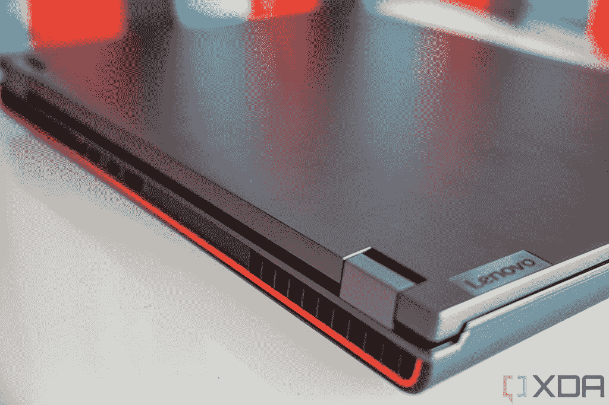
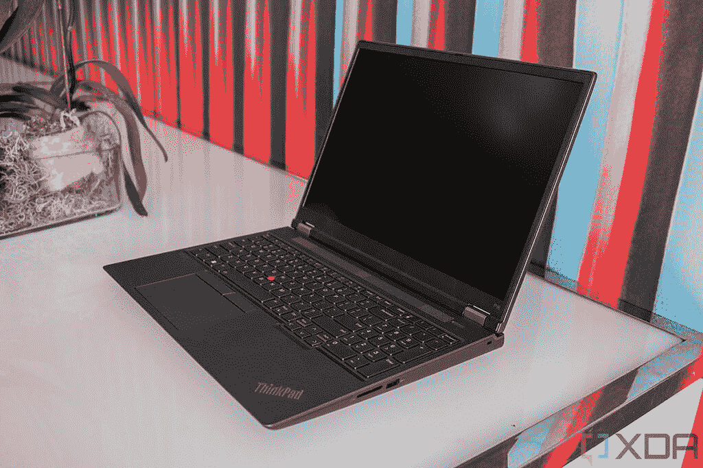
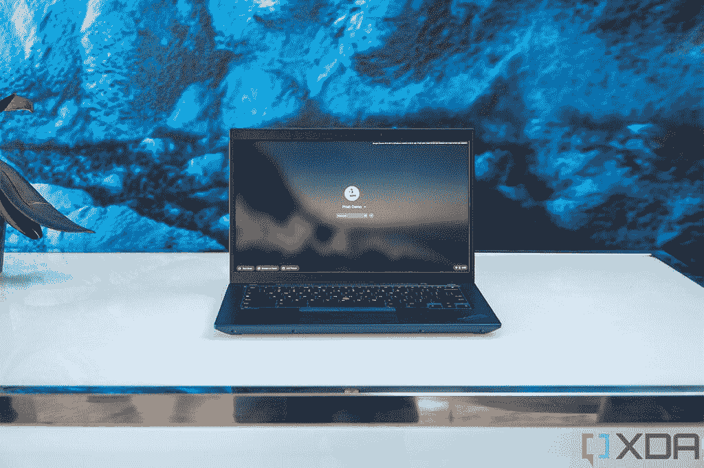

# 联想新推出的 ThinkPad P16 看起来像一台游戏笔记本电脑

> 原文：<https://www.xda-developers.com/lenovos-new-thinkpad-p16-looks-like-a-gaming-laptop/>

今天，联想发布了两款新的 ThinkPad，特别是 ThinkPad P16 和 ThinkPad C14 Chromebook。这两台机器位于光谱的完全相反的两端，但是我们在这里。

## 联想 ThinkPad P16 是一款重新设计的 beast

联想的 ThinkPad P 系列是为移动工作站设计的，它们功能强大。ThinkPad P16 是该系列的新成员，取代了 P15 和 P17，并采用了全新的设计。

 <picture></picture> 

Lenovo ThinkPad P16

它完全由铝制成，背面有一个红色的强调。当我第一次看到它时，最令人惊讶的是 ThinkPad 的品牌。

联想工作站和客户端人工智能业务部门副总裁 Rob Herman 表示:“我们的客户已经表示，他们显然希望两全其美，即在外观和性能一样好的便携式系统中获得具有顶级性能的移动工作站。“新 ThinkPad P16 的外观更好地与完整包装内部的极致性能相匹配，提供了处理计算密集型工作流的技术和复杂性，无论是在家里、在路上还是在办公室。”

除了新的设计，还有一个 16 英寸的 16:10，它甚至提供 3，840x1，200 有机发光二极管触摸。当然，如果你想要最好的电池寿命，有一个 1,920x1,200 的面板。

 <picture></picture> 

Lenovo ThinkPad P16

在性能方面，它采用了英特尔全新的 55W 第 12 代 HX 系列 CPU，这是您所能获得的最接近台式机级别的性能。对于图形，你可以得到高达 16GB 内存的英伟达 RTX A5500。

作为一台 ThinkPad，它通过了 MIL-STD-810G 认证，并配备了一些其他额外的功能，如 FHD 网络摄像头、Wi-Fi 6E 和可选的 4G LTE。联想 ThinkPad P16 将于本月上市，起价 1979 美元。

## 联想 ThinkPad C14 Chromebook

当然，如果你不是在寻找重量为 6.5 磅或能够处理 3D 渲染的东西，那么有联想 ThinkPad C14 Chromebook。这是一款 Chromebook 企业笔记本电脑，因此它面向企业习惯的安全性和可管理性。

 <picture></picture> 

Lenovo ThinkPad C14 Chromebook Enterprise

联想 ThinkPad C14 chrome book Enterprise 配备了英特尔第 12 代处理器，最高可配酷睿 i7，以及 14 英寸 FHD 显示屏、FHD 网络摄像头、最高 256GB 固态硬盘、最高 16GB 内存、Wi-Fi 6E 和可选的 4G LTE。它将于 6 月上市，起价 629 美元。