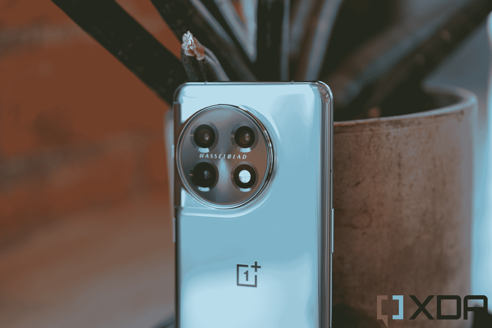
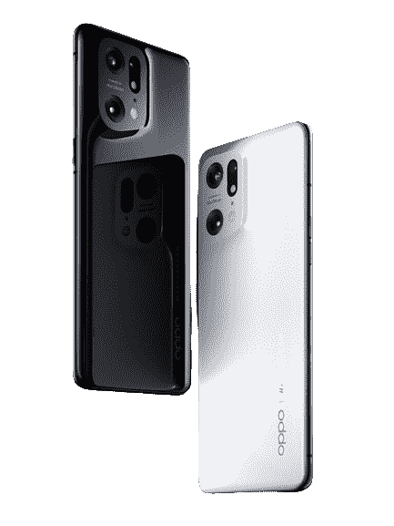

# 2023 年最佳安卓手机

> 原文：<https://www.xda-developers.com/lg-smart-display-20w-stereo-speakers/>

去年可以被认为是 Android 旗舰设备迭代升级的一年——尤其是在美国市场。今年应该会更令人兴奋，更多的可折叠产品即将推出，新的尖端相机硬件正在向平板手机进军。三星推出了 Galaxy S23 系列，其标题是 [Ultra 型号的 200MP 摄像头](https://www.xda-developers.com/samsung-galaxy-s23-ultra-review/)，一加发布了价格合理的[高度抛光的全能手机](https://www.xda-developers.com/oneplus-11-review/)，Oppo 在中国市场之外推出了可折叠手机(对不起，美国人，不过它不会在美国上市)。谷歌当然会有 Pixel 8 系列，传言称甚至是可折叠的。在 Android 领域，今年肯定会比 2022 年更令人兴奋。

如果你想买一部新的智能手机，我们 XDA 公司已经测试了几乎每一部手机，根据你的需求或预算，这些是我们在每个类别中挑选的最好的手机。

## 最佳安卓手机:三星 Galaxy S23 Ultra

考虑到三星的 Galaxy S21 和 S22 Ultra 在 2021 年和 2022 年几乎占据了这一位置，三星不需要为 Galaxy S23 Ultra 的发布做太多事情，特别是在美国市场。虽然除了最新的高通芯片，三星确实带回了几乎相同的显示器、设计和内部组件，但它确实带来了一次重大更新:主摄像头现在是一个 200MP 传感器，能够使用 16 合 1 像素宁滨拍摄实际的 200MP 照片或 1250 MP 照片。

新相机允许 Galaxy S23 Ultra 对弱光摄影进行进一步改进，因为一张普通的入库照片将包含几乎两倍于 S22 Ultra 主相机拍摄的图像信息。你也可以在全 200MP 拍摄，之后你可以大幅裁剪，不会像其他手机相机照片那样丢失太多细节。虽然后置的其他摄像头——一对 10MP 变焦镜头和 12MP 超宽摄像头与 S22 Ultra 保持不变，但三星改进的计算摄影加上高通骁龙 8 Gen 2 芯片中更新的 ISP 有助于提高照片的曝光度和色彩。

事实上，新的高通芯片应该是为 S23 系列定制的，因为它被命名为“银河骁龙 8 代 2”然而，[从我们的测试来看，](https://www.xda-developers.com/qualcomm-snapdragon-8-gen-2-for-galaxy/)它大多只是标准芯片的超频版本。这是一个进步，但也许没有名字想象的那么神奇。

完全集成的 S-Pen、5，000 mAh 电池，以及具有出色峰值亮度和能效的华丽 6.8 英寸 Super AMOLED 面板，都回归了，成为一款精致而强大的设备。再加上 Android 13，它保证提供四年的 Android 更新，然后再提供一年的安全更新，加上 Samsung DeX 等出色的三星软件功能，你就拥有了一款全能的旗舰产品，提供了任何其他手机都无法提供的功能。如果你想要最可靠、最强大、最普及的 Android 手机，Galaxy S23 Ultra 仍是不二之选。

Galaxy S23 Ultra 是市场上最好的手机之一，装有全新的 200MP 传感器，精致的设计，为 Galaxy 芯片组定制的骁龙 8 Gen 2，以及一个 UI 5.1。

## 也很棒:三星 Galaxy S23 Plus

如果你觉得 Galaxy S23 Ultra 的 1200 美元价格有点高，Galaxy S23 Plus 提供了许多让这款手机在不到 1000 美元的情况下变得很棒的东西。你不会有新的 200 兆像素的相机，S-Pen 手写笔，也不会有 10 倍的潜望镜变焦镜头，但你仍然有一个漂亮的 120 赫兹有机发光二极管屏幕，一个出色的 500 兆像素的主相机，一个体面的传感器尺寸，一个良好的 120 兆像素超宽镜头，可以捕捉广泛的风景拍摄；以及出色的 3 倍长焦变焦镜头。换句话说，这是一部仍然可以捕捉一些非常顶级的图像的手机，即使它不能捕捉那些疯狂的变焦镜头或 200 万像素的图像，这是它的哥哥能够做到的。

我们也喜欢平板显示器的简约设计。当然，前后玻璃由 Gorilla Glass Victus 保护。就构造而言，Galaxy S23 Plus 与 Ultra 一样高端。

你可能想考虑 Galaxy S23 Plus 的另一个原因是它有点小——平板屏幕“只有”6.6 英寸——没有 Ultra 的尖角，所以客观上来说，它几乎是一款握起来更舒适的手机。那块面板仍然很出色，120Hz 的三星 AMOLED 2X 面板将是你在任何地方都能找到的最好的屏幕。

在软件方面，你仍然得到三星优秀的 OneUI，以及随之而来的所有红利，包括三星 DeX 你还会得到一个 2023 年的旗舰 SoC(Galaxy 的骁龙 8 Gen 2)。4，700 毫安时的电池比去年有所提升，足以为这款设备提供全天的电池续航时间。防水防尘等级也达到了 IP68。

三星的软件在多任务处理方面也非常出色，这家韩国科技巨头承诺四年保证 Android 更新，所以你至少可以更新到 Android 17。简而言之，虽然 Galaxy S23 Plus 不是三星的终极平板手机产品，但对大多数人来说，它已经足够旗舰了。

##### 三星 Galaxy S23 Plus

Galaxy S23 Plus 没有 Ultra 的所有功能，但它仍然是一款高端旗舰手机。

如果你特别想买一部三星手机，可以看看我们的指南，看看适合任何预算的[最佳三星手机](https://www.xda-developers.com/best-samsung-phones/)。

## 大多数人的最佳安卓手机:谷歌 Pixel 7

这一类别很棘手，因为在拥有所有最高级功能方面，位居榜首的手机本身通常不是最好的手机。但它对大多数人来说是最好的手机，手机的普通消费者应该首先考虑它，因为它综合了性能、功能和性价比。

新发布的谷歌 Pixel 7 就属于这一类，起价 599 美元。尽管价格几乎是典型旗舰手机的一半，但 Pixel 7 有几个关键的旗舰功能，包括谷歌的第二代硅张量 G2 和一个旗舰 50MP 主摄像头，当与谷歌的相机软件实力相结合时，可以说是最好的主摄像头。你还可以获得 6.3 英寸的有机发光二极管屏幕(略小于 Pixel 6 的 6.4 英寸)，IP68 防水等级，以及华丽、独特的设计，带有一些非常有趣的颜色。

当然，要让这款手机降到这个价格范围，还有一些妥协的地方:显示屏的刷新频率最高只能达到 90Hz(但谷歌的 UI 优化非常好，动画感觉比这更流畅)，没有专用的变焦镜头，有线和无线充电相对较慢。但对于那些想要一部外观和感觉都像旗舰但价格只有一半的手机的人来说，这些妥协非常容易接受。

但是让我们回到那个相机:Pixel 6 为 Pixel 系列带来了急需的相机硬件改进，而 Pixel 7 带回了同样的 50MP GN1 传感器，它与谷歌的张量驱动的计算摄影智能具有更好的协同作用。无论是白天还是夜晚，期待令人瞠目结舌的图像产生生动的色彩、准确的白平衡和丰富的细节。这是一部你可以瞄准并拍摄的手机，几乎每次都能拍出精彩的照片。超宽相机也很出色，尽管没有变焦镜头，但 Pixel 7 可以实现高于平均水平的 8 倍数码变焦，这要归功于谷歌的“Super Res”变焦，它使用了传感器内裁剪和计算摄影技巧。

所有这些，我们甚至还没有谈到另一个主要的 Pixel 卖点:这是一款纯粹的谷歌手机，所以你可以期待获得独家的 Android-Pixel 功能和最快的软件更新。随着 Android 12 获得多年来最大的视觉改革之一，现在是优先购买 Android 12 所有东西的最佳时机。简单来说，Pixel 7 是这个榜单上整体价值最好的，也是大多数人最好的手机。

 <picture></picture> 

Google Pixel 7

Pixel 7 包含第二代 Tensor SoC、更亮的显示屏和改进的摄像头。

## 最佳中端安卓手机:谷歌 Pixel 6a

[谷歌 Pixel 6a](https://www.xda-developers.com/google-pixel-6a-review/) 带来了 Pixel 6(甚至 Pixel 7)的许多优势，包括独特的背部设计，谷歌自己的硅，以及那个有用而又棒的 Pixel 软件。但它比其他手机更实惠。

那么，节省额外的本杰明会损失什么呢？这些事情重要吗？像素 6a 具有不太昂贵的外壳。背面和侧面的框架是塑料的，而前面的玻璃是由 Gorilla Glass 3 保护的，而不是 Pixel 6 中使用的 Victus。这意味着，如果像素 6a 和像素 6 遭受相同的跌落，则像素 6a 的正面比像素 6 更有可能破碎。具有讽刺意味的是，6a 的塑料背面确实使它更加坚固。

与 Pixel 6 的 IP68 相比，Pixel 6a 还“仅仅”具有 IP57 防水性能，这意味着 6a 的防水和防尘性能稍差。如果你立即把它捞出来，你的 6a 仍然可以在意外的水中存活。6a 的有机发光二极管显示屏稍小，为 6.1 英寸，刷新频率仅为 60Hz。内存也更少，电池也略小。

到目前为止，我认为以上大多数“缺点”都没什么大不了的，除非你碰巧经常摔手机或者喜欢把手机带进游泳池。否则，对于大多数普通消费者来说，60Hz 和 90Hz 之间的差异并不是一个交易破坏者，IP57 足以防止雨水和厕所中的意外浸泡，6GB RAM 也没问题。

Pixel 6a 输给 Pixel 6 的地方是在主摄像头传感器上:6a 使用的是旧的 12.2 兆索尼 IMX 传感器，而 Pixel 6 使用的是新的 GN1 传感器，图像传感器更大。现在，虽然谷歌的计算摄影技术如此之好，以至于 Pixel 6a 仍然可以产生漂亮的图像，但 Pixel 6 的传感器更大，功能更强。你在镜头中得到更多的景深，并且有更多的光线信息供张量使用。

我们必须再次强调:Pixel 6a 的相机仍然非常好，在这个价格范围内无疑是最好的。但如果我们将其与像素 6 进行比较，明显的差异出现在相机传感器中。当然，它也达不到 Pixel 7。

如果你在市场上购买一部手机，并且你真的不想支付超过 400 美元，Pixel 6a 可能是最好的选择。如果你不受预算限制的话？当然，Pixel 7 或之前列出的任何其他手机都是更有能力的设备。

谷歌 Pixel 6a 是目前最好的中端手机，尤其是在北美。但我们认为，即使在全球范围内，谷歌的计算摄影也足以将其推上榜首。

## 软件和速度最佳安卓手机:一加 11

 <picture></picture> 

DO NOT USE, EMBARGO UNTIL FEB 7, 10:15AM ET

看，我们知道一加的 OxygenOS 在过去的一年里已经失去了一点它的身份——自从一加和 OPPO 最终承认是同一家公司，OxygenOS 开始越来越像 OPPO 的 ColorOS。但事情是这样的——ColorOS 很好，这个运行在一加 10 Pro 上的“彩色化”版本的 OxygenOS 仍然是最灵活、最流畅的软件之一。

如今，每款 Android 旗舰产品都提供 120Hz 的刷新率，但 OxygenOS(和 ColorOS)的动画速度明显比三星的 OneUI 更快、更流畅，后者不时会出现丢帧。谷歌的 Pixel UI 有非常流畅的动画，可以为该软件占据这一位置做一个案例，但 OxygenOS 只是更具可定制性，有更好的永远在线显示和更有用的快捷手势。

一加 11 本身也是一款不错的手机，运行在骁龙 8 Gen 2 上，具有视觉上引人注目的设计，相机模块从侧面溢出，融入底盘，以及非常好的“哈苏”相机系统，由 50MP IMX890 主相机加上 48MP 超广角相机和 32MP 2x 远摄变焦镜头组成。一加 11 号拍摄的照片色彩鲜明，动态范围极佳。

一加的相机应用程序仍然可以说是安卓系统中最好的——它是少数几个可以在镜头之间切换的安卓相机应用程序之一，没有你在三星或索尼手机上做同样的动作时会看到的不稳定的动画。从拍照应用到充电速度，一加 11 仍然是一款非常非常快的手机。

一加 11 配备了一个 100 瓦的快速充电砖(美国为 80 瓦)，可以在 25 分钟内将手机从 0 充满到 100%。总的来说，一加 11 是一款好看、精致的 Android 手机，应该可以满足你对速度的需求，而且它的价格比 Galaxy S23 Plus 便宜几百美元。

一加 11 是该公司的回归，以低于三星的价格提供近乎旗舰的体验。

## 最佳傻瓜相机手机:谷歌 Pixel 7 Pro

前三款谷歌 Pixel 手机无疑是最好的静态相机手机，主要是因为谷歌的计算摄影在当时遥遥领先。这些年来，其他手机品牌加快了他们的计算摄影游戏。此外，谷歌没有为 Pixel 4 和 Pixel 5 升级相机硬件，这意味着到 2019 年左右，Pixel 不再是无可争议的最佳相机手机。

谷歌去年凭借 Pixel 6 Pro(至少在最佳傻瓜相机这一类别中)夺回了桂冠，因为它最终升级了相机硬件，以跟上竞争。今年的 [Pixel 7 Pro](https://www.xda-developers.com/google-pixel-7-pro-review/) 为 Pixel 6 Pro 系统带来了进一步的改进。

Pixel 7 Pro 的主摄像头在硬件方面与 6 Pro 相同——50MP 三星 GN1 传感器，配有 1/1.31 英寸图像传感器和快速光圈。但 Pixel 7 Pro 的新芯片 Tensor G2 提高了性能，特别是在低光场景下，Pixel 7 Pro 不再需要很长时间来拍摄夜景。

12MP 超宽镜头也得到了改进，它有更宽的视野，并兼作微距镜头，工作非常好。然后是 48MP 潜望镜变焦镜头——这也升级到了 5 倍光学变焦范围，但谷歌也使用了一些巧妙的技巧来产生几乎无损的 10 倍变焦。本质上，潜望镜相机将在 5 倍模式下以像素分格模式拍摄，但在 10 倍模式下将使用完整的 48MP 分辨率并裁剪到传感器中，这样，您就可以获得“真正的”10 倍变焦。

虽然 Pixel 7 Pro 仍然缺乏 iPhone 14 Pro 的出色视频功能，或[小米 12S Ultra](https://www.xda-developers.com/xiaomi-12s-ultra-review/) 的巨大传感器魔力，但对于那些只想对准手机，点击快门按钮，然后拍摄一张照片，无需调整或编辑即可立即发布到社交媒体的人来说，它可以说是最好的手机。原因在于软件。谷歌的软件 smarts——也称为计算摄影——使拍照成为一种乐趣，因为你不会真的有太多压力，只需瞄准并拍摄，你就可以获得几乎总是完美平衡的照片，有恰到好处的增强颜色和对比度(不像三星那样过分)，准确的白平衡和足够的清晰度。即使你没有正确地构图，不小心捕捉到了一些不想要的人，谷歌的“神奇橡皮擦”技巧也可以帮助你在 post 中轻敲几下就能修复。实时调节主体和背景照明的转盘也是巨大的奖励。没有像 Galaxy S22 Ultra 那样的轻微快门延迟，也没有华为和令人惊讶的 [iPhone 14 Pro](https://www.xda-developers.com/apple-iphone-14-pro-max-review/) 那样略显人工过度处理的外观。这是一台工作正常的照相机。

但手机不仅仅是相机，所以你可以放心，Pixel 7 Pro 在所有其他方面都提供了顶级性能。6.7 英寸，120 赫兹的显示器看起来很棒，因为它是 LTPO 面板，它有可变的刷新率以节省电池。我们在 XDA 的所有人都是这款设备独特设计的粉丝，尤其是引人注目的护目镜和大胆的颜色。

去年的 Pixel 6 Pro 是第一款带来真正伟大硬件的 Pixel 手机，Pixel 7 Pro 带来了各方面的微妙改进。

##### 谷歌 Pixel 7 Pro

谷歌 Pixel 7 Pro 对大多数人来说是最好的傻瓜相机，因为它几乎总能拍出好照片。

2021 年最佳智能手机相机:苹果、三星、小米、一加——我们全都测试过了！

## 最佳整体拍照手机:Vivo X90 Pro Plus

我知道我们刚刚诗意地谈论了谷歌 Pixel 7 Pro 的相机实力，但最佳整体相机属于 Vivo X90 Pro Plus。Vivo X90 Pro Plus 结合了小米 12S Ultra 中首次出现的 50MP 1 英寸索尼 IMX989 传感器，并结合了覆盖 60 毫米和 90 毫米焦距的两个变焦镜头，以及 48MP 超宽摄像头。无论是图像传感器尺寸还是像素密度，Vivo 的摄像头系统都比 Pixel 7 Pro 的摄像头硬件先进。特别是主传感器比 GN1 传感器大得多，这使得 X90 Pro Plus 可以接收更多的光线和图像信息。

但 Vivo X90 Pro Plus 相机最棒的部分可能是 Vivo 在 V2 芯片中自主开发的 ISP，它允许 X90 Pro Plus 产生神秘的 HDR 照片，几乎从不熄灭任何光源。没错，就连 Pixel 7 Pro 在这方面也输给了 Vivo X90 Pro Plus。

在其他地方，Vivo X80 还配备了骁龙 8 Gen 2，12GB 内存和充满活力的 120Hz 6.8 英寸 2K 有机发光二极管屏幕。还有 [UFS 4.0 存储](https://www.xda-developers.com/ufs-4/)，它比榜单上许多其他手机使用的 UFS 3.1 有了重大升级。

Vivo X90 Pro Plus 唯一的缺点是这款手机目前只在中国销售，这意味着许多读者无法正式购买这款手机。尽管如此，我们在全球范围内覆盖智能手机——我们不能因为一款手机只在中国销售就假装它不存在 Vivo X90 Pro Plus 拥有可以说是最好的整体相机系统。即使 Pixel 7 Pro 还是一款比较好用的傻瓜相机。

 <picture></picture> 

Vivo X90 Pro Plus

##### Vivo X90 Pro Plus

Vivo X90 Pro Plus 拥有目前名单上所有手机中最前沿的移动组件。但到目前为止，这款手机只在中国销售，明年 1 月可能会在全球推出。

## 最佳游戏安卓手机:华硕 ROG 手机 6 Pro

2021 年的华硕 ROG 手机 5 旗舰版是我们的年度游戏手机，2022 年的更新甚至更好，因此它很容易成为迄今为止年度最佳游戏手机的最爱。

那么，是什么让 ROG Phone 6 Pro T1 成为游戏怪兽呢？让我们从 165Hz 显示器开始，它可以以最高的刷新率全时运行，没有微口吃。不过，请注意，这个面板不是 LTPO 面板，但对于以游戏为中心的手机来说，这没什么大不了的。屏幕也完全不受干扰，因为自拍相机位于上面的薄边框中。该显示器还具有 720Hz 的触摸采样率，这意味着它每 1.4 毫秒扫描一次输入，华硕表示，由于触摸采样率的提高，华硕 ROG 手机 6 Pro 的触摸延迟为 23 毫秒。

配备一块 6000 毫安的大电池来处理可变的刷新率，这意味着你不必担心中午找不到充电器。在我们的测试中，如果作为“普通智能手机”使用，这款手机可以轻松坚持一天半，即使你在上面玩游戏，除非你参加马拉松比赛，否则一次充电可以坚持一天。

因为这是一款游戏手机，ROG 手机 6 Pro 提供了名为“AirTriggers”的功能性肩部按钮，以大多数普通智能手机无法提供的方式为第一人称射击者提供额外的控制。还有一个名为“ROG 视觉”的背面显示器，可以让你在上面显示一些图形。

从我们的测试来看，ROG Phone 6 是一款性能卓越的手机，能够以 60fps 的速度运行游戏，几乎没有掉线。所有的基准测试也都名列前茅。

在相机前面，你有一个主系统，包括 50MP IMX766 主传感器，13MP 超宽(f/2.4)和 2MP 微距设置，以及 12MP 自拍相机。这款手机拍摄的照片清晰、有力，总体来说不错，但视频录制并不是最棒的，因为镜头的稳定性很差，并且要处理突然的光线变化。

最终，如果你是一个手机游戏玩家，并且你不想被不那么高档的硬件所困扰，这款手机是你应该买的。

##### 华硕 ROG 手机 6 Pro

华硕 ROG 手机 6 旗舰版，顾名思义，是最高 18GB 内存的终极游戏手机。

## 最佳大型可折叠手机:三星 Galaxy Z Fold 4

Galaxy Z Fold 4 初看起来像是对已经非常优秀的 Galaxy Z Fold 3 的一个非常小的迭代更新，但三星做出了几个小而关键的改进。

首先，三星将铰链的体积削去了几毫米，这样它就不会像以前那样从手机侧面突出来。三星随后给外部显示屏留出了额外的空间，因此屏幕稍微宽了一些。这是一件好事，因为 Fold 系列的外部屏幕总是有点细长和局促。

然后，三星改进了摄像头硬件。Fold 3 的三个 1200 万像素摄像头充其量也就不错，但今年，Fold 4 增加了一个 5000 万像素的图像传感器，图像传感器尺寸更大，为 1/1.53 英寸。10MP 变焦镜头也改进为 3 倍长焦镜头。然而，超宽保持不变，为 12MP，但三星卓越的计算摄影技术稍微提高了性能。

三星还对软件进行了微调，以进一步利用更大的显示屏。我们最喜欢的新功能之一是任务栏，它是手机底部的一个栏，列出了你最常用或最近使用的应用程序。从这个栏中，你可以快速切换应用程序，而不必跳回到主屏幕。当然，如果你不需要或者不想分散注意力，你可以去掉这个酒吧。

三星还进一步与第三方应用开发商合作，以利用 Fold 4 的更大显示屏。例如，Spotify 和 Google Meet 将会以专为 Fold 的大屏幕设计的布局打开。

Galaxy Z Fold 4 配有 4400 毫安时的电池，足以为该设备提供一整天的电力，对于我们这些在 XDA 拥有一台电池的人来说，该设备一次充电可以支持一整天。如果你想充值，手机可以有线或无线充电。还有反向无线充电，比如说，给 Galaxy Buds 充电。

如果你想要一部既能作为平板电脑又能作为智能手机的手机，Galaxy Z Fold 3 目前很难被击败。然而，如果你觉得它有点太大，那么三星也有一个更小的选择——见下文。

三星 Galaxy Z Fold 4 是有史以来最精致的可折叠智能手机

## 最佳小型可折叠手机:三星 Galaxy Z Flip 4

如果你曾经感叹过智能手机尺寸的不断升级，并且想要一些不会在你的口袋中产生膨胀的东西，那么 [Galaxy Z Flip 4](https://www.xda-developers.com/samsung-galaxy-z-flip-4-review/) 值得考虑。与折叠成手机的平板电脑 Galaxy Z Fold 4 不同，Flip 4 是一款普通大小的智能手机，可以折叠成一个紧凑的正方形，大约是杯垫或化妆品压缩机的尺寸(尺寸:84.9 x 71.9 x 17.1 毫米)。从外观上看，三星在整体硬件和设计方面没有太大变化，但去年的 Flip 3 因其美观和功能性设计而广受好评。这意味着你仍然有一个 6.7 英寸的 120Hz 主屏和一个 1.9 英寸的外盖屏。

三星提高了外部屏幕的可用性，允许它显示你现在选择的任何应用程序。虽然一些应用程序在小显示屏上看起来绝对荒谬，但在大多数情况下，这是一个好消息，你不仅限于在外部屏幕上看到小工具。这意味着当翻盖合上时，你可以更多地使用它。

里面有一台骁龙 8 Plus Gen 1，配有 8GB 内存和更大的 3,700 mAh 电池。这种电池尺寸听起来很小，但骁龙 8 Plus Gen 1 是一种高效芯片。我们不能保证 Flip 4 将成为你的全天手机，但至少电池寿命不会像以前的 Flip 那样糟糕。铰链比以往更加坚固，Galaxy Z Flip 4 和 Galaxy Z Flip 3 一样，也具有 IPX8 防水功能。

铰链保持半折叠状态的能力——三星称之为“灵活模式”,为 Galaxy Z Flip 4 增加了一系列新的用例。比如你可以把它折叠成 L 型，放在桌面上，有一个免提的视频通话或观看机器。同样，你可以拍摄延时或长时间曝光的照片，而不需要三脚架或自己拿起手机。

Galaxy Z Flip 4 的起价为 999 美元，仍然是全球销售的最实惠的可折叠手机。Galaxy Z Flip 3 大受欢迎，并在美国、韩国和新加坡等较富裕、高消费的国家成为半主流。Galaxy Z Flip 4 应该会延续这一趋势。

三星 Galaxy Z Flip 4 是目前市场上最实惠、最时尚的可折叠手机。

**[最佳折叠手机:你现在能买到的顶级折叠智能手机](https://www.xda-developers.com/best-foldable-phones/)**

## 最佳股票安卓手机:谷歌 Pixel 7

好吧，所以谷歌 Pixel 7 在技术上不是“库存”Android，因为库存 Android 是一些不知名品牌的入门级廉价手机中常见的基本开源 Android (AOSP)。相反，Pixel 7 运行的是谷歌修改版的 Android 13，但因为这是谷歌眼中的 Android，在我们看来，这使得这种像素化的体验成为“Android 应该如何”的一个更重要的标志，而不是普通的旧股票 Android。

如果你想要真正的谷歌 Android 体验，Pixel 7 系列是你要找的手机。我们在这里列出了标准的 Pixel 7，因为我们仍然认为它是大多数人的最佳 Pixel 手机。对于那些已经使用 Pixel 6 系列的人来说，7 系列的 Pixel 体验不会有根本的不同——Android 13 与 Material You 相比是一个改进年，而不是一个大修年。

所谓的“Material You”是谷歌让 Pixel Android 体验感觉更个性化的方式——用你的主屏幕壁纸和创建一个调色板来给系统界面着色。在整个用户界面中，都有异想天开的谷歌风格，比如不同大小和形状的按钮。

除了优秀的软件，Pixel 7 还能让你拥有一部优秀的手机。6.4 英寸，1080 x 2400 有机发光二极管屏幕以 90Hz 的频率刷新，大多数时间看起来都很棒。这里的相机系统是周围最好的傻瓜相机之一。在 Pixel 7 上，50MP 传感器由谷歌的 epic 照片处理算法支持，该算法可以在任何情况下找到适当的平衡和动态范围。

Pixel 7 可能不是绝对最强大的手机 Tensor G2 在许多基准测试中的得分低于高通骁龙 8 Plus Gen 1——但该软件很智能，比任何其他手机都更好地理解环境。再加上独特的双色外观和极具吸引力的价格，如果你想要运行谷歌 Android 愿景的最佳手机，很难在这个地方说出其他任何东西。当然，Pixel 7 Pro 和 Pixel 6a 将满足同样的需求。

Pixel 7 包含第二代 Tensor SoC、更亮的显示屏和改进的摄像头。

## 未在美国销售的最佳安卓手机:Oppo Find X5 Pro

Oppo Find X5 Pro 是一款高度抛光的高端旗舰产品，可以在几乎所有领域与三星 Galaxy S22 Ultra 相抗衡，除了两个领域:它的变焦镜头远不如三星，而且它没有触控笔。否则，在所有其他方面，OPPO Find X5 Pro 要么至少与 Galaxy S22 Ultra 匹配，要么击败它。让我们从显示屏开始，Find X5 Pro 的 6.7 英寸 WQHD+ OLED 面板与 Galaxy S22 Ultra 的屏幕一样好:它使用相同的 LTPO 2.0 技术，人眼几乎一样亮，色彩还原和视角都是一个虚拟的纽带。然后是处理器，Find X5 Pro 采用了与 Galaxy S22 Ultra 的美国/中国/印度版本相同的骁龙 8 Gen 1 芯片；Find X5 Pro 的 50MP 主摄像头可以在任何情况下与 S22 Ultra 的主摄像头进行交易。

至于 Find X5 Pro 获胜的领域，也有客观的胜利，比如 Find X5 Pro 拥有明显优越的超宽摄像头。这是因为 Oppo 在广角和超广角相机上使用了完全相同的索尼 IMX 传感器，虽然广角和超广角镜头之间仍有一点质量下降，但它比其他手机小得多。Find X5 Pro 还采用了陶瓷一体式设计，我们许多人都觉得握起来非常舒适。

如果你知道你不在乎手写笔或能够抓取干净的 10 倍变焦照片，并且你住在这款手机正式销售的地方，Find X5 Pro 是 Galaxy S22 Ultra 的绝佳替代选择。

 <picture></picture> 

OPPO Find X5 Pro

##### Oppo Find X5 Pro

Find X5 Pro 几乎可以在所有领域与 Galaxy S22 Ultra 针锋相对，因此如果这款手机在您所在的地区有售，它将是三星旗舰产品的绝佳替代产品。

## 最适合多任务处理:微软 Surface Duo 2

如果生产力是最重要的，那么两个屏幕显然比一个屏幕好，现在，市场上唯一一个不在过时硬件上运行的双屏手机是微软的 Surface Duo 2。Surface Duo 2 回归了原版的前提，本质上是两个屏幕通过一个非常好的 360 度铰链连接在一起。虽然第一款机型的单摄像头设置非常平庸，SoC 过时(即使在发货时)，电池也很小，但 Surface Duo 2 在这三个方面都有所改善。

首先，现在有一个合适的相机，由 12MP，f/1.7 主，16MP 超宽和 12MP 2x 远摄变焦镜头组成。不幸的是，这也意味着该机现在有一个摄像头突起，所以两个屏幕不能像以前一样向后翻转并保持平坦。

接下来，微软将骁龙 888 放入 Surface Duo 2，这款手机发布时仍是旗舰芯片。现在已经两代了，但是对于大多数用户来说还是带来了足够的处理能力。电池容量也增加到了 4，449 mAh，尽管有两个屏幕，但一次充电可以为机器提供 12 到 13 个小时的电力。屏幕周围的边框也缩小了一点——尽管它们仍然很大——并且屏幕刷新率提高到了 90Hz。所以在硬件方面，Surface Duo 2 在各个方面都是一个进步。

当 Surface Duo 2 按预期工作时，这是一个多任务处理者的梦想:在不同的屏幕上同时运行两个应用程序，或者将一个应用程序扩展到两个屏幕上，以查看更多内容。或者将手机对折，免提观看视频或进行视频通话。我喜欢的另一种用法是“侧着”拿着手机，用底部屏幕显示键盘，而顶部屏幕显示谷歌文档或 WhatsApp。这让我想起了老派的蛤壳式掌上电脑。可能性并不是无穷无尽的，但是有很多。

然而，Surface Duo 2 仍然受到困扰第一代 Duo 的一些软件缺陷的困扰，包括对切换方向的反应缓慢，或者一个屏幕有点冻结，而另一个屏幕仍然活跃。bug 不像最初的 Duo 那样频繁出现，但如果它是你的主手机，每天至少一两次仍然是显而易见的。没有糖衣:微软 Surface Duo 2 的边缘有点粗糙。但是，如果在移动设备上进行多任务处理是你的首要目标，那么很难超越这款手机所能做到的。

##### 微软 Surface Duo 2

微软 Surface Duo 2 带来了比第一代产品更好的硬件和略有改进的软件。其结果是一个双屏手机，可以比大多数手机。

* * *

如果我们必须选择这里最好的手机，那将是 Galaxy S23 Ultra。但谷歌 Pixel 7 和一加 11 便宜几百美元，这使得它们非常非常有吸引力。对于不介意进口的，Oppo Find X5 Pro 或者 Vivo X90 Pro Plus 带来了超赞的硬件。但最终，如果你有钱花，Galaxy Z Fold 4 仍然是终极全能设备。