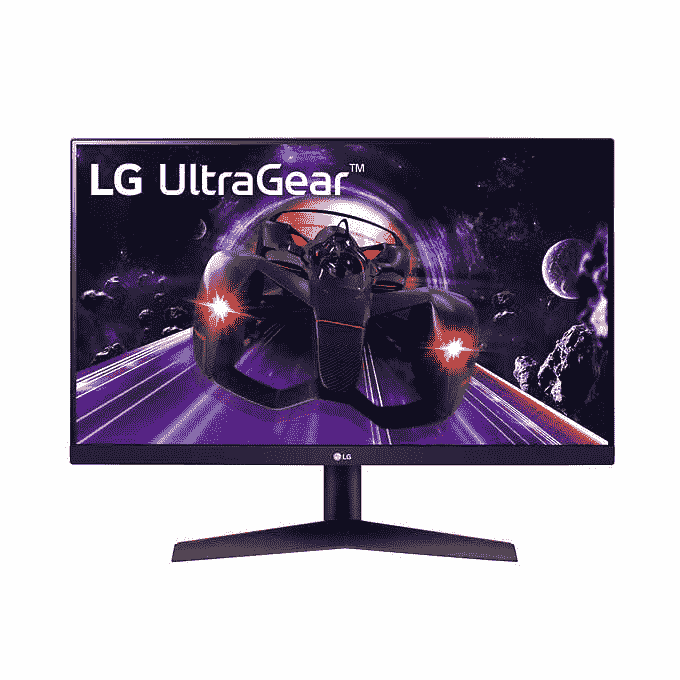

# LG 正在以 180 美元的价格出售其 24 英寸 144 赫兹的 UltraGear 显示器

> 原文：<https://www.xda-developers.com/lg-ultragear-24-inch-gaming-monitor-deal/>

# LG UltraGear 24 英寸 144 赫兹游戏显示器售价 180 美元

LG UltraGear 24 英寸游戏显示器配有 IPS 面板，可提供准确的色彩，144Hz 的刷新率可提供流畅的游戏体验。

如果您一直在寻找新的游戏显示器，那么这是一个你不应该错过的交易。LG UltraGear 24 英寸游戏显示器目前的折扣价为 180 美元，比正常定价 220 美元低 40 美元。LG 的 UltraGear 系列显示器被誉为业内最佳产品之一。事实上，我个人在玩游戏时使用的是 27 英寸版本的,它提供了出色的亮度和色彩还原，以及平滑的 144Hz 刷新率。

型号为 LG 24GN600-B 的 24 英寸型号具有 1080p 分辨率，并使用 IPS 面板，这使得它比提供 TN 面板的显示器更贵。如果您追求色彩准确性和良好的视角，IPS 面板非常合适。此外，LG 提供 144Hz 的刷新率和 1 毫秒的响应时间，使其成为您快节奏 FPS 动作的绝佳选择。

还支持 AMD FreeSync 技术，基本上可以减少游戏中的屏幕撕裂，它可以与 AMD 和 NVIDIA 显卡配合使用。LG 声称该显示器提供 HDR10 和 99%的 sRGB 色彩空间覆盖率。然而，在 300 尼特的亮度下，如果你期待 HDR 的内容，尤其是在游戏中，你不应该期望太多。该显示器配有两个 HDMI 端口、一个显示端口和一个 3.5 毫米音频端口，用于连接耳机或扬声器。

 <picture></picture> 

LG UltraGear 24-inch Gaming Monitor

##### LG UltraGear 24 英寸游戏显示器

如果您注重色彩准确性和 144Hz 的快速刷新率，24 英寸 LG UltraGear 游戏显示器应该是您的选择。

市场上有各种各样的 24 英寸游戏显示器，但在我看来，LG 提供了最好的面板之一。你不会得到一个面向游戏玩家的设计语言。但如果面板质量最重要，这应该是你花钱买的。请记住，由于这项交易是在好市多，你需要成为会员才能利用它。