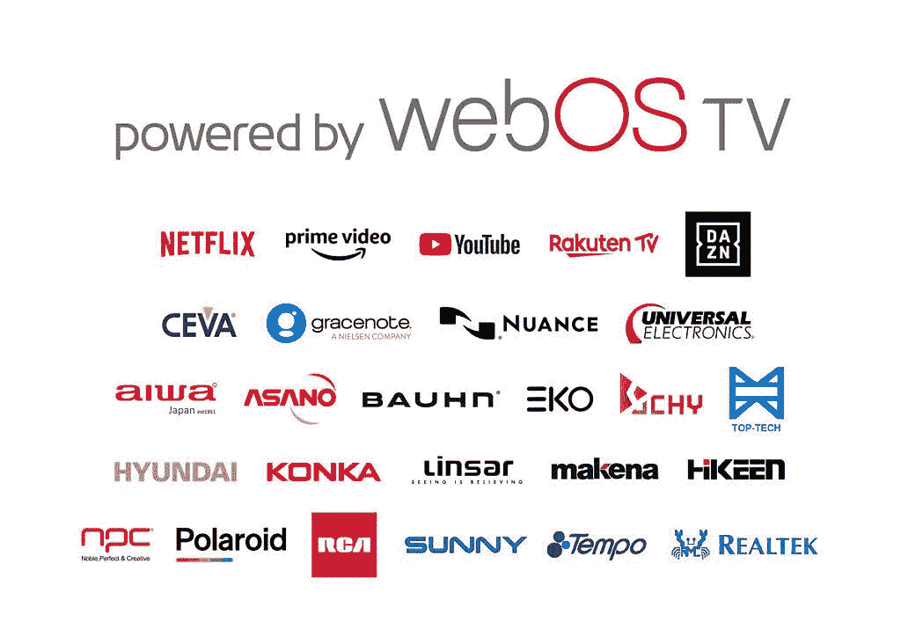

# LG 的 webOS 智能电视平台将很快在其他品牌的电视上推出

> 原文：<https://www.xda-developers.com/lg-webos-platform-other-tv-brands/>

今年 1 月早些时候，LG 揭开了其最新智能电视平台 webOS 6.0 的面纱。此次更新引入了各种变化，包括更新的主屏幕、对谷歌助手和亚马逊 Alexa 的支持、用于增强内容发现的新的 Next Picks 功能等等。除此之外，该公司还宣布，更新后的软件体验将在今年晚些时候在部分 2021 LG 智能电视型号上获得[原生谷歌 Stadia 和 NVIDIA GeForce NOW 支持](https://www.xda-developers.com/lg-tvs-google-stadia-geforce-now-coming-soon/)。其中一些功能甚至可能在今年进入其他制造商的智能电视，因为 LG 现在透露，它已经开始向其他电视品牌授权 webOS。

根据来自 *The Verge* 的[最近报道](https://www.theverge.com/2021/2/23/22298058/lg-licensing-webos-other-tvs-rca-polaroid)，LG 的 webOS 将很快出现在其他品牌的电视上。该公司已经开始将软件平台授权给其他电视制造商，RCA、Ayonz 和康佳等品牌已经加入。在一份关于此事的新闻稿中，LG 表示，*“这有可能重塑技术和内容提供商的电视业务，同时显著提高 LG 在全球家庭娱乐市场的地位和影响力。”*

 <picture></picture> 

"powered by webOS TV" partners

遗憾的是，LG 目前没有向其他电视品牌提供 webOS 6.0，其“由 webOS TV 驱动”平台基于旧的 webOS 5.0 版本。然而，这在不久的将来可能会改变。在阐述许可协议时，LG 透露，注册“由 webOS TV 驱动”平台的电视制造商将获得*“熟悉且备受好评的 UX 设计，以及丰富的功能，如语音搜索和控制、集成的人工智能算法和 webOS 闻名的轻松连接”*。他们还将获得广泛的内容选项，包括访问流行的流媒体服务，如网飞、YouTube、亚马逊 Prime Video、体育流媒体服务 DAZN 和 LG Channels。一些兼容的电视型号也将配备 LG 的 Magic Motion 遥控器。