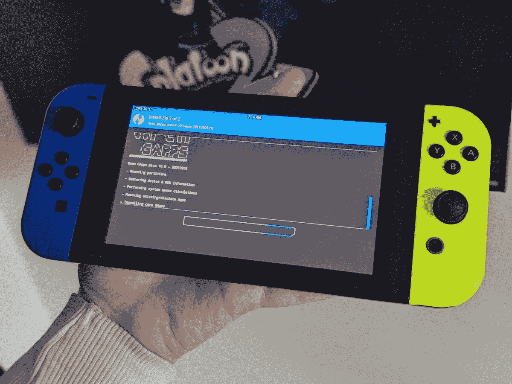

# 任天堂 Switch 的 LineageOS 17.1 带来了 Android TV 10

> 原文：<https://www.xda-developers.com/lineageos-17-1-nintendo-switch-android-tv-10-joy-con-support/>

Android 10 刚刚被移植到任天堂 Switch。由于 SwitchRoot 团队的辛勤工作，现在有可能在您的任天堂 Switch 控制台上享受基于 Android 10 的 LineageOS 17.1 端口。这个版本来自最初将 Android 8.1 Oreo 移植到任天堂 Switch 的团队。

Android 10 版本基于 NVIDIA SHIELD TV 的 LineageOS 17.1 版本，并在之前的版本基础上进行了许多改进，包括急需的深度睡眠模式，这样操作系统就不会谋杀你的主机的电池寿命。根据 SwitchRoot 团队的说法，它通常比之前的 Android 8.1 Oreo 版本更快，响应更快。

任天堂 Switch 的非官方* LineageOS 17.1 端口提供以下功能:

*   基于沿袭 17.1 的 Android 10
*   OTA 更新。
*   完整的 Joy-Con 和 Pro 控制器支持模拟棒和轨道。
*   Hori Joy-Con 支持。
*   可以持续数周的深度睡眠。
*   基于 Android TV 的构建。
*   重新设计的风扇外形可实现更安静的运行。
*   分辨率缩放的优化坞站支持。
*   支持 USB-PD 和第三方坞站的重写充电器驱动程序。
*   优化的触摸屏驱动程序。
*   通过赫卡忒分区工具更容易安装。
*   返工，更简单，电源配置文件。
*   更好的 WiFi 驱动，更少的掉线。
*   Shield TV remote app 支持轻松对接控制。
*   重启至有效负载支持。
*   改进的蓝牙配件支持。
*   支持自动旋转。

ROM 有两种风格:一种是平板电脑版本，提供标准的 Android UI，支持所有应用程序；另一种是 Android TV 版本，支持对接和非对接用例，但对应用程序的支持较为有限。如果您主要在未对接时使用任天堂 Switch，建议使用前者，而后者将提供更好的对接体验。

至于 bug 和破东西，开发商说是为神盾局打造的游戏(半条命 2，古墓丽影等。)不受支持，您可能会注意到蓝牙音频有些断断续续。一些应用程序也可能不支持 Joy-Con D-Pad。

为了安装这个版本，你需要[一个 RCM 可利用的任天堂 Switch](https://ismyswitchpatched.com/) ，一根 USB-C 电缆，一个高速 microSD 卡(格式化为 FAT32)和一台 PC。如果你已经在 SD 卡上安装了 Android 8.1 Oreo build，请确保在安装 Android 10 build 之前备份你的数据，因为闪存这个新 ROM 将擦除所有数据。安装 ROM 本身后，如果你使用 Xbox 控制器，一定要刷新 Google Apps 包、警报禁用 ZIP 和 Xbox Joycon 布局 ZIP。

 <picture></picture> 

Installing Google Apps onto a Nintendo Switch via TWRP. Photo: Adam Conway

如果你有兴趣在你的任天堂 Switch 上试用 Android 10 的 LineageOS 17.1 ROM，请访问下面的链接，在那里你会找到所有必要的信息，包括一步一步的闪烁指南。向开发者[章程](https://forum.xda-developers.com/m/bylaws.9648761/)、[钢铁 01](https://forum.xda-developers.com/m/steel01.1416222/) 、 [CTCaer](https://forum.xda-developers.com/m/ctcaer.4559618/) 、[朗格汉斯](https://forum.xda-developers.com/m/langerhans.3817491/about)、Ave 和其他贡献者致敬，感谢他们为此付出的努力！

**[为任天堂 Switch](https://forum.xda-developers.com/t/rom-unofficial-switchroot-android-10.4229761/)** 下载 LineageOS 17.1

*需要澄清的是，这是 LineageOS 17.1 的“非官方”版本，因为它不是由 LineageOS 团队构建的。然而，它是“官方”的，因为它是由最初将 Android 移植到任天堂 Switch 的 SwitchRoot 团队制作的。