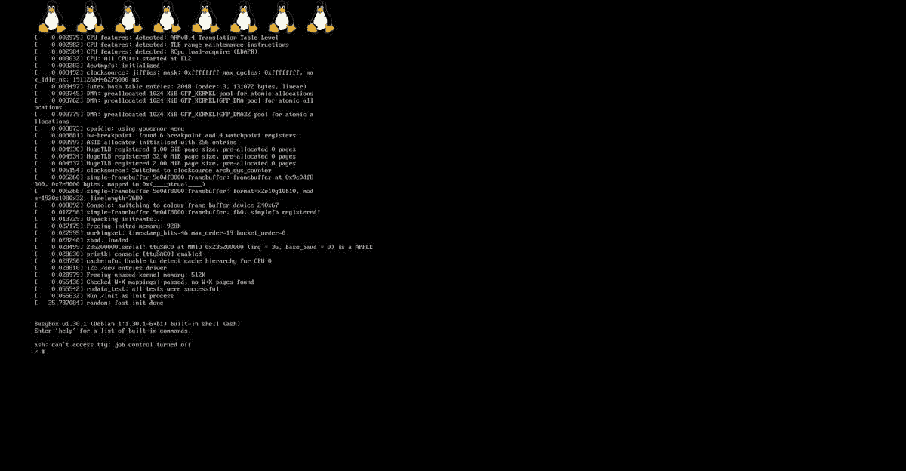

# Linux 内核将很快对苹果的 M1 芯片组提供初始支持

> 原文：<https://www.xda-developers.com/linux-kernel-initial-support-apple-m1/>

苹果去年发布了其首款桌面级片上系统设计——苹果 M1，基于与大多数智能手机和平板电脑相同的 ARM 架构。虽然 Linux 多年来在 ARM 设备(如 Raspberry Pi)上运行良好，但苹果的硬件是高度定制的，需要特定的软件支持。谢天谢地，我们现在离在苹果芯片上运行 Linux 又近了一步。

Asahi Linux 一直致力于将“完美的 Linux 体验”带到苹果硅 MAC 电脑上，并向 Linux 项目提交其代码，以纳入官方 Linux 内核。该小组的最初工作已经合并到 Linux SoC 代码库中，并且很可能作为即将到来的 Linux 5.13 更新的一部分。

看到对苹果新硬件的初始支持在第一个硬件开始发货后几个月就出现在 Linux 内核中令人兴奋，但这里的关键词是“初始”。虽然从技术上来说，Linux 已经在 M1 启动，但距离插上 USB 驱动器并点击安装按钮，我们还有很长的路要走。当前代码包括对基本底层功能的支持，例如通过旋转表的[对称多处理](https://en.wikipedia.org/wiki/Symmetric_multiprocessing)、 [IRQ 处理](https://www.kernel.org/doc/html/latest/core-api/genericirq.html)、串行连接和一个帧缓冲区。Linux 可以引导到命令提示符，但除此之外就没什么了——甚至还没有完全的图形支持。

 <picture></picture> 

Linux on Apple M1 Mac Mini (Credit: Asahi Linux)

虽然官方内核对 M1 硬件的支持稳步发展，但一些人已经通过各种黑客手段接近了真正的桌面体验。专门从事 ARM 虚拟化的开发公司 Corellium 能够在 M1 Mac Mini 上创建一个[可用的 Ubuntu 桌面。然而，Corellium 的大部分工作并没有升级到 Linux 内核中。](https://www.xda-developers.com/desktop-ubuntu-linux-ported-apple-m1-mac/)

Corellium 在博客文章中描述了 M1 的架构与其他手臂设计[的不同之处。引导加载程序，传统上称为 iBoot，以称为 Mach-O 的格式加载可执行目标文件，可选地压缩并包装在称为 IMG4 的基于签名 ASN.1 的包装器格式中。相比之下，64 位 ARM 上的普通 Linux 从平面二进制映像开始。该小组继续说，“如果这还不够，苹果公司设计了他们自己的中断控制器，苹果中断控制器(AIC)，不兼容任何一个主要的 ARM GIC 标准。不仅如此:定时器中断——通常连接到 ARM 上常规的每 CPU 中断——转而路由到 FIQ，这是一个深奥的架构特性，在过去的 32 位 ARM 时代更常见。”](https://corellium.com/blog/linux-m1)

苹果的 [M1 芯片组](https://www.xda-developers.com/apple-macbook-air-macbook-pro-13-mac-mini-m1-arm-soc/)目前在 MacBook Air、MacBook Pro 和 Mac Mini 上发货。这是一款 5 纳米芯片，共有八个内核:四个高性能内核和四个高能效内核。还有一个用于机器学习任务的神经引擎，以及一个八核 GPU。苹果承诺 M1 将提供比以前使用的英特尔 CPU 更好的性能，同时只使用大约四分之一的功率，后来的[真实世界测试](https://www.macrumors.com/guide/m1-macbook-pro-vs-intel-macbook-pro/)证实了这些说法。幸运的是，M1 完全支持引导未签名的/定制的内核，所以运行 Linux 不需要任何安全漏洞，以后可以打补丁。

苹果自己的 macOS 已经是一个很棒的操作系统，但将桌面 Linux 作为一个选项可能是一些潜在 MacBook 和 Mac Mini 买家的一个强大卖点。多年来，苹果一直因锁定 macOS 的某些方面或放弃跨平台标准以支持专有替代品而受到批评。比如 macOS 仍然不支持图形的跨平台 Vulkan API，[只有公司自己的 Metal API](https://venturebeat.com/2018/06/06/apple-defends-end-of-opengl-as-mac-game-developers-threaten-to-leave/) 。