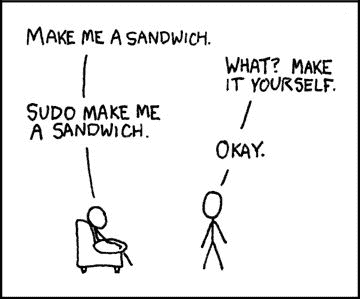

# PSA:如果你的 PC 运行 Linux，你应该现在更新 Sudo

> 原文：<https://www.xda-developers.com/linux-update-sudo-security-flaw/>

尽管事实上成千上万的贡献者积极地仔细研究 Linux 内核和各种 Unix 实用程序的源代码，寻找安全缺陷，但未被注意到的严重错误并不是闻所未闻。就在一天前，Qualys 的人披露了一种新的基于堆的缓冲区溢出攻击向量，该向量以“Sudo”程序为目标来获得根访问权限。这次的 bug 好像还挺严重的，bug 在代码库内部已经存在了差不多 **10 年**！尽管特权提升漏洞已经被修补，但它仍有可能在**几乎所有的 Linux 发行版**和几个类似 Unix 的操作系统上被利用。

* * *

## 萨梅迪男爵入场

正式编目为 [CVE-2021-3156](https://cve.mitre.org/cgi-bin/cvename.cgi?name=CVE-2021-3156) ，该漏洞已被命名为**巴龙·萨姆迪特**。这个名字似乎是对巴隆·萨梅迪 和`sudoedit`实用程序的一种发挥，因为后者被用于其中一个漏洞利用路径。通过利用此漏洞，任何无权限的本地用户都可以在易受攻击的主机上拥有不受限制的超级用户权限。用更专业的术语来说，该错误涉及控制“user_args”缓冲区的大小(这意味着 sudoers 匹配和日志记录)，以便执行缓冲区溢出和错误地取消转义参数中的反斜杠，从而获得 root 权限。

[EMBED _ VIMEO]https://VIMEO . com/504872555[/EMBED _ VIMEO]

## 为什么巴隆·萨梅迪是一个致命的弱点

可利用的代码[可以追溯到 2011 年 7 月](https://github.com/sudo-project/sudo/commit/8255ed69)，它影响了所有从 1.8.2 到 1.8.31p2 的遗留 Sudo 版本以及所有从 1.9.0 到 1.9.5p1 的稳定版本的默认配置。据说这个安全漏洞很容易被利用:本地用户不需要是特权用户或者是 sudoers 列表的一部分。因此，任何运行相当现代的 Linux 发行版的设备都可能成为这个 bug 的受害者。事实上，Qualys 的研究人员能够在 Ubuntu 20.04 (Sudo 1.8.31)、Debian 10 (Sudo 1.8.27)和 Fedora 33 (Sudo 1.9.2)上获得完全的 root 权限。

在 XDA，我们通常欢迎普通用户获得 root 访问权限的能力，但我们并不庆祝像这样的 root 漏洞的存在，尤其是这样一个如此普遍并且对最终用户具有潜在的难以置信的危险的漏洞。该漏洞已在昨天发布的 [sudo 版本 1.9.5p2](https://www.sudo.ws/alerts/unescape_overflow.html) 中修复，同时 Qualys 公开披露了他们的发现。我们要求读者尽快升级到 sudo 1.9.5p2 或更高版本。

 <picture></picture> 

Source: [xkcd](https://xkcd.com/149/)

## 如何检查自己是否受到巴隆·萨梅迪的影响

如果您想测试您的 Linux 环境是否易受攻击，请以非 root 用户身份登录系统，然后运行以下命令:

```
 sudoedit -s / 
```

易受攻击的系统应该以一个以`sudoedit:`开头的错误来响应。但是，如果系统已经打了补丁，就会显示以`usage:`开头的错误。

* * *

**来源: [Qualys 博客](https://blog.qualys.com/vulnerabilities-research/2021/01/26/cve-2021-3156-heap-based-buffer-overflow-in-sudo-baron-samedit)**

**Via: [哔哔声电脑](https://www.bleepingcomputer.com/news/security/new-linux-sudo-flaw-lets-local-users-gain-root-privileges/)**