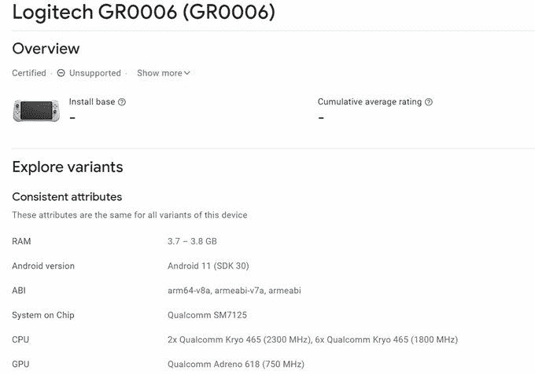

# 罗技 G 云游戏手持设备可以配备骁龙 720G 和 6000 毫安时电池

> 原文：<https://www.xda-developers.com/logitech-cloud-gaming-handheld-specs-leak/>

# 罗技的云游戏掌机可以装载骁龙 720G 和 6000 毫安时电池

一系列新的泄露显示，即将推出的罗技 G 云游戏手持设备可能会配备骁龙 720G 和 6000 毫安时电池。

罗技正与腾讯合作，在今年晚些时候向市场推出一款新的云游戏手持设备。虽然该公司尚未发布关于该设备的任何细节，但最近的一次泄露让我们第一次看到了它的设计。现在，我们有一些关于它的硬件的细节。

罗技云游戏手持设备的 Google Play 控制台列表显示，该设备的型号将为 GR0006，并将封装高通 SM7125 SoC(又名骁龙 720G)，Adreno 618 GPU 和 4GB 内存。该清单还透露，该设备将运行 Android 11 开箱即用，它包括一个渲染，证实了我们在最近的泄漏中看到的设计。

 <picture></picture> 

Via: Kuba Wojciechowski

FCC 列出的一款相同型号的罗技设备进一步补充说，它将配备 6000 毫安时电池和 Wi-Fi 5 支持。虽然在 FCC 的列表中没有提到蜂窝变体，但它确实透露了这款设备可能会被称为罗技 G 云游戏手持设备。美国专利商标局的设备清单也证实了这一名称。

基于这些规格，我们怀疑罗技 G 云游戏掌机可能只是一款专门用于云游戏服务的平价游戏机。然而，由于较旧的骁龙 720G 芯片、Adreno 618 GPU 和 4GB 内存，它可能不太适合移动游戏。如果是这样的话，与带有游戏控制器的中档智能手机相比，罗技 G 云游戏手持设备可能会很难销售。

*你会选择专用的云游戏设备，而不是价格相似的中档 Android 智能手机和游戏控制器组合吗？请在下面的评论区告诉我们。*