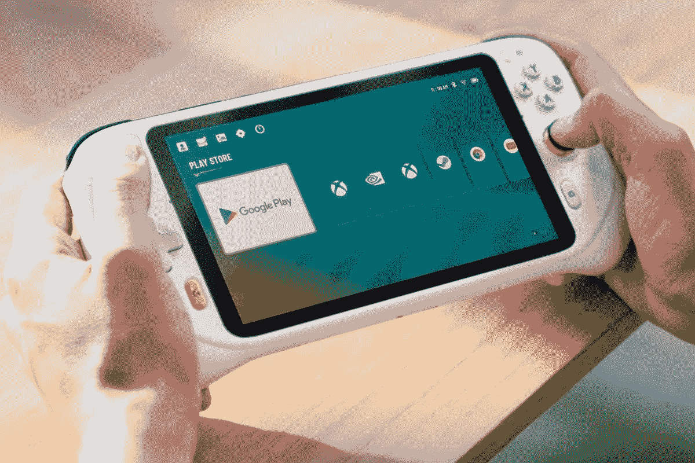

# 罗技的 G 云游戏手持设备首次亮相，售价 349.99 美元

> 原文：<https://www.xda-developers.com/logitech-g-cloud-gaming-handheld-release/>

经过上个月的一些小泄露后，罗技正式发布了它的首款云游戏主机。罗技 G 云游戏手持设备将于 10 月份上市，售价为 349.99 美元。

罗技 G 云游戏手持设备是一款游戏设备，提供精确的游戏控制，大型 1080p 显示器，并利用云游戏流媒体服务来提供最多样化的体验。该设备是与腾讯游戏合作开发的，支持 Xbox Game Pass Ultimate 和 Nvidia GeForce Now 等云游戏服务。该主机甚至可以在支持 Xbox 和 Steam 的情况下执行本地游戏流。此外，该设备可以利用谷歌 Play 商店的视频流应用程序和游戏。

罗技 G 云游戏掌机由高通骁龙 720G 处理器提供动力，拥有一个 7 英寸 1080p 的大显示屏，刷新率为 60Hz。该显示器将提供 450 尼特的最大亮度，这应该会使户外游戏变得更好，而且它还将支持多点触摸。该设备将有立体声扬声器和麦克风，具有回声消除和噪声抑制功能。此外，该设备将为您提供多种连接音频设备的方式，包括 3.5 毫米耳机插孔、带高通 aptXTM 自适应支持的蓝牙 5.1 以及可用于音频和充电的 USB-C 端口。

尽管在引擎盖下提供了许多硬件，罗技 G Cloud 的重量将达到 462 克，比任天堂 Switch 有机发光二极管模型的重量略高，约为 421 克。在正常使用的情况下，罗技掌上电脑一次充电将能够提供超过 12 小时的游戏。这款游戏机将于 10 月份上市，售价 349.99 美元。作为特别促销的一部分，那些预购该设备的人将获得 50 美元的折扣，使价格降至 299.99 美元。

 <picture></picture> 

Logitech G Cloud Gaming Handheld

##### 罗技 G 云游戏掌机

罗技的新游戏手持设备可以利用 Xbox Game Pass Ultimate 和 Nvidia Geforce Now 等游戏流媒体服务。

* * *

**来源** : [罗技](https://ir.logitech.com/press-releases/press-release-details/2022/Logitech-G-Elevates-Game-Streaming-By-Unveiling-Cloud-First-Handheld-Gaming-Device/default.aspx)