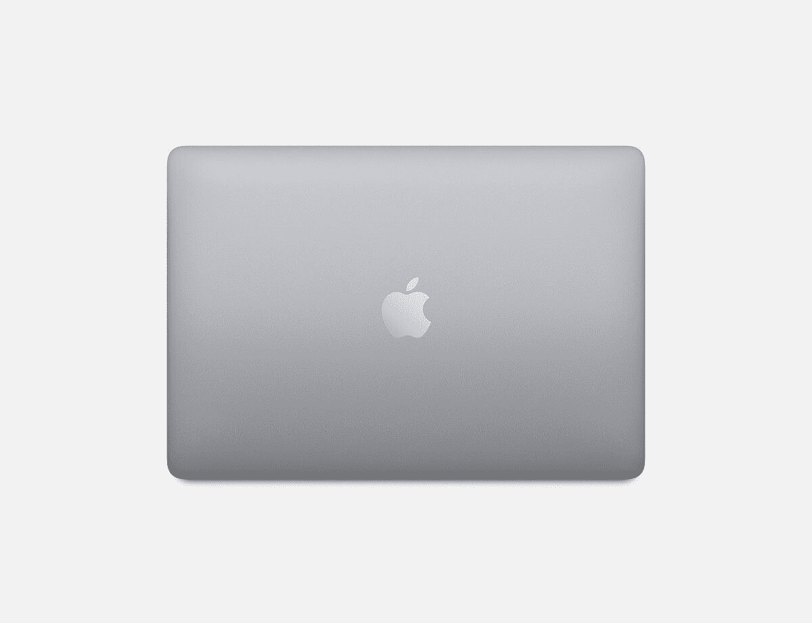

# 仅今天在百思买购买精选 MacBook Pros 可节省 200 美元

> 原文：<https://www.xda-developers.com/macbook-pro-best-buy/>

我绝对是一个拖延者，尽管我通常很早就把我的假日购物处理掉。当然，有些人会等到最后一刻才挑选节日礼物，我通常会对他们说“祝你好运”。但是，好吧，既然我的正式工作是为你们这些最后一分钟的购物者找到一些物美价廉的好礼物，我想我是今年的幸运儿。百思买也为我们所有人的拖延购物者感到难过，因为最后一秒钟的储蓄活动。

一直持续到周四，百思买的最新促销活动为各种精美礼品提供了不错的折扣。他们也有一些很棒的日常交易，今天的交易是在 MacBook Pro 的特定型号上节省 200 美元。虽然销售活动一直持续到周四，但这种特殊的销售只持续到当天结束。不要拖延这笔交易！

一个重要的注意事项是，这项协议并不适用于装有新 M1 芯片的 MacBook。这些 MacBooks 仍然是 2020 年的型号，但它们是装有英特尔酷睿 i5 芯片的笔记本电脑。如果这不是一个交易破坏者，那么你有一个伟大的交易在你的手中！

在售的 MacBook Pros 是 13 英寸的型号，os 的价格差异来自于内存。你可以选择 256GB 或 512GB 的固态硬盘，价格相差 200 美元。我个人的建议是购买 256GB 的型号，并辅以外置固态硬盘或硬盘，但你是否希望节省空间取决于你自己！

无论如何，一旦你做了决定，立即前往百思买的销售页面！

 <picture></picture> 

Apple MacBook Pro 13

##### 苹果 MacBook Pro 13 英寸(英特尔，2020 年)

需要新的 MacBook？新款 MacBooks 的英特尔酷睿型号今天在百思买打折 200 美元！这次拍卖只持续到今天结束，所以不要睡大觉。

如果你正在寻找更多的交易，前往百思买的[最后一秒节约活动](https://shop-links.co/1727183684522779993?u1=9c628c91-1135-4924-88d9-d80decaa0756)登录页面。也许你会为自己找到一份礼物！