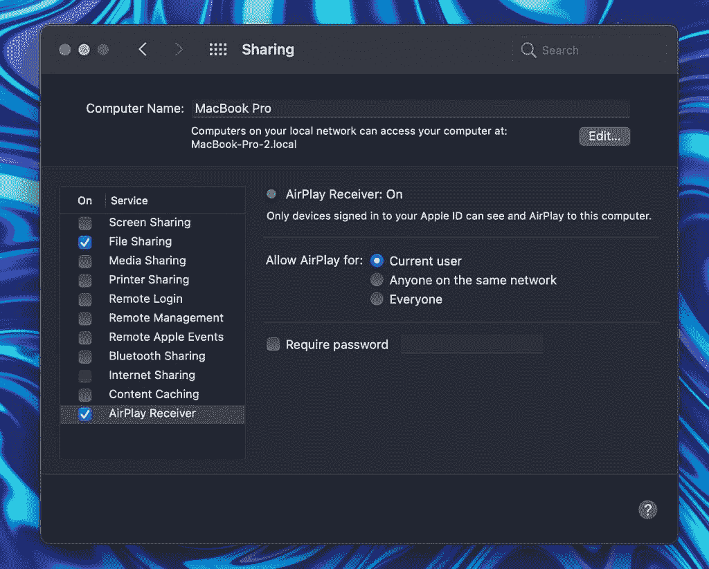
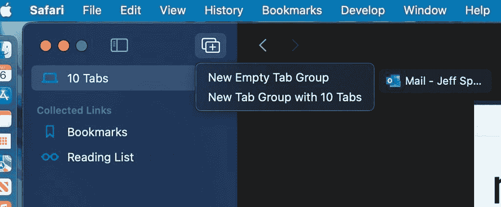
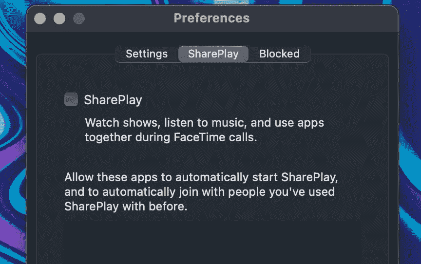
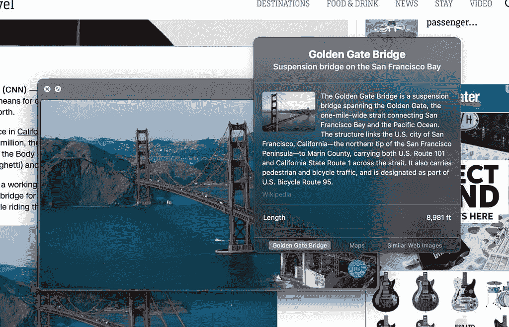

# macOS Monterey:发布日期、功能、隐私等

> 原文：<https://www.xda-developers.com/macos-monterey/>

最初于 2021 年 6 月在苹果的虚拟 WWDC 活动上亮相， [macOS Monterey](https://www.xda-developers.com/how-to-install-macos-monterey/) 是 macOS 的最新版本。之前的 macOS 正式版是 Big Sur，在视觉上有了巨大的改变，可用性也有了很大的提升。相比较而言，macOS Monterey 是一个较小的更新，侧重于性能和隐私。此外，Safari 还获得了新的外观和一些漂亮的新功能。在本文中，我们将介绍您需要了解的关于 macOS Monterey 的一切:发布日期、新特性等等。

## 马科斯·蒙特雷是什么时候发行的？

macOS Monterey 于 2021 年 10 月 25 日向公众发布。它的发布日期是在 10 月 18 日苹果的“Unleashed”Mac 发布会上宣布的。测试期持续了大约四个月，由于操作系统的复杂性，这比 iOS 的三个月要长，这并不奇怪。

## 我的 Mac 能运行 macOS Monterey 吗？

macOS Monterey 与许多能够运行 macOS Big Sur 的 MAC 兼容。不幸的是，一些 2013 年和 2014 年的老款 MAC 电脑没有安装 macOS Monterey。以下是现在可以更新到 macOS Monterey 的所有 MAC 的列表:

*   iMac-2015 年末及以后
*   iMac Pro - 2017 和更高版本
*   MacBook Air-2015 年初及以后
*   MacBook Pro-2015 年初和更高版本
*   MAC Pro-2013 年末及更高版本
*   MAC mini-2014 年末及更高版本
*   MacBook-2016 年初及以后

这些是与 macOS Big Sur 更新兼容的 MAC:

*   2015 年及以后的 MacBook
*   2013 年及以后的 MacBook Air
*   2013 年末及之后的 MacBook Pro
*   2014 年及以后的 iMac
*   2017 年及以后的 iMac Pro
*   2014 年及以后的 Mac mini
*   2013 年及以后的 Mac Pro

请注意，2013 年和 2014 年的 MacBook Air、2014 年的 iMac 以及 2013 年和 2014 年的 MacBook Pros 都处于 Big Sur 更新生命周期的末期。

## macOS Monterey 有哪些大的特点？

### 通用控制

如果你有多台苹果电脑，或者一台苹果电脑加 iPad 组合电脑，这个功能会让你的生活方便很多。您现在可以使用单个键盘和鼠标/触控板来控制多个 Mac 或 iPad 设备。这对于我们这些将 iPad 作为台式电脑 Mac 或 MacBook Pro 的辅助设备的人来说尤其有用。现在，你甚至可以在 Mac 和 iPad 之间拖放文本或多媒体内容。

也许万能控制最好的部分就是它能正常工作。您不需要在任何设备上进行任何设置或启用设置。将你的 Mac 和 iPad 放在一起，你可以自动地将光标从一个设备无缝地移动到另一个设备。对于许多依赖全套苹果设备的高级用户来说，这一功能可以轻松变革工作流程。

### AirPlay 到 Mac

AirPlay 在这一点上已经存在了相当一段时间，所以大多数人都知道它是如何工作的。您可以将音频从 Mac 或 iOS 设备发送到附近兼容 AirPlay 的扬声器。有了 macOS Monterey，你还可以将 Mac 用作 AirPlay 接收器。如果你想将 iPhone 上的音乐发送到附近的 Mac 上，以获得更强劲的音频体验，这是一个非常好的功能。事实上，您甚至可以将 Mac 作为扬声器添加到任何 AirPlay 2 多房间音频设置中。

### 

通过新的 AirPlay 转 Mac 功能，您可以分享的不仅仅是音频。您还可以将任何 Apple 设备的显示器扩展或镜像到您的 Mac。这意味着你也可以将一台 Mac 用作另一台的外部显示器，这对那些拥有 iMac 和 MacBook 的人来说非常有用。新的 AirPlay to Mac 功能可以通过 USB-C 无线或有线工作，这将有助于减少听音乐时的延迟。

AirPlay to Mac 适用于 2018 或更高版本的 MacBook Pro 或 MacBook Air、2019 或更高版本的 iMac 或 Mac Pro、iMac Pro 以及 2020 或更高版本的 Mac mini。

### Safari UI 更新和标签组

有了 macOS Monterey， [Safari 有了明显不同的面貌](https://www.xda-developers.com/safari-macos-monterey/)。标签栏现在与您当前访问的网站的颜色配置文件相匹配。选项卡也更好地融入网页背景，并被重新设计为浮动气泡。网页也会在 Safari 中填满整个屏幕，页面的边框会被推到 Safari 窗口的边界。

### 

除了美学上的改进，Safari 还有一些新的可用性特性。选项卡组允许用户将一组选项卡保存在一起供以后查看，这样它们就不会占用选项卡栏上的所有空间。如果您经常需要在工作时打开一组特定的选项卡，这个功能非常有用，您可以将它们保存在一个选项卡组中，只在工作时打开这个组。要访问选项卡组，只需点击书签旁边的向下箭头。

标签组可以与其他人共享，并可以在任何运行 iOS 15、iPadOS 15 或 macOS Monterey 的 Apple 设备上访问。

### FaceTime 改进和 SharePlay

FaceTime 是苹果的标志性服务之一。对于许多 macOS 和 iOS 用户来说，FaceTime 和 iMessage 是他们被锁定在苹果生态系统中的最大原因。有了 macOS Monterey，FaceTime 有了许多可爱的功能。也许最吸引人的新功能是 SharePlay。SharePlay 允许用户通过 FaceTime 与朋友一起观看内容，并带有同步播放和音量控制。事实上，音量甚至可以调整，让您在欣赏电影或节目时继续通话。如果你更喜欢音乐，你也可以和朋友一起听 Apple Music 播放列表，用户可以在你听的时候添加曲目。

### 

如果您需要完成一些小组工作，您也可以在 FaceTime 中共享您的屏幕，以便在文稿、电子表格等方面进行协作。为了让 SharePlay 体验更好，FaceTime 现在支持空间音频。借助空间音频，您的 FaceTime 通话质量比以往任何时候都更好。空间音频使得屏幕上的声音听起来像是来自特定的人在你的网格视图中所处的方向。

你甚至可以在 macOS Monterey 与非 iPhone 用户进行 FaceTime，这个功能我们已经等了很久了。要与 Android 或 PC 用户进行 FaceTime 通话，只需创建一个 FaceTime 链接，并与您希望加入 FaceTime 通话的人分享。用户可以通过安卓手机或个人电脑上的 Chrome 或 Edge 浏览器加入通话。您甚至可以使用 Parallels Desktop 17 在您的 [Mac 上运行 Windows，然后与自己进行 FaceTime(如果您愿意)。](https://www.xda-developers.com/parallels-17-mac-review/)

如果你喜欢和一大群人进行 FaceTime，新的网格视图会用同样大小的磁贴显示通话中的每个人。对于使用 M1 MAC 电脑的用户，你还可以在 FaceTime 中使用[肖像模式，这样你就可以在通话时模糊背景。](https://www.xda-developers.com/how-to-use-portrait-mode-facetime-macos/)

### 实时文本

macOS Monterey 中的新动态文本功能允许用户与照片中的文本进行交互。您可以从一张简单的照片中复制地址、电话号码等等。我最常用的一种方法是给收据拍照。例如，如果你寄了一个包裹，你可以拍下收据，点击包裹追踪号，然后在 Safari 中自动追踪你的包裹。

尽管 Google 相册已经有这个功能很长时间了，但还是很高兴看到它出现在蒙特雷的 Mac 用户面前。实时文本也可以处理手写信息，所以你可以用笔写下一些东西，然后用 iPhone 拍照，创建一个数字副本来传输信息。

### 视觉查找

继续机器学习功能，视觉查找允许您获取给定照片中重要特征的信息。你可以在 Safari 或本地 Mac 上右击一张照片，然后选择“查找”选项。如果照片有任何关键特征，您会看到一个显示有用信息的弹出窗口。

### 

目前，视觉查找可以识别地标、植物、动物品种、云类型等。令人惊讶的是，这一功能在英特尔和 M1 的 MAC 电脑上都可以使用。

### 快捷指令

如果你使用 iPhone 有一段时间了，快捷方式已经很熟悉了。早在 2019 年，苹果就在 iOS 13 和 iPadOS 13 中推出了移动操作系统的快捷方式。快捷方式的基本思想是创建例程，让你从苹果设备中获得更多。快捷方式的一大卖点是提高生产力，因此将该应用程序与 Monterey 一起引入 macOS 是有意义的。

您可以从图库中获得快捷方式建议，还有新的 Mac 专用建议来提高您的台式机或笔记本电脑的工作效率。快捷方式很好地集成到了 macOS Monterey 中，可以从 Dock、菜单栏、Finder、Spotlight 或使用 Siri 运行，而且它们也是通用的。在 iPhone 上制作的快捷方式可以在 Mac 上使用，反之亦然。如果您是专业用户，您还可以将快捷方式与 shell 脚本集成，以获得更多功能。

## 还有其他值得了解的小功能/变化吗？

我们已经介绍了 macOS Monterey 中真正重要的东西，但是您可能也会用到的较小的功能呢？以下是蒙特雷的一些有用的特性，它们没有被大肆宣传，但仍然值得了解:

*   Finder - Finder 在复制文件时提供了一个饼图进度窗口，并且“转到文件夹”有了新的外观和自动完成引擎。现在还有一个存放共享文档的 iCloud 协作文件夹。Finder 窗口现在在显示器之间移动时会自动调整大小，提高了多任务处理能力。
*   **Focus -** [使用 Focus](https://www.xda-developers.com/focus-ios-15-macos-monterey/) 将您的设备与您的心态相匹配。根据您当前的操作自动过滤通知。打开“请勿打扰”关闭一切，或者从工作、个人时间、睡眠、健身、游戏、阅读或驾驶的建议焦点中进行选择。
*   **低功耗模式** -您可以通过低功耗模式延长 MacBook 的电池寿命，这种模式会降低系统时钟速度和显示器亮度，以延长电池寿命。
*   **清除所有内容和设置** -有一个新选项可以清除系统中的所有用户数据和用户安装的应用程序，而无需重新安装 macOS。
*   Memoji - Memoji 通过新的定制功能代表了更多你的外观和风格，包括氧气管、耳蜗植入物和软头盔。
*   **图书应用** -享受更新版本的应用，使用起来更简单、更直观。访问以前仅在 iOS 上提供的阅读目标、想要阅读和立即阅读等功能。搜索也更直观。
*   你可以为你的 Apple ID 设置一个帐户恢复联系人，以防你忘记密码，还有一个数字遗产，这样你就可以将某人设置为遗产联系人，在你死后可以访问你的帐户。
*   **Apple Card** -高级欺诈保护让 Apple Card 用户可以频繁更改安全代码，使卡号交易更加安全。
*   **可访问性** -添加了标记描述和 PDF 签名的 VoiceOver，并且有新的可访问性聚焦的 Memoji。鼠标指针也可以定制，对“全键盘访问”的改进让 Mac 完全由键盘控制。
*   你好屏幕保护程序和背景 - macOS Monterey 包括一个“你好”的桌面图片和屏幕保护程序。
*   **查找我的**—“查找我的”应用程序提供家人和朋友的实时位置，还有一个“查找我的”小工具。AirPods Pro 和 AirPods Max 现在也与“查找我的”网络兼容，因此即使在蓝牙范围之外也可以找到它们。
*   Home - HomeKit 安全视频现在可以让你知道一个包裹何时被送到。
*   **提醒** -提醒包括对标签和自定义智能列表的支持，另外还有一个删除已完成提醒的选项。
*   **屏幕时间** -按需停机可以被激活，只允许您选择的电话和应用程序。当激活时，停机时间发送一个五分钟的提醒，然后一直持续到一天结束。
*   **Siri**-MAC OS Monterey 中的 Siri 更擅长维护请求之间的上下文，所以你可以参考你刚才问的内容，Siri 会理解的。
*   **提示**——苹果给 macOS Monterey 带来了一个提示功能，帮助人们学习新的 Mac 功能。
*   **窗口更新** -你可以在分屏视图中换出应用程序，或者将分屏视图窗口改为全屏窗口。还有一个选项可以启用全屏菜单栏，这样你就可以在全屏模式下看到应用程序菜单。
*   **邮件应用扩展**-MAC OS Monterey 中的邮件应用支持一些扩展，例如阻止内容、执行消息和撰写操作，以及提高安全性。
*   **改进的显示器支持** -运行 Monterey 的新款 MAC 将支持具有可变刷新率的自适应同步外部显示器。Adaptive-Sync 是一种可变刷新率显示技术，用于 AMD FreeSync、Nvidia G-Sync 和其他类似的显示功能。
*   **全屏菜单栏** -您可以选择始终全屏显示菜单栏，以便随时轻松查看应用程序菜单和其他简略信息。

## macOS Monterey 的隐私有什么新内容？

苹果公司一直标榜自己是隐私方面的头号科技公司。在 macOS Monterey 中，有许多新的以隐私为中心的功能。让我们来看看苹果为改善 Mac 电脑的隐私所做的一切。

### 儿童安全功能

苹果正在推出一项功能，保护儿童在任何苹果设备上交流时的安全。新的通信安全功能将在 macOS Monterey 和 iOS 15 中推出。如果孩子试图发送或接收色情照片，“信息”应用程序将发出警告。如果孩子不理会警告，或者试图回复露骨的色情照片，家长也可以选择收到通知。

此外，苹果最初概述了推出扫描 iCloud 照片以查找儿童色情内容的新功能的计划。这项功能受到了安全研究人员的强烈反对，已经被暂时推迟，并且没有在 macOS Monterey 的第一个公共版本中推出。

### 邮件隐私保护

邮件隐私保护通过防止电子邮件发件人了解您的邮件活动信息来帮助保护您的隐私。如果您选择打开它，它会隐藏您的 IP 地址，这样发件人就无法将其与您的其他在线活动关联起来或确定您的位置。它还可以防止发件人看到您是否打开了他们的电子邮件。

### 隐藏我的电子邮件

[隐藏我的电子邮件](https://www.xda-developers.com/how-to-use-hide-my-email-ios/)'允许您创建唯一的随机电子邮件地址，转发到您的个人收件箱，这样您就可以发送和接收电子邮件，而不必共享您的真实电子邮件地址。

### 密码改进

使用 Monterey，您可以生成额外登录安全性所需的验证码。如果一个站点提供双因素鉴定，您可以在“系统偏好设置”和 Safari 中的“密码”下设置验证码，而无需下载额外的应用程序。设置完成后，验证码将在您登录网站时自动填充。

密码也更容易管理。在“系统偏好设置”的“新密码”部分查找和管理您为应用程序和网站存储的密码，该部分将取代“钥匙串”。将其他密码管理器中的密码导入“系统偏好设置”或 Safari 中的密码。您也可以导出密码。对于拥有 Android 手机但使用 Mac 电脑的用户来说，这是一个很好的功能。

### 带专用中继的 iCloud Plus

[iCloud Private Relay](https://www.xda-developers.com/what-is-icloud-plus/) 是一项服务，让您可以连接到几乎任何网络，并以更加安全和隐私的方式使用 Safari 浏览。它可以确保离开您的设备的流量被加密，这样就没有人可以拦截和读取它。然后你所有的请求都通过两个独立的网络中继发送。它的设计使得任何人——包括苹果——都不能使用你的 IP 地址、位置和浏览活动来创建关于你的详细资料。

### 记录指示器

在控制中心中查看哪些应用程序可以访问 Mac 上的麦克风。一个新的软件指示器通过在应用程序访问您的麦克风时向您显示来增强相机指示灯。

## 英特尔和苹果的硅苹果电脑都有新功能吗？

随着如此多的新功能来到 macOS Monterey，您可能会想知道英特尔用户是否会被排除在某些更新之外。不幸的是，有一些功能是运行苹果芯片的 MAC 电脑独有的。

Live Text 功能最初是作为 M1 Mac 独有的功能宣布的，但随着第 4 个测试版的更新，这一功能发生了变化。英特尔 MAC 现在可以在 macOS Monterey 中使用实时文本。以下是蒙特雷剩余的苹果芯片专有功能列表:

*   肖像模式模糊了 FaceTime 视频中的背景(肖像模式选项在英特尔 MAC 上显示，但不起作用)。
*   地图应用程序中的交互式 3D 地球。
*   美国大城市更详细的地图。
*   其他语言的文本到语音转换，包括瑞典语、丹麦语、挪威语和芬兰语。
*   完全脱机执行所有处理的设备上键盘听写。
*   无限制的键盘听写(取消 60 秒的限制)。

* * *

你最喜欢的 macOS Monterey 功能是什么？请在下面的评论区告诉我们。