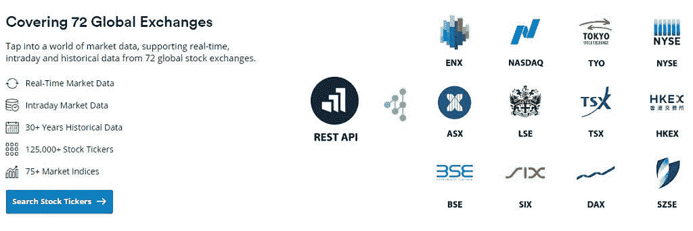
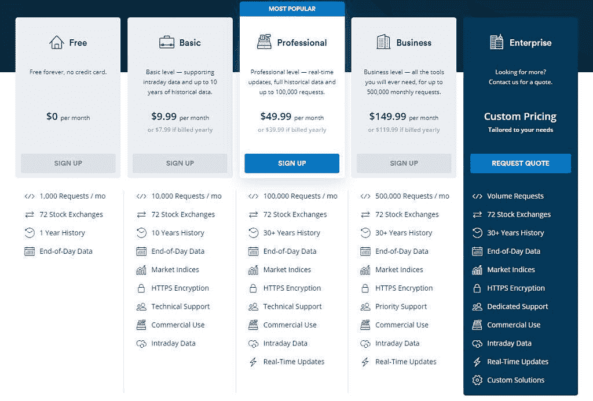

# Marketstack 是一个实时、当日和历史市场数据 API

> 原文：<https://www.xda-developers.com/marketstack/>

对于希望在应用程序中实现实时股市数据的开发人员来说，marketstack 是最佳解决方案。Marketstack 能够向您的应用程序提供实时数据和历史数据。它带有简单的搜索功能和过滤器，可以帮助您的用户找到特定的信息。开发人员更喜欢 easy REST API 接口，它可以以 JSON 格式提供全球股票市场数据。

marketstack API 能够获得任何股票的实时股票数据，精确到分钟。您的用户将能够要求当日报价，以及搜索 30 多年的市场历史。拥有超过 125，000 个股票代码，数据收集自超过 72 个全球交易所，包括纳斯达克、纽约证券交易所等。这个 REST API 是可伸缩的，可以适应任何规模的受众。

 <picture></picture> 

Marketstack REST API

您可以开始使用免费计划，不需要信用卡。在免费计划中，您每个月可以访问 1，000 次数据请求。在决定计划之前，这是一个很好的机会来看看这个 API 是否适合你和你的应用。

我们的股票市场 API 由尖端技术和高度可扩展的云基础设施提供支持，能够处理从每月数百次请求到每天数百万次点击的任何事情。无论是哪一卷，我们都会为您提供帮助！

 <picture></picture> 

Marketstack pricing

目前，超过 30，000 家公司和 80 多所大学信任 marketstack 并使用其 API。现在就开始为您的 JSON market API 使用 marketstack。

[**获取 Marketstack**](https://marketstack.com/)

###### 我们感谢 marketstack 赞助了这篇文章。我们的赞助商帮助我们支付与运行 XDA 相关的许多费用，包括服务器成本、全职开发人员、新闻撰稿人等等。虽然您可能会在门户内容旁边看到赞助内容(这些内容将始终被标记为赞助内容),但门户团队对这些帖子不承担任何责任。赞助内容、广告和 XDA 仓库完全由一个独立的团队管理。XDA 绝不会通过接受金钱来赞扬一家公司，或以任何方式改变我们的观点或看法，从而损害其新闻诚信。我们的意见不能被收买。