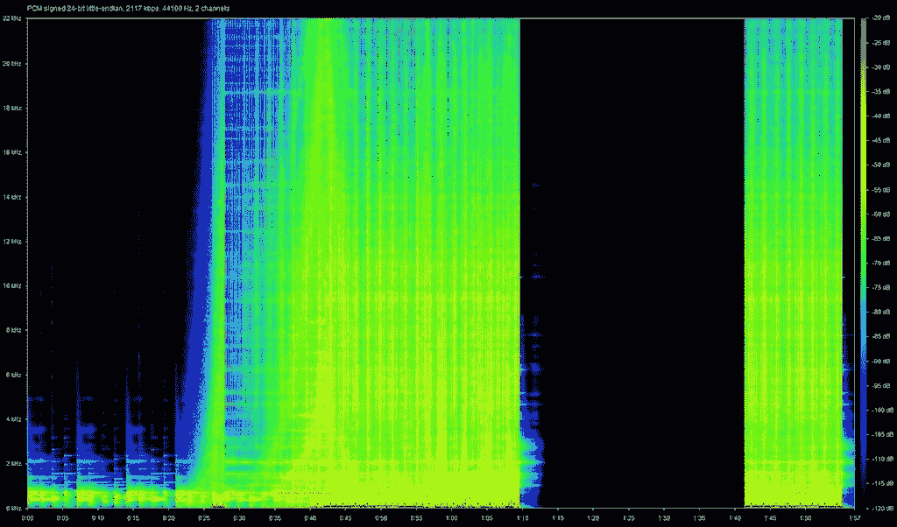
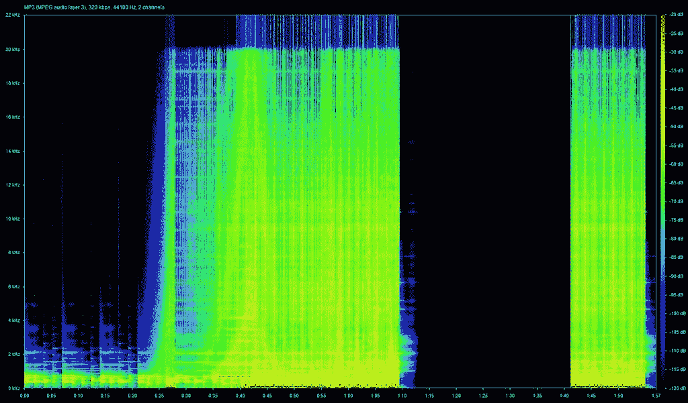
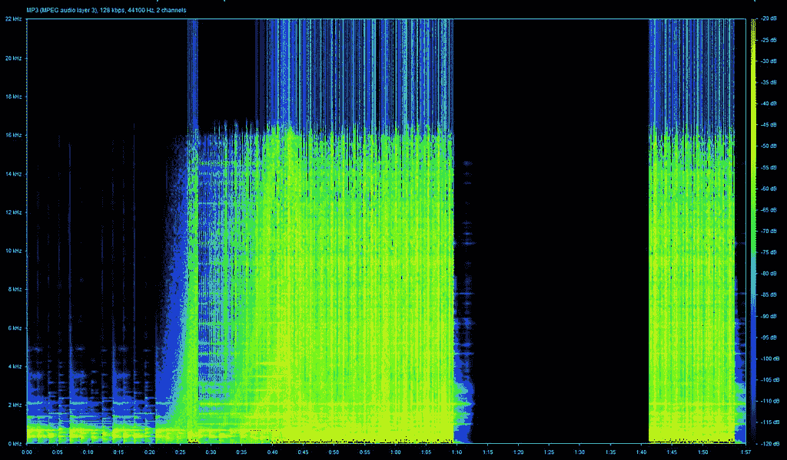
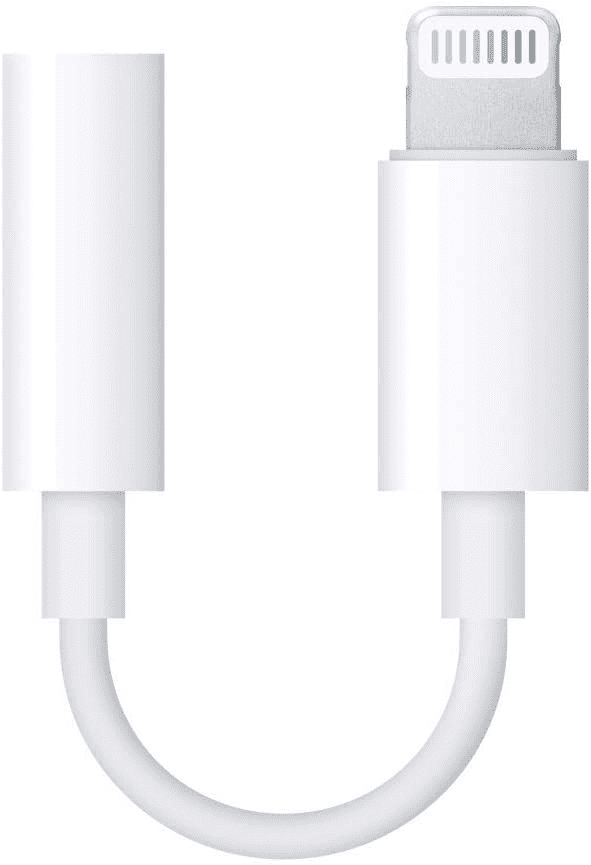
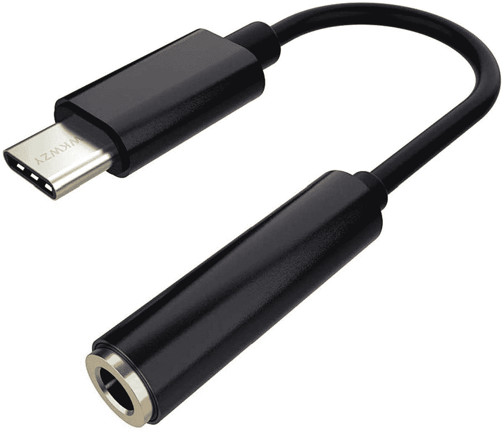
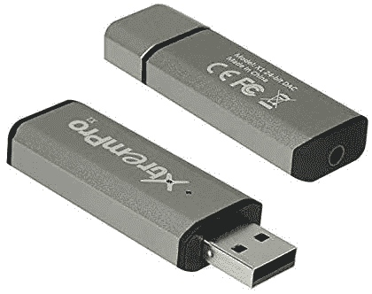
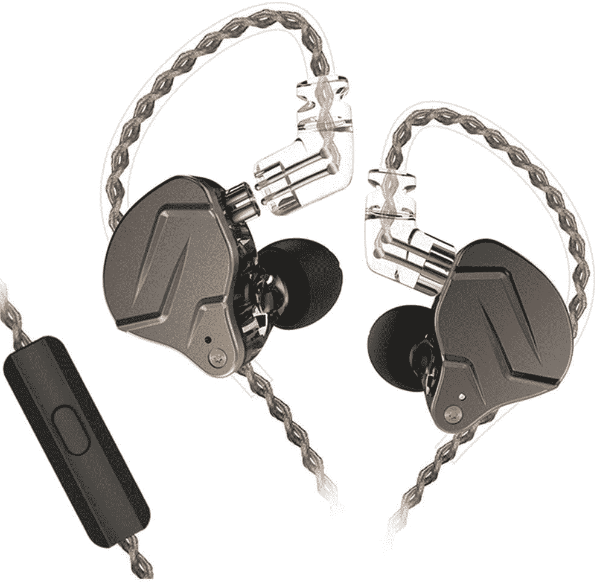

# 无损音频:作为智能手机用户你需要知道的一切

> 原文：<https://www.xda-developers.com/marshmallow-reduces-audio-latency-but-its-still-not-enough/>

还记得随身听、iPods 和 CD 播放器的美好时光吗？或者甚至在那之前，唱片在唱盘上播放的时候？这才是真正的无损音频。最纯粹形式的音频，音乐以最纯粹的形式呈现，完全符合艺术家的意图。然而，随着智能手机和音乐流媒体服务的出现，专用音乐播放器几乎已经过时。虽然能够随时随地访问庞大的音乐库非常方便，但这种方便是有代价的——音乐的音频质量。

如今，我们听的大多数音乐都经过了大幅压缩，以节省设备空间和消耗更少的移动数据。这种压缩会显著降低音频质量。如果你想听最高质量的音乐，就像艺术家想要的那样，无损音频就是答案。但是什么是无损音频呢？是否明显优于 MP3 等压缩音频格式？

## 什么是音频压缩？

 <picture></picture> 

Image credit: Florian Schemetz on Unsplash

在我们回答这个问题之前，重要的是多了解一些(不那么)常用的术语- *比特率*和*采样率*。

比特率是指每秒钟编码为音频的数据量。数据是以比特的形式存在的，因此比特率通常以千比特每秒或 *kbps* 的形式表示。另一方面，采样率指的是一秒钟内声音被转换成数据的次数。因为任何每秒*的值*都表示频率，所以采样率以千赫兹或*千赫兹*的形式表示。如果你觉得很难理解比特率和采样率的真正含义，只需知道比特率和采样率越高，你听到的音频质量就越好。

CD 或压缩光盘通常使用专门为 CD 播放器构建的音频格式，没有直接连接到 PC 的对等物。当我们将 CD 文件“翻录”到计算机时，我们通常会将这些音频流转换为 WAV 或 AIF，因为这两种编解码器支持 CD 的相同比特率和采样速率。高质量的 WAV 文件通常具有 1，411kbps 的比特率和 44.1KHz 的采样速率。理想情况下，这是听到“无损”音频所需的比特率和采样速率。然而，有一个警告。高比特率意味着更多的数据，这反过来意味着高文件大小。为了减小这些音频文件的大小，它们必须被压缩，这就是它们失去*无损*标签的地方。

现在你从网上下载的大多数音频文件通常都是 MP3 格式的。这种格式很受欢迎，因为它在多种设备上得到广泛支持，没有任何兼容性问题。然而，MP3 是一种压缩音频格式，这基本上意味着你会错过一些信息，而这些信息你可能会在无损音频文件中听到。我们说*可能*的原因是因为甚至一些音响发烧友声称他们无法区分 320kbps MP3 和 FLAC 这样的无损格式，我们稍后会谈到这一点。音频流媒体服务也使用一种称为 AAC 的格式，在相同的比特率下，这种格式通常比 MP3 听起来更好。

 <picture></picture> 

24-bit WAV Audio

 <picture></picture> 

320kbps MP3 Audio

 <picture></picture> 

128kbps MP3 Audio

你在上面看到的波形很好地描述了 WAV 和 MP3 音频之间的区别。正如你所看到的，特定频率以上的细节在 MP3 音频文件中被截掉，但在 WAV 音频中被保留。在 128kbps MP3 频谱图中，您可以看到截止频率低于 320kbps MP3 文件，这表明比特率和位深度较低的音频文件的音频质量较低。24 位 WAV 文件具有更高的频率范围，表示更多的细节和更好的音频质量。

## 未压缩音频和无损音频的区别

自从苹果宣布在 iOS 和 Android 上的 Apple Music 中使用无损音频以来,“无损”一词就被广泛使用。尽管无损音频和未压缩音频是不一样的，但值得注意的是。未压缩音频指的是未经任何技术干预的最纯粹形式的录制轨道。这是一种拥有最细微细节的音频。然而由于存储限制，分发这种音频格式是不实际的，这是压缩但无损的音频进入画面的地方。通俗地说，这就是所谓无损音频。

在某些情况下，我们提到无损音频的比特率通常从 1，411kbps 开始。另一方面，MP3 和 AAC 最大可以压缩 320kbps，这显示了这些格式的实际压缩程度。到现在为止，你一定已经意识到在无损音频和压缩音频之间找到一个中间点是很重要的。输入弗莱克和 ALAC。

## 智能手机 flac 和 alac 上的无损音频

智能手机和电脑等数字设备上的无损音频已经存在了一段时间，但由于两个原因一直不太受欢迎——一是价格昂贵，需要订阅服务，如 [Tidal](https://tidal.com/) 或 [Amazon Music HD](https://www.amazon.com/music/unlimited/hd?tag=xda-6mjt00n-20&ascsubtag=UUxdaUeUpU6436&asc_refurl=https%3A%2F%2Fwww.xda-developers.com%2Flossless-audio%2F&asc_campaign=Authority) 。第二，无损格式的专辑是有限的。

它们是如何工作的呢？他们使用一种称为 FLAC 或免费无损音频编解码器的音频编解码器。

FLAC 使用一种压缩算法，可以保持高达 96KHz 的高采样率，这甚至比我们之前谈到的 WAV 格式更好，而只占用一半的存储空间。虽然大多数现代智能手机和笔记本电脑都支持 FLAC，但苹果公司开发了自己的编解码器，称为 ALAC，代表苹果无损音频编解码器。这类似于 FLAC，只不过它兼容 iOS 和 macOS。如果您想要使用 iTunes 将无损音频传输到 iPhone，这是您需要的格式。

有一个参数我们之前没有提到，它在决定音频质量方面也起着很大的作用，那就是*位深度*或*分辨率*。位深度表示每个样本中存在的数据的位数。理解这一点的一个简单方法是从视频的角度来看。如果你看的是分辨率较低的视频，比如 480p，那么你看到的信息量或数据量比 1080p 视频要少。同样，更高的*位深度*或*分辨率*表示更好的音频质量。

FLAC 和 ALAC 都支持高达 32 位的音频，高于 CD 支持的 16 位分辨率。另外，请注意，FLAC 和 ALAC 并不总是未压缩音频的完美再现。

## Apple Music 无损音频

2021 年 7 月，Apple Music 加入了 Tidal 和亚马逊音乐 HD，为大众带来无损音频流。Apple Music 与其他平台提供无损音频的最大区别是，Apple Music 上的所有歌曲都是无损格式的，而不仅仅是精选的几张专辑。最棒的是，苹果不会对无损选项额外收费。这是一个大新闻，因为苹果通常会为其他品牌树立榜样。如果苹果免费提供无损音频，使用其他流媒体服务的消费者将会转向苹果音乐。

Spotify 宣布他们也在致力于将无损音频引入该平台，但该公司尚未提供具体的发布日期。就目前的情况来看，Apple Music 是无损荣耀中最简单、最便宜的收听所有喜欢的曲目的方式。当然，你需要相关的硬件来体验它，你可以在我们的[体验无损音频的最佳配件文章](https://www.xda-developers.com/best-wired-earphones-headphones-dac-lossless-audio/)中找到，它列出了你听无损音频所需的所有不同部分。

## 无损音频与压缩音频:你真的能区分吗？

对于普通用户来说，压缩音频和无损音频之间的区别可能并不明显。即使你是一个音响发烧友，你可能仍然不能清楚地区分 320kbps 的 MP3 和 FLAC 文件。一个简单的方法来检查你是否真的能够区分压缩音频和无损音频，就是通过你的智能手机上的录音机应用程序，以两种不同的格式录制相同的音频。

例如，在 iPhone 上，导航到*设置* *>* *语音备忘录*会显示一个名为*音频质量的选项。*先设置为*压缩*，然后转到语音备忘录 app，录一个短片。回到*设置*，现在将*质量*更改为*无损*。再录一段。连续回放两个片段，看看是否能听出不同。

这或多或少就是你在播放压缩音频和无损音频时会注意到的区别。请注意，最好使用一副高品质的耳机或头戴式耳机来听这段，因为差异会更明显。或者，你也可以访问[这个网站](http://abx.digitalfeed.net/list.html)，戴上耳机进行测试，看看你能否区分无损音频和有损音频。

然而，如果您没有合适的硬件来利用它，高比特率甚至没有任何意义。

## 如何在 Android/iOS 智能手机上体验无损音频

现在困难的部分来了。你已经理解了无损音频、FLAC、ALAC 和所有其他术语的含义，现在你想体验一下。你怎么能这样做？我们希望答案是直截了当的。

在宣布 Apple Music 上的无损音频后不久，苹果公司也发表了一份声明，称无损音频不会在 [AirPods Pro](https://www.amazon.com/Apple-MWP22AM-A-AirPods-Pro/dp/B07ZPC9QD4/?tag=xda-6mjt00n-20&ascsubtag=UUxdaUeUpU6436&asc_refurl=https%3A%2F%2Fwww.xda-developers.com%2Flossless-audio%2F&asc_campaign=Authority) 甚至超级昂贵的 [AirPods Max](https://www.amazon.com/New-Apple-AirPods-Max-Space/dp/B08PZHYWJS?tag=xda-6mjt00n-20&ascsubtag=UUxdaUeUpU6436&asc_refurl=https%3A%2F%2Fwww.xda-developers.com%2Flossless-audio%2F&asc_campaign=Authority) 上工作。事实上，即使你有[最好的智能手机](https://www.xda-developers.com/best-phones/)和[最好的真正无线耳机](https://www.xda-developers.com/best-wireless-earbuds/)，你仍然无法在 Apple Music 上体验无损音频。

原因是蓝牙编解码器无法匹配无损音频文件的比特率。苹果使用 AAC 通过蓝牙传输音频，比特率上限为 256kbps。虽然 Android 手机和一些无线耳机支持 aptX HD，但该编解码器的比特率(576 kbps)也无法接近 ALAC。索尼的 LDAC 最接近实现无损音频所需的 1，411 kbps(990 kbps 时为 32 位/96kHz)，但 iPhone 不支持它，支持该编解码器的耳机也很少。

问题的关键是蓝牙音频编解码器不支持传输无损音频文件所需的带宽，而不压缩它们。

在 iPhone 上体验无损音频的最佳方式是使用 lightning to 3.5mm 毫米 DAC 以及一副好的耳机或头戴式耳机。Android 设备也一样，只是你需要一个 Type-C 到 3.5 毫米的适配器。一些 Android 手机确实带有内置的 HiFi DAC，这些应该能够通过耳机插孔或 USB-C 端口直接传输无损音频。虽然从技术上讲，每部手机都有内置的 DAC，但它可能无法推送无损音频。LG 在其智能手机上使用了高质量的 DAC，现在华硕 ROG 手机 5 也有一个。如果您想要最佳体验，您可能需要购买一个通过 USB 连接的良好外部 DAC。同样的解决方案也可以用在电脑或笔记本电脑上。

注意，Apple Music lossless 将分为两层——*无损*层是 *16 位/48kHz* ，比特率为 *1411kbps* 。如果您使用苹果的 lightning DAC，这是可以访问的层。还有一个*高分辨率无损*层，让你体验 *24 位/192KHz* 音频，为此你需要一个更好的 DAC。

因此，要真正享受无损音频，您需要三个部分协同工作:

*   内置 DAC 的器件，或者内置 DAC 的器件。
*   一副高质量的耳机
*   无损的文件源，即支持无损音频流的流服务。

以下是一些产品建议，可以帮助您在智能手机或电脑上开始使用无损音频。这些只是你可以根据你的设备选择的一些建议。

 <picture></picture> 

Apple Lightning to 3.5mm Dongle

##### 苹果 Lightning 转 3.5 毫米耳机适配器

这是您需要通过 lightning 端口将有线耳机连接到 iPhone 的加密狗。

 <picture></picture> 

Portable USB-C 32-bit DAC

##### WKWZY 32 位 USB-C DAC

这是我们能找到的最实惠的 32 位 USB-C DAC 之一，对于大多数想要体验无损音频的人来说应该足够好了。

 <picture></picture> 

Xtrem Pro X1 USB-A DAC

##### Xtrem Pro X1 USB-A DAC

Xtrem Pro X1 DAC 通过 USB-A 连接，性能可靠，价格实惠。如果你只是想入门，这是一个理想的选择。

 <picture></picture> 

KZ ZSN Pro IEM

##### KZ ZSN 亲 IEM

这是你能找到的最受欢迎的 iem 之一，而且价格也很实惠。强烈推荐。

如果您正在寻找更多选项，我们有关于[音频设备的单独指南，您将需要开始使用无损音频](https://www.xda-developers.com/best-wired-earphones-headphones-dac-lossless-audio/)。这里列出了 DAC、高保真音响、IEMs、耳机等多种选择。

## 你应该对无损音频感到兴奋吗？

一般来说，无损音频听起来比压缩音频好，但好到什么程度取决于你的耳机和音频源的质量。虽然 Apple Music 和 TIDAL 使访问高分辨率音频变得更加容易，但您仍然需要购买 DAC 或 USB-C 到 3.5 毫米转换器等附件，才能真正体验无损音频。如果你是一个漫不经心的听众，这可能不值得投资，因为音质的差异可能对你来说不明显。另一方面，音响发烧友和专业人士可能会欣赏无损音频增加的深度、清晰度和丰富性。也就是说，音频质量是一个非常主观的话题。在 Apple Music 上尝试无损音乐，并将其与 Spotify 进行比较，亲自看看您是否能真正区分两者。