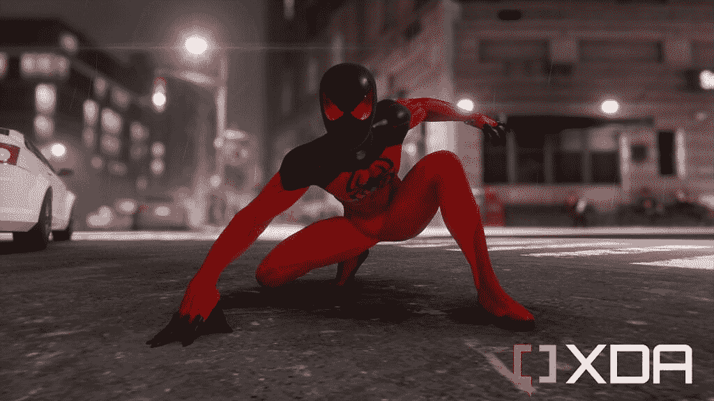

# 漫威的蜘蛛侠重拍获得蒸汽甲板验证

> 原文：<https://www.xda-developers.com/marvels-spider-man-remastered-gets-itself-verified-for-steam-deck/>

# 漫威的蜘蛛侠重拍获得蒸汽甲板验证

漫威的蜘蛛侠重拍版正在 Steam Deck 上以网络摇摆的方式进行，并带有非常重要的验证复选标记。

在漫威的《蜘蛛侠》中，在 PlayStation 上以照片模式拍摄

曾经有一段时间，索尼的热门电影《漫威的蜘蛛侠》在其他平台上播放是不可想象的。现在我们生活在一个很快就能在掌上游戏机上玩游戏的世界里。在期待已久的游戏登陆 PC 大约一周前，开发商 Insomniac Games 分享了漫威的《蜘蛛侠》重制版已经通过了 Steam Deck 的验证。

然而，这并不完全令人震惊。之前的索尼游戏《战神》和《地平线:零黎明》也都是 Steam Deck 验证过的。这可能需要很长时间才能实现，但看起来索尼在这种 PC 游戏方面并不差。

## 蒸汽甲板验证对蜘蛛侠意味着什么

 <picture></picture> 

Taken in photo mode in Marvel's Spider-Man on PlayStation

然而这实际上意味着什么呢？为了获得梦寐以求的复选标记，漫威的《蜘蛛侠》重制版满足了 Valve 评估的四个关键标准:

*   带有适当图标的完整控制器输入。
*   没有兼容性警告，任何游戏启动器必须与控制器一起使用。
*   应支持 Steam Deck 显示器的默认分辨率(1280x800 或 1280x720)，具有良好的默认设置和清晰的文本。
*   完全支持质子包括任何反作弊。

机会是游戏仍将被限制在 30 FPS，但考虑到 PS4 上的原始版本无论如何都有这一点，这几乎不是世界末日。Steam Deck 玩家也不太可能使用这种奇特的光线追踪技术。但是让我们不要回避成就。蜘蛛侠拥有一个密集的开放世界，它在 Steam Deck 这样的硬件上运行是一项成就。

超级英雄很容易超载，尤其是漫威，但这是一个必须玩的游戏。这个游戏的设定，故事，配音，一切都太不可思议了。我迫不及待地想再玩一遍，这次是在我的蒸汽甲板上。

漫威的《蜘蛛侠》将于 8 月 12 日通过 Steam 和 Epic Games 在 PC 上重新发售。它包括基本游戏加上三个额外的 DLC 包，组成了完整的不夜城资料片。

 <picture></picture> 

Marvel's Spider-Man Remastered

##### 漫威的蜘蛛侠重拍

索尼史诗蜘蛛侠的故事终于来到了个人电脑上，以其重制的形式与所有额外的 DLC。它甚至被验证为蒸汽甲板。