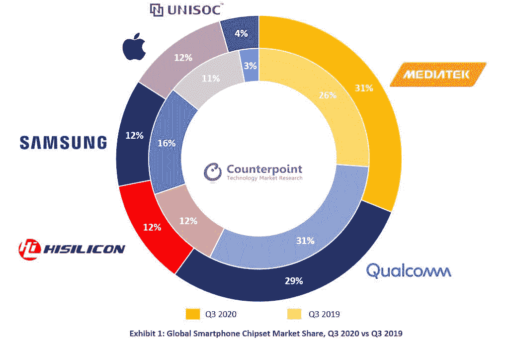
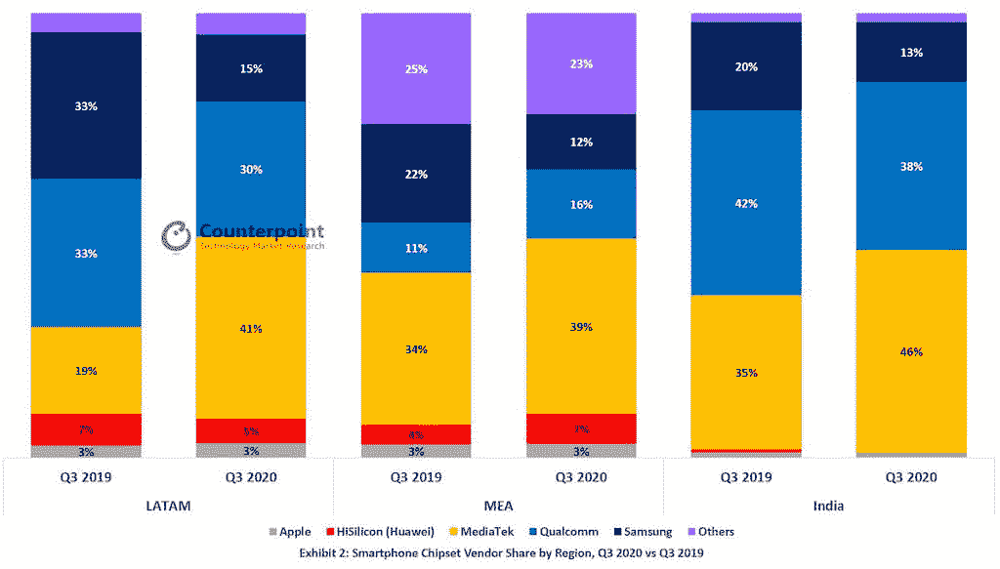

# 联发科击败高通成为顶级智能手机芯片组供应商

> 原文：<https://www.xda-developers.com/mediatek-top-smartphone-chipset-vendor-qualcomm/>

# 报告:2020 年第三季度，采用联发科芯片的手机出货量超过高通芯片

联发科是 2020 年第三季度最大的移动芯片组供应商，击败了紧随其后的高通。

2020 年第三季度，联发科击败高通，成为全球最大的移动芯片组供应商。凭借 31%的市场份额，该公司今年在智能手机市场复苏的同时迈出了令人生畏的一大步。这家芯片制造商增长的其他因素被归因于 100 美元至 250 美元价位段的强劲表现，以及包括印度和中国在内的关键地区的增长。

由 [*Counterpoint*](https://www.counterpointresearch.com/mediatek-biggest-smartphone-chipset-vendor-q3-2020/) 发布的报告称，高通以 29%的市场份额位居第二，而华为的海思、三星和苹果三家公司的市场份额均为 12%。就在上周，[联发科宣布](https://www.xda-developers.com/mediatek-dimensity-1000-plus-smartphones-coming-india-early-next-year/)它将与受欢迎的智能手机制造商合作，最早于下个月向印度市场推出其新的 Dimensity 800U 驱动的中端 5G 设备，并于明年初推出 Dimensity 1000 Plus 驱动的 5G 旗舰产品。

 <picture></picture> 

Image credits: Counterpoint

据研究总监 Dale Gai 称，拉丁美洲和中东地区的新兴市场以及美国对华为的禁令帮助联发科实现了显著增长。他还表示，与去年第三季度相比，小米手机中使用的联发科技芯片组增加了三倍以上。由 TSMC 制造的平价联发科芯片成为许多原始设备制造商的首选，以迅速填补华为缺席留下的空白。

 <picture></picture> 

Image credits: Counterpoint

然而，高通是 2020 年第三季度 5G 芯片组的最大供应商，全球销售的 5G 手机中有 39%采用了骁龙处理器。该报告进一步指出，对 5G 智能手机的需求在 2020 年第三季度翻了一番，同期销售的所有智能手机中有 17%支持 5G。由于苹果最近推出了 5G 功能的 iPhones，预计这一趋势将朝着向上的方向发展。据推测，2020 年第四季度出货的所有智能手机中有三分之一将支持 5G，高通很有可能在 2020 年第四季度卷土重来，再次成为领导者。