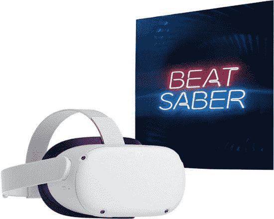

# Meta 和高通宣布合作，签署新的多年协议

> 原文：<https://www.xda-developers.com/meta-and-qualcomm-will-continue-to-partner-for-new-products/>

在过去的产品依赖其芯片后，Meta 似乎将继续与高通的关系，与该公司签署一项新的多年“广泛战略协议”。两家公司在 IFA 2022 期间宣布了合作伙伴关系，旨在为未来的 Meta Quest 项目开发利用高通定制 XR 平台的经验。

此外，Meta 和高通将通过在下一代项目中进行更深层次的合作来加强他们的关系。虽然这些公司没有宣布任何新产品或平台，但它确实继续表示，他们将“在未来几年内提供由定制虚拟现实平台驱动的多代高端设备和体验。”

高通总统兼首席执行官克里斯蒂亚诺·阿蒙指出:

通过与 Meta 合作，我们将全球两位元宇宙领导者聚集在一起，在未来几年为数十亿人带来一场计算革命。基于我们在 XR 领域的联合领导地位，该协议将允许我们的公司提供一流的设备和体验，以改变我们在完全实现的元宇宙中工作、娱乐、学习、创造和联系的方式。

Meta 的创始人兼首席执行官马克·扎克伯格表示:

我们正在与高通技术公司合作定制虚拟现实芯片组——由骁龙 XR 平台和技术提供支持——以实现我们未来的 Quest 产品路线图。这些芯片组将帮助我们不断将虚拟现实推向极限，并提供令人惊叹的体验。

最近，两人在 Meta Quest 2 上合作，该游戏于近两年前首次发布。与之前使用高通骁龙 835 处理器的 Quest 耳机不同，更新的型号提供了一个专门为 AR 和 VR 硬件构建的新平台，名为骁龙 XR2。Quest 2 是一个相对热门的产品，自发布以来在全球售出了 1480 万台，提供了一种多功能的体验，可以与 PC 一起使用，也可以作为独立的耳机使用。然而，这款耳机如此伟大的原因是其较低的价格点，这一点最近有所改变，因为 Meta 宣布在 8 月 1 日提价。

 <picture></picture> 

Meta Quest 2

##### Meta Quest 2

元任务 2 与击败军刀

至于接下来是什么，Meta 一直在调侃它的下一款 VR 头戴设备 Project Cambria。据传，这款耳机是一款高端产品，价格可能在 800 美元至 1000 美元之间。然而，尽管它的价格不菲，但据传该设备采用了与 Quest 2 中相同的高通骁龙 XR2。虽然这可能是事实，但在即将到来的单元中有某些技术将提供一种新的虚拟现实体验。例如，耳机很可能具有眼睛和面部跟踪功能，使体验变得真实。考虑到大多数消费耳机目前不提供这种技术，这是一件大事。Meta 的新 VR 头戴设备预计将于 10 月的某个时候到达。

* * *

**来源** : [高通](https://www.qualcomm.com/news/releases/2022/09/qualcomm-and-meta-partner-to-deliver-multi-generation-metaverse-)