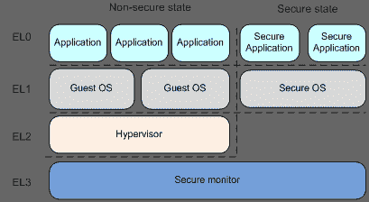
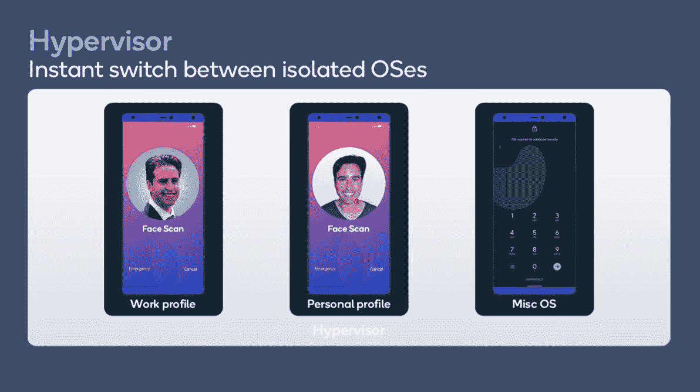

# MicroDroid 是针对虚拟机的精简版 Android

> 原文：<https://www.xda-developers.com/microdroid-stripped-down-android-virtual-machines/>

谷歌正在制作 microdroid，该公司称这是一个“最小的基于 Android 的 Linux 映像”。

根据[提交描述](https://android-review.googlesource.com/c/platform/packages/modules/Virtualization/+/1557661)，microdroid 将被用于虚拟机，并被设计为“通用 Android 系统映像(GSI)的精简版”GSI 已经是开源 Android 的一个准系统，但是 microdroid 似乎更加精简了。该项目的目标可能是允许在虚拟机管理程序上运行最小版本的 Android，以便允许虚拟化单个 Android 应用程序，而不是提供完整的二级桌面环境。

该项目可能是谷歌在 Android 硬件上实现虚拟化的更大努力的一部分，旨在提高安全性。具体来说，谷歌正在努力将名为“KVM”的 Linux 内核虚拟化机制引入由 ARM64 SoCs 驱动的 Android 设备，据杰克·艾治在*表示。( *LWN* 的文章提供了一篇名为“[面向大众的虚拟化:揭露 Android 上的 KVM](https://mirrors.edge.kernel.org/pub/linux/kernel/people/will/slides/kvmforum-2020-edited.pdf)”[PDF warning]的演讲摘要，该演讲由 Googler Will Deacon 在 KVM 论坛上举办。)引入 KVM 支持据说是为了“取消”运行在 Armv8 的[高特权异常级别](https://developer.arm.com/architectures/learn-the-architecture/exception-model/privilege-and-exception-levels)之一的第三方代码的特权。第三方代码，如 DRM、加密和其他二进制代码，可以在与 Android 操作系统相同级别的虚拟机上运行。*

 *<picture></picture> 

Source: ARM

为了管理这些虚拟机，谷歌正在为 Android 改编 Chrome OS VMM ( [crosvm](https://chromium.googlesource.com/chromiumos/platform/crosvm/) )，该系统用于[在 Chrome OS](https://www.xda-developers.com/linux-apps-chrome-os-overview-crostini/) 上运行 Linux 应用。谷歌正在[准备](https://android-review.googlesource.com/c/platform/packages/modules/Virtualization/+/1557662)交付 crosvm 作为一个名为“虚拟化”的新 APEX 包的一部分，同时为 Android 的 Linux 内核 forks 带来其 ARM64 的“受保护 KVM”项目。

有了 microdroid，我们设想谷歌希望在 Android 旁边运行小虚拟机，可能是为了 DRM 相关的应用。Microdroid 将拥有最少的组件，如 init 和 binder 服务，以便与底层 Android 主机通信。这项工作可能会与骁龙 888 中的[新类型 1 虚拟机管理程序结合起来，该公司表示，该虚拟机管理程序允许在同一设备上的应用程序和操作系统之间隔离数据，并在隔离的操作系统之间即时切换，而不会降低性能。](https://www.xda-developers.com/qualcomm-snapdragon-888-explained-specs-features/#security)

 <picture></picture> 

The new Type-1 Hypervisor on the Snapdragon 888\. Source: Qualcomm

这也可能与谷歌努力将 crosvm 背后的想法扩展到 Android 应用程序有关，作为该公司正在进行的“ARCVM”项目的一部分。没有更多的信息，我们不能肯定地说谷歌的意图是什么，但我们将继续关注 AOSP 的更多细节。

*感谢 XDA 知名开发商 [luca020400](https://forum.xda-developers.com/m/luca020400.5778309/) 的提示，感谢知名开发商 [phhusson](https://forum.xda-developers.com/m/phhusson.1915408/) 的协助！**