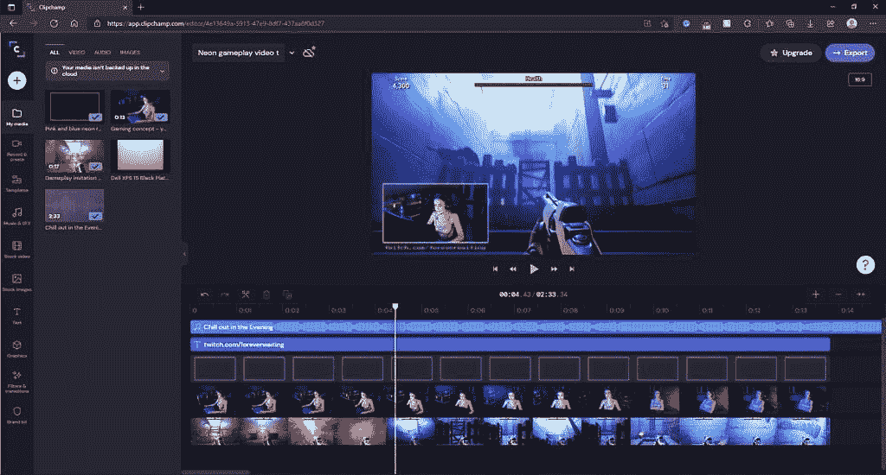

# 微软收购视频编辑器 Clipchamp 以扩展其生产力工具

> 原文：<https://www.xda-developers.com/microsoft-acquires-video-editor-clipchamp-expand-productivity-tools/>

微软已经收购了 Clipchamp，这是一个基于云的视频编辑器，可以在网上使用。公司[宣布收购](https://www.microsoft.com/en-us/microsoft-365/blog/2021/09/07/microsoft-acquires-clipchamp-to-empower-creators/)，目标是赋能创作者，这是我们以前听说过的。

有相当多的历史使得这次收购更加引人注目。早在 2000 年代和 2010 年代初，微软有一个名为 Windows Movie Maker 的工具，它包含在 Windows 中，也有几个独立版本。这是一个基本的视频编辑器，但它可以让你把剪辑、图像和音乐放在一起，创建你自己的视频。这个工具已经停产了，不过，2017 年以后，你就不能再直接从微软下载了。

如今，如果你想在 Windows 上编辑视频，你可以使用 Windows 10 的照片应用程序，但功能集非常有限，用户界面也不直观。更不用说，你甚至可能不知道它的存在，因为它是照片应用程序的一部分，而不是它自己的东西。

 <picture></picture> 

The video editor in the Windows 10 Photos app

收购 Clipchamp 让人们看到了一些希望，微软可能很快就会在 Windows 11 中加入一个合适的视频编辑器。Clipchamp 提供了一个功能齐全的视频编辑器，您可以在任何地方轻松访问。它支持多个视频和音频轨道，您可以以任何方式组合、修剪等等。它甚至提供股票视频，图像和音频，您可以使用您的视频项目。

正如我们在上面提到的，微软说它想授权给创作者，这不是我们第一次听到这种说法了。回到 2017 年初，微软发布了 Windows 10 版本 1703，它被称为 Creators Update。就在那时，它推出了 Paint 3D——一款本应取代经典 Paint 应用的应用——和带有 Beam 的 Xbox live 流媒体(后来更名为 Mixer，然后在 2020 年被取消)。当时微软的努力似乎被误导了，因为两大创新功能[并没有真正走向任何地方](https://www.xda-developers.com/microsoft-paint-3d-3d-viewer-removed-windows-installations/)。我们当时也没有一个合适的视频编辑工具，甚至没有随后的秋季创作者更新(版本 1709)。

与此同时，macOS 搭载了 iMovie，这是一款面向初学者的可靠视频编辑器，无需额外费用，是许多有抱负的创作者的首选。正如微软在博客中提到的，没有一个简单易学的工具，在开始视频编辑时很容易感到迷失。有趣的是，微软在其公告中甚至一次都没有提到它的照片应用，这应该向你展示它是一个多么可行的工具。

微软表示，Clipchamp 与微软 365 中的生产力工具以及 Windows 本身非常契合。这可能意味着我们将在未来看到 Clipchamp 内置于 Windows 11 中的强大功能，但也意味着它可以与其他微软 365 应用程序连接。例如，一个潜在的用例可能是在 PowerPoint 演示文稿中嵌入视频。另一个潜在的用例可能是将这些工具添加到 Flipgrid，这是一个教育视频平台，微软最近也收购了它。

 <picture></picture> 

Video editing timeline in Clipchamp on the web

现在，任何人都可以免费使用 Clipchamp，但你只能以 480 便士的价格导出视频。一些付费计划可以增加更高的导出分辨率和云存储。如果微软计划在微软 365 中包含 Clipchamp 工具，某些功能可能需要微软 365，但该公司也可以选择在 Windows 11 中免费提供更多功能。

当然，这一切仍有待观察，该公司表示，未来将与 Clipchamp 分享更多有关其工作的信息。不过，我们已经看到一些应用在 Windows 11 中进行了重大改变，包括[剪辑工具](https://www.xda-developers.com/microsoft-rolls-out-new-snipping-tool-and-app-updates-for-windows-11/)、[时钟](https://www.xda-developers.com/microsoft-rolls-out-new-clock-app-focus-sessions/)、[绘画](https://www.xda-developers.com/microsoft-shows-off-new-paint-windows-11/)，甚至[照片](https://www.xda-developers.com/microsoft-shows-off-photos-app-windows-11/)，因此视频编辑功能最终也会进入其中，这看起来肯定是可信的。