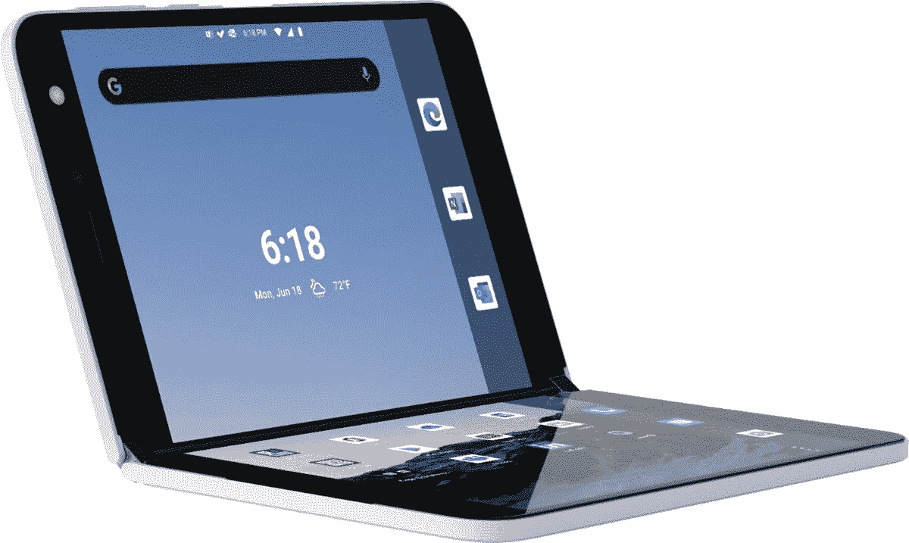

# 感恩节在百思买购买微软 Surface Duo 可节省 300 美元

> 原文：<https://www.xda-developers.com/microsoft-duo-black-friday-sale-best-buy/>

# 感恩节在百思买购买微软 Surface Duo 可节省 300 美元

微软 Surface Duo，双屏 Android 手机，在黑色星期五在百思买降价 300 美元，让你物有所值！

微软 Surface Duo 是本年度更加两极分化的消费科技产品之一。在长达一年的调侃期后，这款备受期待的设备于 9 月份推出，因其优质、巧妙的双屏硬件立即获得了好评，但也因其漏洞百出的软件和相对较高的价格受到了很多负面报道。好消息是，由于每月更新，有缺陷的软件有所改善。那 1400 美元的价格标签呢？百思买(Best Buy)的黑色星期五交易让人们更容易接受。对于黑色星期五，如果你今天愿意用威瑞森或美国电话电报公司激活它，你可以花 1099 美元买一台 128GB 的微软 Surface Duo，如果你想解锁，你可以花 1199 美元。这分别比 Surface Duo 的原价 1399 美元节省了 300 美元或 200 美元。

 <picture></picture> 

Surface Duo

##### 微软 Surface Duo

越多并不总是越好——除非你谈论的是屏幕及其与生产力的关系，因为在这种情况下，越多越好。微软 Surface Duo 可能没有最强大的处理器或摄像头，但它的双屏肯定能让高效工作变得更容易。

如果你想要更多的存储空间，256GB 的型号可以以 1199 美元(通过运营商)或 1299 美元(未锁定)的价格购买，也比原来 1499 美元的价格节省了 300 美元或 200 美元。

作为一个购买了微软 Surface Duo 并使用了一个多月的人，我不能说这些错误不是令人沮丧的，它的骁龙 855 SoC 现在已经超过一年了。然而，不可否认的是，拥有一个双屏设备很酷，即使折叠起来，也只有 9.9 毫米。如果你是一个经常在旅途中进行大量办公室工作的人，拥有两个屏幕可以让一切事情——校对 word 文档、发送长邮件、在网上搜索信息——变得更容易处理。一旦你尝试同时运行两个生产力应用程序，就没有回头路了。如前所述，软件的情况有所改善，许多粗糙的边缘现在变得平滑了。一定要意识到，微软 Surface Duo 并不适合所有人——它不是你普通的智能手机。所以，准备好为站在工程和智能手机设计的前沿支付额外费用吧。