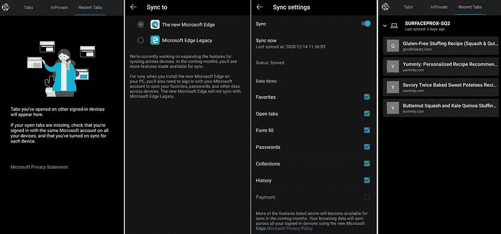

# 安卓系统上的微软 Edge 正在获得标签页和历史同步功能

> 原文：<https://www.xda-developers.com/microsoft-edge-sync-tabs-history-across-android-windows/>

# Microsoft Edge 现在可以在 Android 和 Windows 之间同步标签和历史记录

Microsoft Edge 获得了新的更新，允许您在 Android 和 Windows 版本的浏览器之间同步标签和历史记录。请继续阅读！

如果你一直在 Windows 和你的 Android 设备上使用微软 Edge 浏览器，那么有一个好消息。微软终于推出了在手机版和 Windows 版浏览器之间同步标签的功能。然而，这项新功能只是在测试阶段推出，它还包括一个选项，可以让你在不同版本的浏览器之间同步历史记录。

据 [*Windows Central*](https://www.windowscentral.com/microsoft-edge-beta-now-lets-you-sync-tabs-across-android-and-windows-10) 报道，该功能是由一名拥有 Edge Beta 版本 45.11.24.5118 的用户发现的。根据分享的截图，用户已经在 12 月 11 日获得了更新。这实质上意味着新功能将在未来几周内面向所有人推出。

 <picture></picture> 

Image credits: Windows Central

要使用此功能(一旦向您推出)，您需要做的只是在 Edge 中启用历史记录并打开标签页同步。为此，在你的 Android 设备上打开浏览器，进入设置。点击您的电子邮件地址，然后点击同步。您应该看到需要检查的打开选项卡和历史记录的选项。完成后，重启浏览器，等待页面同步。

Edge 目前允许您同步浏览器上的各种内容，包括表单数据、密码、收藏夹和收藏。通过添加同步历史的选项，可以无缝地打开您在特定设备上查看的特定网站，然后在另一台设备上快速打开它。Edge 浏览器已经有了一个功能，可以将打开的网站从手机发送到 PC，但同步标签可以更容易地在设备之间同步多个页面，而不是逐个打开它们。此外，该报告还指出，显示同步标签、收藏夹和其他内容选项的设置页面还包括一个同步支付的复选框，尽管目前还不可用。这意味着微软也在努力引入通过 Edge 在设备间同步支付选项的功能。这将是一个不错的尝试，当然是在[标签组折叠和自动创建功能](https://www.xda-developers.com/microsoft-edge-canary-tab-group-collapse-auto-create/)之后。