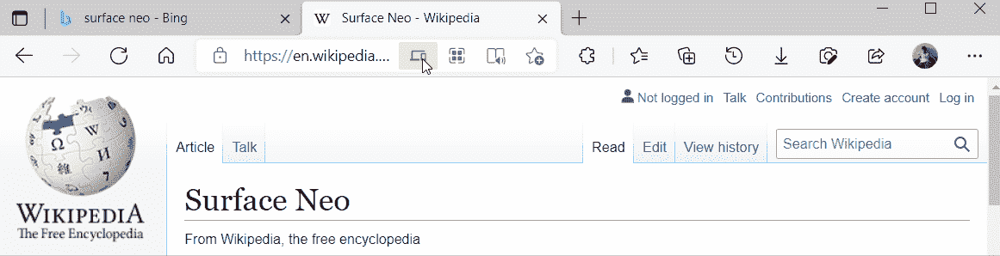
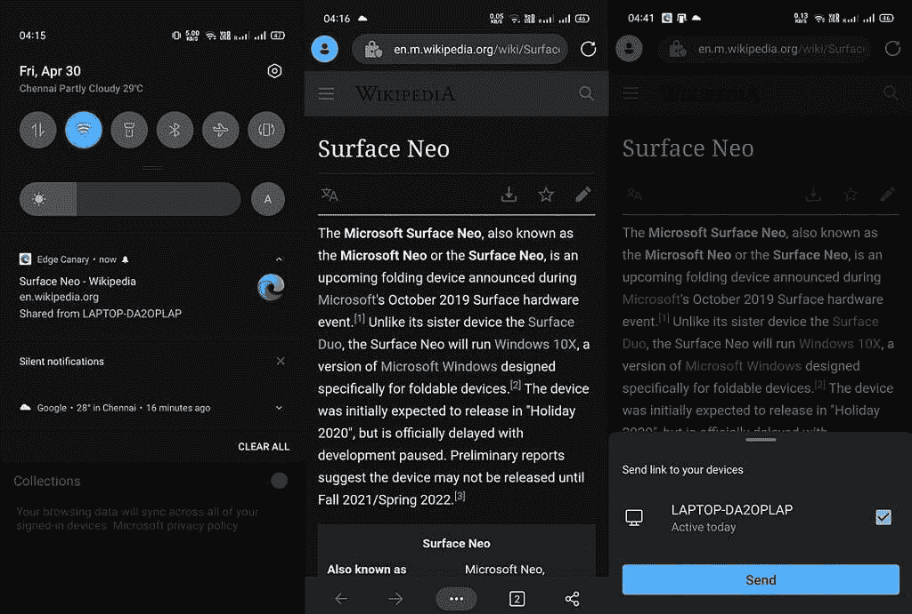

# 微软 Edge 很快就会让你在 Windows 10 和 Android 之间发送标签

> 原文：<https://www.xda-developers.com/microsoft-edge-tab-sharing-windows-android/>

微软的 Edge 浏览器已经迅速成为最受欢迎的桌面浏览器之一。事实上，它是目前第二受欢迎的浏览器，仅次于谷歌浏览器。作为一个基于 Chromium 的浏览器，它与 Google Chrome 和其他 Chromium 浏览器共享许多核心功能。这意味着如果你来自谷歌浏览器，你会有宾至如归的感觉。然而，与谷歌 Chrome 相比，Edge 仍然错过了几个功能。Microsoft Edge 缺乏的一个功能是在设备之间共享标签。但它终于赶上了。

微软正在(通过 [*Windows 最新*](https://www.windowslatest.com/2021/04/30/microsoft-edge-can-now-share-tabs-with-windows-10-and-android-devices/) )推出 Edge Canary 的一项新功能，该功能将允许用户向其他设备发送标签。如果你有多台设备，并使用 Microsoft Edge 作为默认浏览器，这将非常方便。基本上，你可以将标签从你的桌面推送到你的 Android 手机或其他使用相同微软账户登录的 Windows 设备上。

 <picture></picture> 

GIF: Windows Latest

标签共享功能是桌面版 Edge Canary 92.0.873.0 和安卓版 92.0.870 的一部分。要共享选项卡，请转到您要共享的网页，右键单击链接或选项卡，然后从弹出菜单中选择“将链接发送到[您的设备名称]”。该功能也可以从地址栏[访问，就像谷歌 Chrome](https://www.xda-developers.com/chrome-android-self-share-tabs/) 一样，它会向你显示所有可以共享页面的同步设备的列表。

当你把一个标签从你的桌面发送到你的 Android 手机时，你会收到一个带有链接、页面名称等信息的通知。，点击它将在 Microsoft Edge 中打开该链接。

 <picture></picture> 

Image: Windows Latest

选项卡共享是双向的。你还可以将 Android 手机上的页面分享到桌面上。当您从手机上的 Edge 浏览器向 Windows 设备共享链接时，Window 的通知中心会出现通知。

在 Windows 和 Android 平台上，Edge 最新的金丝雀版本推出了共享标签的功能。如果你想尝试一下，你可以从[这里](https://www.microsoftedgeinsider.com/en-us/download)获取你的 Windows 设备的最新版本。