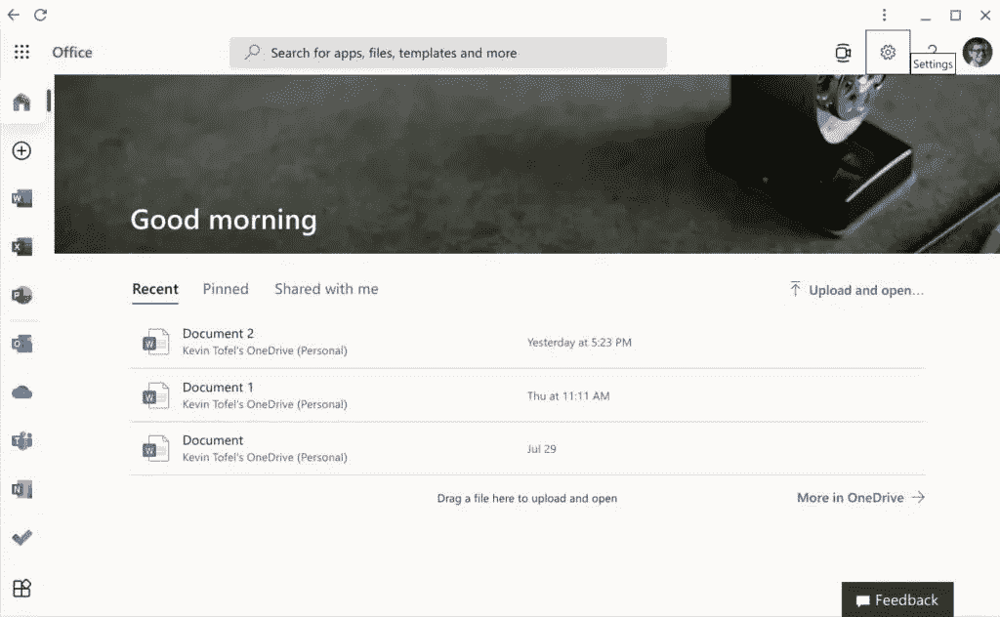

# Android 版的微软 Office 应用程序将无法在 Chrome 操作系统上运行

> 原文：<https://www.xda-developers.com/microsoft-office-apps-android-no-longer-work-on-chrome-os/>

运行 Android 应用程序的能力是现代 Chromebooks 的最佳功能之一，使得大量流行的应用程序可以在笔记本电脑上轻松使用。然而，看起来微软并不完全认同这一愿景。从 9 月 18 日开始，安卓版的微软 Office 应用将不再适用于 Chrome 操作系统。这包括去年推出的统一办公应用程序和 Outlook。

在一些用户[在使用应用程序时开始看到支持终止通知后，微软向](https://twitter.com/littvay/status/1430110307079368721) [*确认了关于 Chromebooks*](https://www.aboutchromebooks.com/news/microsoft-ending-chromebook-support-for-office-android-apps-in-september/) 的消息。目标是将用户转移到基于网络的体验，即 Office.com 和 Outlook.com。这些都是免费使用的，但是功能集可能更有限。

这并不令人惊讶，因为这是微软在大显示器上免费发布 Office 的路线。事实上，[公司对办公移动应用有一个政策](https://support.microsoft.com/en-us/office/what-you-can-do-in-the-office-apps-on-mobile-devices-with-a-microsoft-365-subscription-9ef8b63a-05fd-4f9c-bac5-29da046833ea),如果你想在 10.1 英寸以上的屏幕上编辑文件，你需要订阅微软 365。通过在 Chromebook 上加载 Office 应用程序，你要么不能编辑文件，要么会绕过微软的政策。

然而，如果你为微软 365 付费，这可能看起来像是降级。您可以将 web 体验安装为渐进式 web 应用程序(PWA ),并从那里轻松创建文件。然而，打开一个现有的文件只是打开一个新的浏览器标签，所以体验不是集中在应用程序上。另外，当你离线时，你根本不能使用这些应用程序，至少现在不能。

 <picture></picture> 

Office.com experience on a Chromebook | Image credit: About Chromebooks

几年前，微软也有 Office“移动”应用程序，可以在 Windows 10 Mobile 和 Windows 10 for PCs 上运行，有一段时间，你可以通过这种方式自由编辑文档。然而现在，Windows 个人电脑配备了一个统一的 Office 应用程序，可以引导用户使用每个应用程序的网页版本。Chrome OS 现在的情况差不多就是这样。

然而，这是有区别的。Windows PCs 仍然附带一个邮件应用程序，允许用户添加来自不同提供商的多个邮箱，就像 Android 的 Outlook 应用程序一样。Outlook.com 只支持两个账户，除了你的微软账户，你只能添加一个谷歌账户。

希望这种体验将在某个时候更新，使不同帐户之间的电子邮件管理更加容易。有传言称，微软也将把 Windows Mail 应用替换为基于网络的体验，如果这种体验的功能少于当前的应用，那就不太理想了。

澄清一下，微软的 Android 版 Office 应用将继续得到支持，只是不支持 Chrome 操作系统。如果你使用的是安卓手机或平板电脑，一切都会照常运行。提醒一下，微软表示其应用将于 9 月 18 日过渡到网络体验。

*更新:*以下是我们从谷歌发言人处收到的关于此消息的声明:

> #### “我们很高兴看到微软为 Chrome OS 用户提供更优化的体验，并拥抱开放的网络。人们喜欢 Chrome 操作系统，因为它提供了快速、安全和简单的计算体验，帮助他们在工作、学习和娱乐时保持联系。”—谷歌发言人