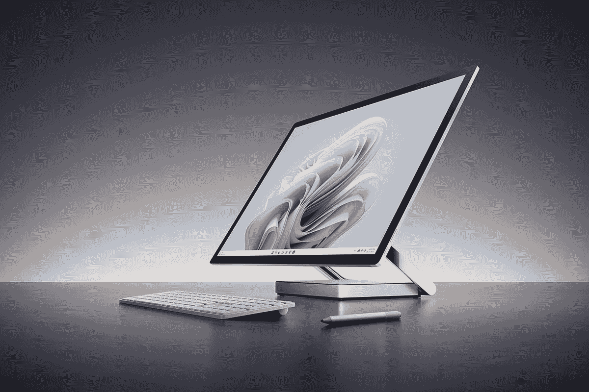

# 沉寂四年后，微软推出 Surface Studio 2 Plus

> 原文：<https://www.xda-developers.com/microsoft-surface-studio-2-plus-announcement/>

微软每年 10 月都会举行一次硬件发布会，每年都会更新的一款产品是 [Surface Pro](https://www.xda-developers.com/surface-pro-9/) 。虽然 [Surface Laptop 5](https://www.xda-developers.com/surface-laptop-5/) 在一年半后到来，但有一款产品直到最近才被人们期待看到，那就是 [Surface Studio 2 Plus](https://www.xda-developers.com/surface-studio-2-plus/) 。上一次我们看到一体机是在 2018 年 10 月 Surface Studio 2 发布的时候。

该产品采用英特尔第七代处理器和 Nvidia GeForce GTX 1070 显卡。这些规格太老了，以至于微软实际上为一个第七代处理器的 [Windows 11](https://www.xda-developers.com/windows-11/) 系统要求开了一个例外，就是 Studio 2 中的那个。这意味着无论如何，Surface Studio 2 Plus 都是一次大规模升级。

## 英特尔第 11 代处理器和 RTX 显卡

Surface Studio 2 Plus 仍然坚持使用最新一代移动处理器。具体来说，它配备了一个酷睿 i7-11370H，一个四核 35W 芯片，因此它实际上比其前辈的 45W 处理器具有更低的 TDP。这与你在 Surface 笔记本电脑工作室中找到的 CPU 相同。最重要的是，它有一个 Nvidia GeForce RTX 3060 GPU，这也是笔记本电脑的一部分，但它仍然是 GTX 1070 的一个大升级。

值得记住的是，虽然 Surface Studio 一直使用笔记本电脑部件，但这是因为这些部件本质上适合迷你 PC。所有这些都放在底座上，还有连接到显示器的零重力铰链，让你可以把它折叠到你可以在上面画画的地方。事实上，微软今天也宣布了一些面向创作者的新软件。

这款产品的另一个变化是它现在有了 Thunderbolt 4，而以前它只有标准的 USB Type-C 端口。Thunderbolt 4 有三个端口，所以它非常通用。

## 其他一切都一样

这是微软第二次发布‘Plus’产品，第一次是 Surface Pro 7 Plus。这个想法是，该产品与之前的产品非常相似，尽管内部有了很大的改进，但这比 Surface 系列中的其他代产品要重要得多。然而，当重新设计的 Surface Pro 8 即将问世时，Surface Pro 7 Plus 就被称为 Surface Pro 7 Plus。按理说，可能会有重新设计的 Surface Studio 3 在某个时候到来。

显示屏为 28 英寸，长宽比为 3:2，分辨率为 4，4,500x3,000。它仍然有 60Hz 的刷新率，而且它仍然使用旧的 Surface Pen，而不是 Surface Pro 9 和 Surface Laptop Studio 使用的新的 Slim Pen 2。

与前几代产品不同，Surface Studio 2 Plus 只有一种配置。它有一个酷睿 i7-11370H、32GB DDR4 和 1TB 固态硬盘。但这并不便宜，因为它将花费你 4299.99 美元。此外，在这个价格上，它是极少数不带任何外设的一体机之一。如果你想要一个键盘、鼠标和笔，有一个 4499 美元的捆绑包。你能在 10 月 25 日拿一个。

 <picture></picture> 

Surface Studio 2 Plus

##### Surface Studio 2 Plus

Surface Studio 2 Plus 是一款顶级的一体式台式电脑，配有大而清晰的显示屏和强大的规格。