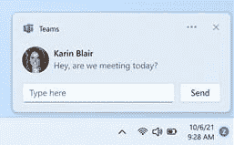

# 微软团队聊天今天将进入 Windows 11 预览版

> 原文：<https://www.xda-developers.com/microsoft-teams-chat-coming-windows-11-preview/>

虽然 Windows 11 已经与内部人士进行了数周的测试，但仍有一些功能缺失。其中一个功能是微软团队聊天，这是从今天开始的 Windows 11 预览版。你可以在你的任何设备上发送和接收信息，你与之交谈的人甚至不需要是团队用户。您也可以通过短信或电子邮件发送信息。

你将在任务栏中看到一个聊天图标，这是微软在你的任务栏中添加的另一个新图标。如果你点击它，你会看到你所有的各种对话。还会有一个“开放微软团队”按钮，可以打开完整的体验。你现在特别需要它，因为不是所有的团队功能在今天的预览版中都可用。

 <picture></picture> 

Interactive Teams notification

微软说你会自动同步你的 Skype 和 Outlook 联系人；然而，它并没有说它会带来你的 Skype 对话。请记住，Skype 不再与 Windows 11 一起发布，因此团队集成是对它的替代。

你不需要一个链接来开始一个对话。如上所述，你可以用某人的电话号码或电子邮件地址和他聊天。但是，您可以使用链接将联系人添加到群聊中。同样的事情也适用于视频通话，但音频和视频通话是以后才会出现的事情。

微软夸口说，你可以在各种设备上完成所有这些工作。这没什么好惊讶的。虽然这是 Windows 11 内部的聊天体验，但它仍然是微软团队。这意味着，如果你在 iOS、Android、macOS 或 Linux 上登录微软团队应用，你仍然可以访问所有这些对话。

我们在这里看到的是 Windows 10 上“现在见面”的下一次演变，只不过那是针对 Skype 的。这类似于 Windows 11 中新闻和兴趣如何演变成小部件。就像现在开会一样，你只需点击聊天按钮就可以开始了。还有更多的功能，如视频和音频通话、在线状态和状态设置、屏幕共享等。所有这些都将在未来几周内到来。离线模式也不工作，所以你需要一个互联网连接。