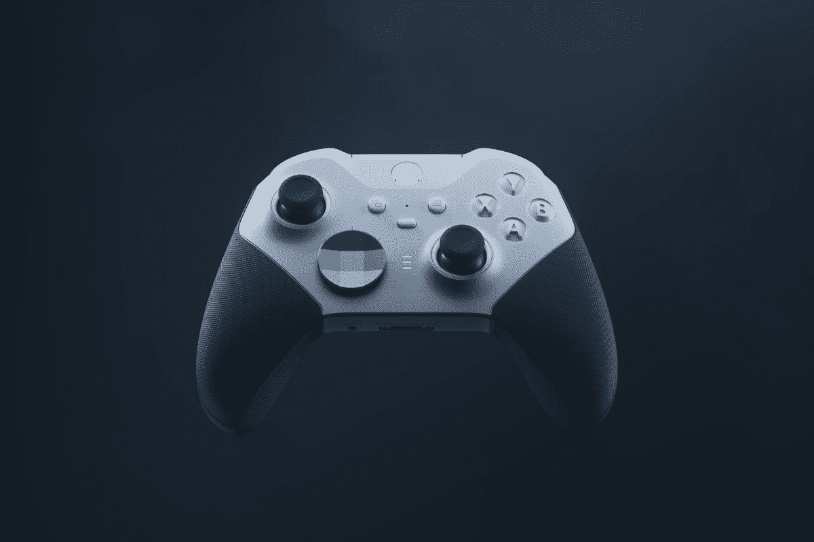

# 微软首次推出 129.99 美元的 Xbox 精英无线控制器系列双核

> 原文：<https://www.xda-developers.com/microsoft-xbox-elite-wireless-controller-series-2-core/>

Xbox Elite 无线控制器系列 2 发布已近三年，现在微软通过推出新的控制器 Xbox Elite 无线控制器系列 2 - Core 来增加其精英阵容。虽然它很长，但控制器将有一种颜色，白色，价格将大大低于其兄弟姐妹的 129.99 美元。

微软的 Xbox Elite 无线控制器系列 2 核心将在不破产的情况下为游戏玩家提供竞争优势。新的控制器包含优秀的高级组件，提供定制，如可调张力拇指操纵杆，橡胶手柄和较短的头发触发锁。控制器也可以被编程，当涉及到自定义映射按钮时，给玩家无限的选择。此外，控制器一次充电可持续 40 小时。

那么 Xbox Elite 无线手柄系列 2 核心控制器与原版有何不同呢？主要的核心区别是，新的控制器不会附带额外的部件，正因为如此，它的价格会低得多。购买时，Xbox Elite Wireless Controller Series 2 控制器附带额外的拨片、拇指棒和 D-pad。控制器还配有便携包和充电底座。好消息是，如果你仍然想购买这些项目，微软现在将提供一个完整的组件包，售价为 59.99 美元。完整的组件包部件也将与 Xbox Elite 无线控制器系列 2 兼容。

作为一个额外的奖励，这个假期，Xbox Elite 无线控制器系列 2 控制器将通过 Xbox 设计实验室提供。Xbox 设计实验室允许你定制你的控制器的外观，给它一个你自己的定制配色方案。如果你对 Xbox Elite 无线控制器系列 2 核心控制器感兴趣，现在可以直接从微软预购。这款控制器售价 129.99 美元，将于 9 月 21 日开始发售。如果价格有点高，请务必查看[我们的指南](https://www.xda-developers.com/best-xbox-series-x-controller/)中的其他控制器选项。

 <picture></picture> 

Xbox Elite Wireless Controller Series 2

##### 微软 Xbox 精英无线控制器 2

* * *

来源: [Xbox](https://news.xbox.com/en-us/2022/09/07/xbox-elite-series-2-evolving-with-more-ways-to-play/)