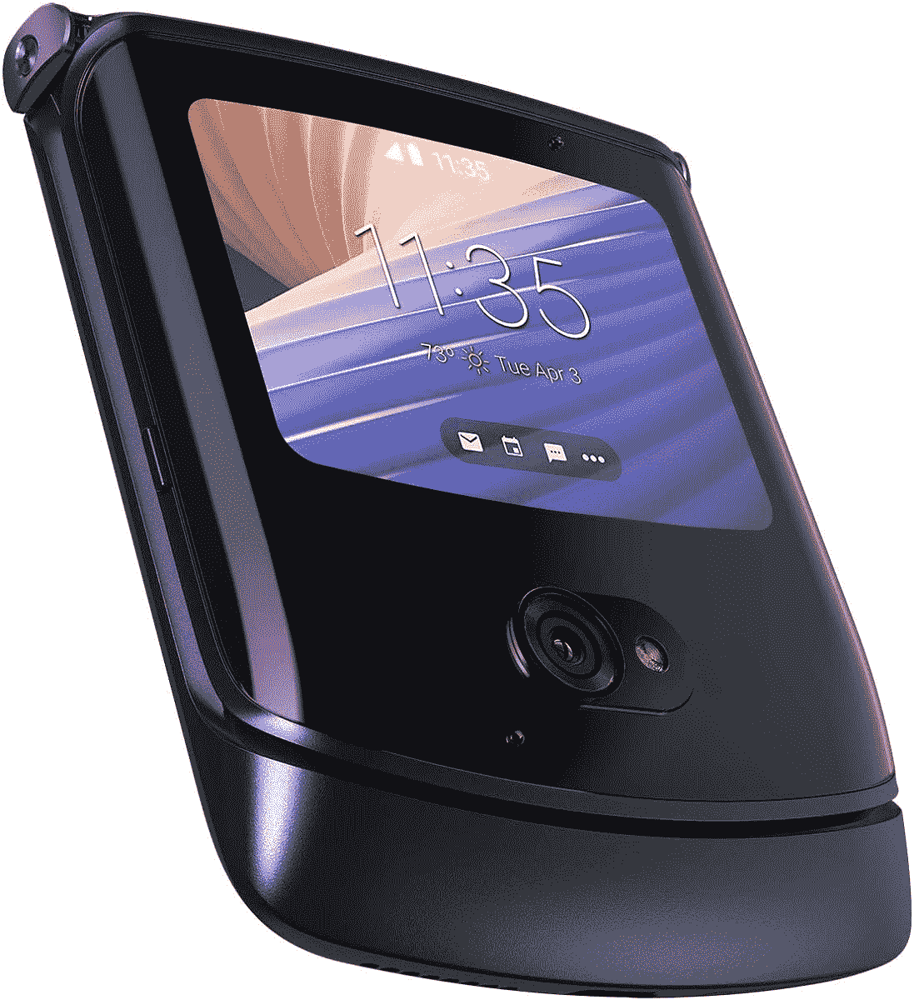
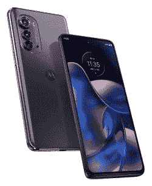
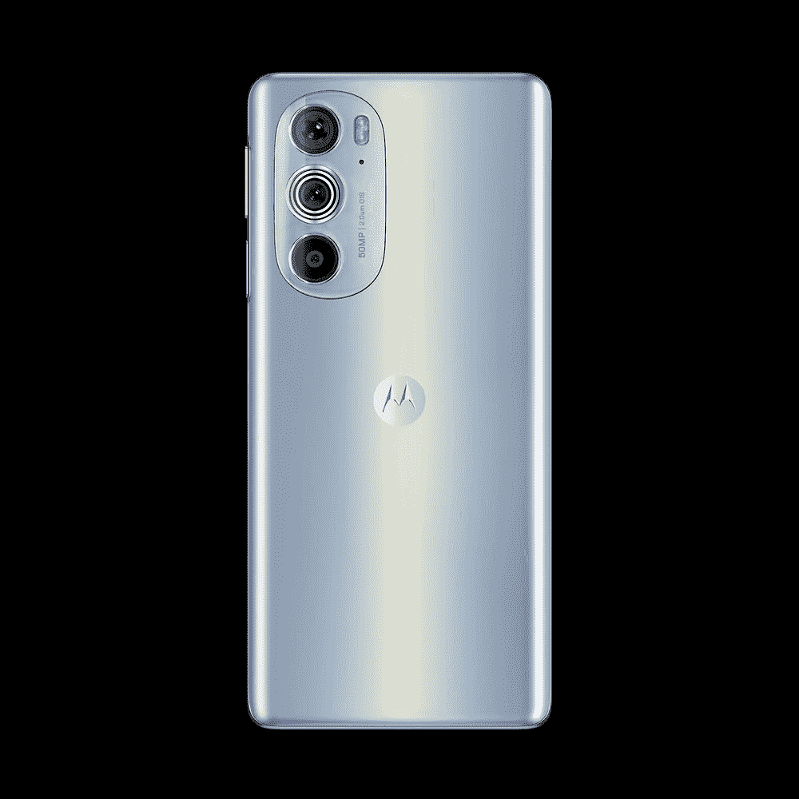
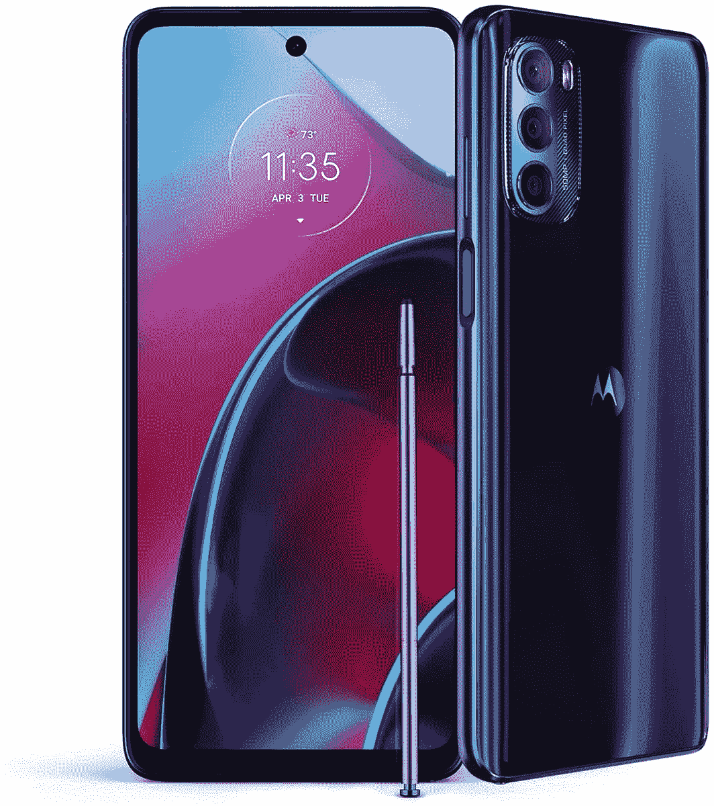

# 摩托罗拉正在提供许多新的交易来庆祝它的 94 周年

> 原文：<https://www.xda-developers.com/motorola-94th-anniversary-sale/>

新的一个月，摩托罗拉的智能手机有了一系列新的交易。这一次，它提供折扣来庆祝它的 94 周年。没错，摩托罗拉已经经营了 90 多年，实际上是从高尔文制造公司开始的。在最终转向制造电信硬件之前，它首先制造电池拆卸器。因此，为了庆祝这一时刻，从今天开始，你可以在一系列精选的智能手机上享受一些优惠。

## 拉兹

如果你正在寻找一些独特和有趣的东西，摩托罗拉 Razr 可能是它。这款可折叠手机的设计融合了新旧元素。另外，在新的促销活动中，如果你买一个，就可以免费得到一个。

 <picture></picture> 

Motorola Razr

## 摩托罗拉边缘 2022

摩托罗拉 Edge 2022 是一款相当新的产品，具有令人印象深刻的 6.6 英寸有机发光二极管显示屏，刷新率为 144Hz。摩托罗拉还声称，一次充电可以持续两天，现在可以预订，价格为 499.99 美元。这款手机计划于 2022 年 9 月 22 日发布。

 <picture></picture> 

Motorola Edge 2022

## 摩托罗拉边缘增强版

摩托罗拉 Edge Plus 凭借其高通骁龙 8 Gen 1 处理器提供了强大的功能，并拥有令人印象深刻的 6.7 英寸有机发光二极管显示屏，刷新率为 144Hz。它还通过 30W 涡轮功率充电功能提供快速充电支持。

 <picture></picture> 

Motorola Edge 2022

## 摩托罗拉 Moto G 手写笔 5G

摩托罗拉 Moto G Stylus 5G 是一款独特的手机，因为它价格实惠，而且还提供手写笔支持。该设备还提供一次充电长达两天的电池。如果有兴趣，最好看看我们的评论。

 <picture></picture> 

Motorola Edge 2022

现在，这些只是销售过程中的一些交易。摩托罗拉的 14 款手机都有交易，价格从 129.99 美元到 1399.99 美元不等。如果你有兴趣，你可以在下面的链接中查看所有的手机。选择范围广泛，总有适合每个人的东西。但是如果你不确定，你可以看看我们的指南，看看 2022 年最好的安卓手机。

* * *

**来源** : [摩托罗拉](https://shop-links.co/link/?exclusive=1&publisher_slug=xda&article_name=Motorola+is+offering+lots+of+new+deals+to+celebrate+its+94th+anniversary&article_url=https%3A%2F%2Fwww.xda-developers.com%2Fmotorola-94th-anniversary-sale%2F&u1=UUxdaUeUpU43540&url=https%3A%2F%2Fwww.motorola.com%2Fus%2Fspecials)